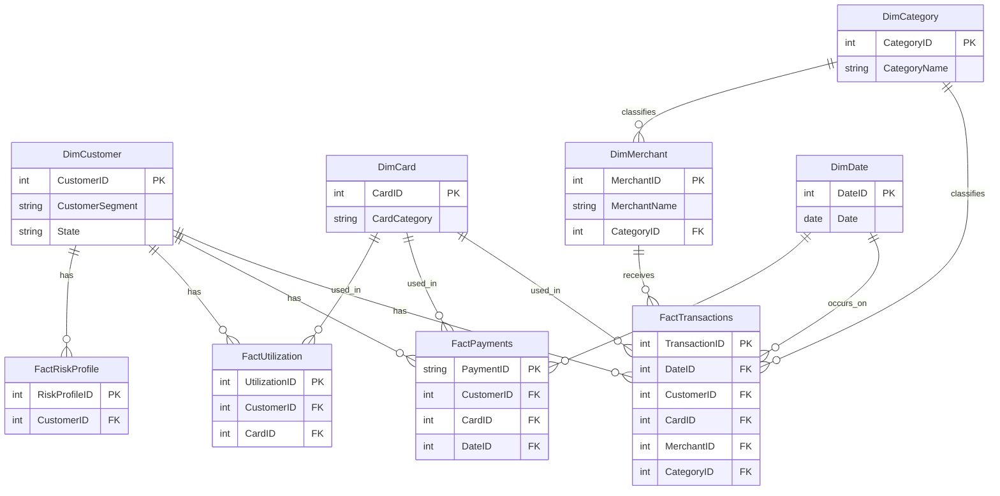

<div align="center">

# 📂 Enterprise Dataset Portal

## 💳 Credit Card Portfolio Analytics & Risk Intelligence

### *Enterprise Dataset Documentation*

#### *Power BI Semantic Model Foundation*

<p align="center">
Building reliable analytics starts with trustworthy data.
</p>

<br>


---

<p align="center">
<b>📊 9 Enterprise Datasets</b> •
<b>⭐ Star Schema</b> •
<b>📈 150K+ Records</b> •
<b>⚡ Power BI Semantic Model</b>
</p>

<p align="center">
<i>Designed to document every dataset powering the analytics platform.</i>
</p>

</div>

---

> [!NOTE]
>
> This document serves as the **official landing page for the `Data/` folder**.
>
> It documents every dataset powering the **Credit Card Portfolio Analytics & Risk Intelligence** semantic model.
>
> For project level information, visit the **[Repository README](../README.md)**.
>
> For detailed architecture, DAX, ETL, and implementation documentation, visit the **[Documentation Suite](../Documentation/README.md)**.
---

## 📘 Dataset Overview

This folder contains every source dataset consumed by the Power BI semantic model for the **Credit Card Portfolio Analytics & Risk Intelligence** solution.

The datasets are structured according to a **Star Schema (Kimball dimensional model)**, separating descriptive attributes (dimensions) from measurable business events (facts). Collectively, they represent a synthetic **credit card portfolio**, including customers, cards, merchants, transactions, payments, utilization, and risk classification.

Every dashboard visual, DAX measure, and KPI in the associated `.pbix` file is derived directly from the tables described in this document. This README does not explain DAX logic or dashboard design — those are covered in the [Related Documentation](#-related-documentation) section below.

---

## 📊 Dataset Statistics

| Metric | Value |
|---|---|
| 🔹 Dimension Tables | 5 |
| 🔸 Fact Tables | 4 |
| 📦 Total Tables | 9 |
| 🏛 Data Model | Star Schema |
| 🔗 Relationships | 11 Power BI relationships + 1 supporting dimension relationship |
| 🧾 Total Records | ~150,408 |
| 🖥️ Platform | Microsoft Power BI Desktop |
| ⚙️ Storage Mode | Import Mode |

---

## 🗂️ Folder Structure

```
Data/
│
├── README.md                     # This file
│
├── Dimension Tables/
│   ├── DimCustomer.csv.xlsx
│   ├── DimCard.csv.xlsx
│   ├── DimMerchant.csv.xlsx
│   ├── DimCategory.csv.xlsx
│   └── DimDate.csv.xlsx
│
└── Fact Tables/
    ├── FactTransactions.csv.xlsx
    ├── FactPayments.csv
    ├── FactUtilization.csv.xlsx
    └── FactRiskProfile.csv.xlsx
```

> [!TIP]
> Dimension and fact tables are physically separated into subfolders to reinforce the star schema mental model — descriptive context on one side, measurable events on the other. Eight of the nine sources are Excel workbooks (`.xlsx`); `FactPayments.csv` is the only true CSV source. See [Data Sources.md §4](../Documentation/04_Data_Sources.md) for the format rationale.

---

## 🧩 Dimension Tables

Dimension tables provide descriptive, slowly changing context used to filter and group facts.

### `DimCustomer`

| Attribute | Detail |
|---|---|
| **Purpose** | Describes each customer's demographic and account profile |
| **Business Process** | Customer master / KYC |
| **Primary Key** | `CustomerID` |
| **Row Count** | 1,000 |

### `DimCard`

| Attribute | Detail |
|---|---|
| **Purpose** | Describes each credit card product issued to a customer |
| **Business Process** | Card product catalog |
| **Primary Key** | `CardID` |
| **Row Count** | 20 |

### `DimMerchant`

| Attribute | Detail |
|---|---|
| **Purpose** | Describes merchants where transactions occur |
| **Business Process** | Merchant network master |
| **Primary Key** | `MerchantID` |
| **Row Count** | 500 |

### `DimCategory`

| Attribute | Detail |
|---|---|
| **Purpose** | Describes spending categories used to classify transactions and merchants |
| **Business Process** | Spend category taxonomy |
| **Primary Key** | `CategoryID` |
| **Row Count** | 12 |

### `DimDate`

| Attribute | Detail |
|---|---|
| **Purpose** | Standard calendar table supporting all time intelligence; marked as the model's official Date Table |
| **Business Process** | Calendar / date master |
| **Primary Key** | `DateID` |
| **Row Count** | 1,096 (~3 calendar years) |

---

## 📈 Fact Tables

Fact tables store measurable, quantitative business events at a defined grain.

### `FactTransactions`

| Attribute | Detail |
|---|---|
| **Purpose** | Records individual card spend/transaction events |
| **Grain** | One row per card transaction |
| **Business Process** | Card spend / transaction events |
| **Primary Key** | `TransactionID` |
| **Row Count** | 50,000 |

### `FactPayments`

| Attribute | Detail |
|---|---|
| **Purpose** | Records customer payments made against card balances |
| **Grain** | One row per billing/repayment cycle event, per customer-card |
| **Business Process** | Billing and repayment events |
| **Primary Key** | `PaymentID` (text identifier, e.g. `PAY000001`) |
| **Row Count** | 24,682 |

### `FactUtilization`

| Attribute | Detail |
|---|---|
| **Purpose** | Records monthly credit utilization snapshots per customer-card |
| **Grain** | One row per customer-card, per calendar month |
| **Business Process** | Monthly credit utilization snapshots |
| **Primary Key** | `UtilizationID` |
| **Row Count** | 39,780 |

### `FactRiskProfile`

| Attribute | Detail |
|---|---|
| **Purpose** | Records periodic risk scoring and classification per customer |
| **Grain** | One row per customer, per calendar month |
| **Business Process** | Monthly risk assessment scoring |
| **Primary Key** | `RiskProfileID` |
| **Row Count** | 36,000 |

> [!NOTE]
> `FactUtilization` and `FactRiskProfile` are both monthly-snapshot facts, but at different grains — `FactUtilization` is customer-**card**-month, while `FactRiskProfile` is customer-month only. Neither table has a relationship to `DimDate`; both use a text-based snapshot month column instead (`SnapshotMonth` / `AssessmentMonth`). See [Data Model.md §3](../Documentation/14_Data_Model.md).

---

## ⭐ Star Schema



> [!IMPORTANT]
> The diagram above uses standard Mermaid `erDiagram` syntax, which renders natively in GitHub Markdown without additional plugins. The `DimCustomer ↔ FactRiskProfile` relationship is the model's single **bidirectional** relationship in Power BI (a filter-propagation setting, not an ER cardinality) — see the callout in [Relationship Summary](#-relationship-summary) below.

---

## 🔄 Data Flow


---

## 🔗 Relationship Summary

| Item | Count |
|---|---|
| Dimension Tables | 5 |
| Fact Tables | 4 |
| Fact-to-Dimension Relationships | 11 |
| Dimension-to-Dimension Relationships | 1 (`DimMerchant → DimCategory`) |
| **Total Relationships** | **12** |

> [!WARNING]
> One relationship — **`FactRiskProfile ↔ DimCustomer`** — is configured as **bidirectional** to let a customer-level slicer (segment, state) narrow the risk-category breakdown without affecting the rest of the model. All other relationships follow standard single-direction filtering from dimension to fact. Note that `FactUtilization` has no relationship to `DimDate`; its time grain is carried in a text `SnapshotMonth` column instead.

---

## 🏷️ Dataset Naming Convention

| Prefix / Suffix | Meaning | Example |
|---|---|---|
| `Dim` | Dimension table | `DimCustomer` |
| `Fact` | Fact table | `FactTransactions` |
| `*ID` | Primary/foreign surrogate key column | `CustomerID`, `CardID` |

Source file names use PascalCase matching the table name, with format-specific extensions: `.xlsx` for eight of the nine sources, and `.csv` for `FactPayments` only. See [Data Sources.md §2](../Documentation/04_Data_Sources.md) for the full inventory.

---

## ♻️ Refresh Process

| Aspect | Configuration |
|---|---|
| **Query Engine** | Power Query (M) |
| **Storage Mode** | Import Mode |
| **Refresh Trigger** | Manual refresh in Power BI Desktop |
| **Source Parameterization** | Not yet implemented — every `Source` step currently references a hardcoded local file path (see [Technical Design.md §7](../Documentation/09_Technical_Design.md)) |
| **Scheduled Refresh** | Not currently configured |
| **Gateway** | Not currently deployed — reserved for future enhancement |

> [!NOTE]
> Because this solution uses local files with hardcoded source paths, refresh only succeeds on the original development machine. A recommended near-term fix is introducing a single `SourceFolderPath` Power Query parameter (see [Technical Design.md §7](../Documentation/09_Technical_Design.md)) so the source location can be updated in one place instead of nine.

---

## 🔁 How to Replace the Data

To substitute this dataset with your own portfolio data:

1. **Replace the source files** in `Dimension Tables/` and `Fact Tables/` with your own data, keeping identical file names and formats (`.xlsx` for all tables except `FactPayments.csv`).
2. **Preserve column names, data types, and key columns** — see [Data Dictionary.md](../Documentation/03_Data_Dictionary.md) — so existing Power Query steps do not break.
3. **Update the `Source` step** of each Power Query query to point at your local file path. Paths are currently hardcoded per table; consider implementing the recommended `SourceFolderPath` parameter (see [Technical Design.md §7](../Documentation/09_Technical_Design.md)) to update all nine queries at once.
4. **Refresh the semantic model** (Home → Refresh) to reload all tables.
5. **Reload the `.pbix` file** and validate that visuals render correctly against the new data.

> [!TIP]
> Keep primary key columns unique and non-null — the semantic model relationships depend on referential integrity between dimension and fact tables.

---

## ✅ Data Quality

-Source data was validated during development using the testing and validation process documented in Testing & Validation.md.- All data cleansing and shaping occurs exclusively in the **Power Query transformation layer**, keeping raw source files untouched.
- `FactRiskProfile[RiskCategory]` originally contained the inconsistent label `"Aggressive User"`; this was corrected once, at the source, to `"Critical Risk"` in Power Query — every downstream visual inherits the fix automatically.
- A payment-to-spend anomaly (`PaymentAmount` exceeding `BillAmount`) was identified in `FactPayments` during validation and corrected before measures were finalized.

---

## ⚠️ Known Limitations

> [!CAUTION]
> This dataset is intended for **portfolio and demonstration purposes only**.

- Data is **synthetic** and does not represent real customers, cards, or transactions.
- Built as part of a **personal portfolio project**, not a production banking system.
- Sourced from **local flat files** (Excel workbooks and one CSV) rather than a live database or API.
- **Source file paths are currently hardcoded** to the original development machine — no `SourceFolderPath` parameter has been implemented yet.
- **No scheduled refresh** is currently configured.
- **No live connection** to any external or production data source.
- **No Row-Level Security (RLS) or Object-Level Security (OLS)** implemented in the current release.

---

## 📚 Related Documentation

For deeper technical detail beyond the scope of this dataset overview, refer to:

| Document | Description |
|---|---|
| [`03_Data_Dictionary.md`](../Documentation/03_Data_Dictionary.md) | Full field-level data dictionary |
| [`04_Data_Sources.md`](../Documentation/04_Data_Sources.md) | Origin, format, and provenance of source data |
| [`08_Power_Query_Transformations.md`](../Documentation/08_Power_Query_Transformations.md) | Detailed M-code transformation logic |
| [`09_Technical_Design.md`](../Documentation/09_Technical_Design.md) | Storage mode, relationship configuration, and parameterization design |
| [`14_Data_Model.md`](../Documentation/14_Data_Model.md) | Semantic model grain, keys, and relationship design |
| [`17_Testing_Validation.md`](../Documentation/17_Testing_Validation.md) | Data validation and testing methodology |

---

## 🧭 Best Practices

- ❌ Do not modify column names in dimension or fact tables.
- ❌ Do not change key columns (`*ID`) — relationships depend on them.
- ✅ Maintain existing relationships and preserve the documented table grain when extending the model.
- ✅ Keep data types consistent with the original schema.
- ✅ Refresh the semantic model after any change to source files.

---

<div align="center">

## 🏁 Closing

---

<div align="center">

---

<div align="center">

## ❤️ Thank You for Exploring the Dataset

This dataset is the backbone of the **Credit Card Portfolio Analytics & Risk Intelligence** solution.

Every dashboard, KPI, DAX measure, and business insight begins with the data documented here.

If you enjoyed exploring this project, consider giving the repository a ⭐.

---

### Continue Exploring

🏠 **Repository Home**

📖 **Enterprise Documentation**

💳 **Power BI Dashboard**

---

<sub>

Built with ❤️ using Microsoft Power BI, Power Query, DAX, and enterprise data modeling.

</sub>

</div>
