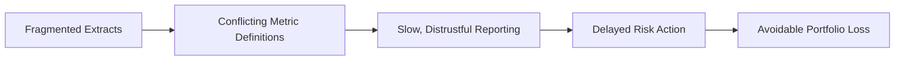
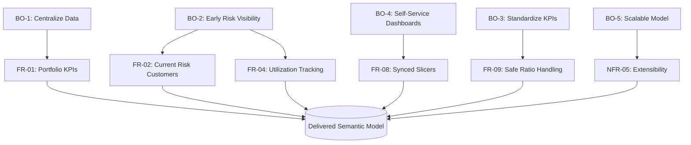

# Business Requirements Document (BRD)
## Credit Card Portfolio Analytics & Risk Intelligence

| | |
|---|---|
| **Document Type** | Business Requirements Document |
| **Project** | Credit Card Portfolio Analytics & Risk Intelligence |
| **Platform** | Microsoft Power BI |
| **Prepared For** | Executive Leadership, Risk & Collections, Product & Marketing, Customer Analytics |
| **Prepared By** | Alan Binu — BI Solution Architect |
| **Document Status** | Final |
| **Version** | 1.1 |
| **Last Updated** | 2025-12 |

---

## 1. Executive Summary

This engagement delivers a governed, single-model Power BI platform that replaces ad-hoc spreadsheet reporting across four credit card business functions with one certified semantic layer. The business case is straightforward: every additional day spent reconciling conflicting definitions of "spend," "risk," or "delinquency" between teams is a day collections cannot act on, marketing cannot target with, and leadership cannot trust.

The requirements captured in this document were validated against the delivered solution described in [Architecture.md](./02_Architecture.md) and [Dashboard Guide.md](./06_Dashboard_Guide.md), and are traceable end-to-end through the [Data Lineage.md](./16_Data_Lineage.md) documentation.

> **Architecture Note:** This BRD intentionally separates *what the business needs* from *how the platform delivers it*. Implementation detail belongs in [Technical Design.md](./09_Technical_Design.md); this document stays at the requirement level so it remains valid even if the underlying implementation evolves.

## 2. Business Context

Card-issuing banks generate transactional, repayment, utilization, and risk-assessment data continuously across millions of customer interactions. In the absence of a centralized analytics layer, each business function — Risk, Collections, Product, and Marketing — builds its own extracts, pivot tables, and definitions of "spend," "risk," and "delinquency."

This fragmentation produces three recurring business problems:

| # | Problem | Consequence |
|---|---|---|
| 1 | **Lagging risk visibility** | Delinquency is discovered in monthly reports, after the exposure has already materialized |
| 2 | **Inconsistent metrics** | The same term ("active customer," "high risk," "utilization") is calculated differently by different teams, undermining trust in reporting |
| 3 | **High cost of ad-hoc analysis** | Every new business question requires a new manual extract, with no reusable, governed semantic layer |

## 3. Business Objectives

| # | Objective | Business Outcome | Traceability |
|---|---|---|---|
| BO-1 | Centralize transaction, payment, utilization, and risk data into a single governed model | One source of truth across Risk, Collections, Marketing, and Leadership | [Architecture.md](./02_Architecture.md) |
| BO-2 | Surface risk signals *before* delinquency occurs | Earlier collections intervention, reduced write-offs | [Dashboard Guide.md §5](./06_Dashboard_Guide.md) |
| BO-3 | Standardize KPI definitions across the organization | Consistent reporting language; reduced reconciliation effort | [DAX Measures.md](./05_DAX_Measures.md) |
| BO-4 | Provide self-service, filterable dashboards per audience | Reduced dependency on ad-hoc report requests | [Dashboard Guide.md](./06_Dashboard_Guide.md) |
| BO-5 | Establish a scalable semantic model for future expansion | Foundation for RLS, Azure/Fabric migration, and predictive risk scoring | [Project Roadmap.md](./12_Project_Roadmap.md) |

## 4. Stakeholders

| Stakeholder Group | Primary Interest | Consuming Dashboard | Decision Rights |
|---|---|---|---|
| Executive Leadership | Portfolio health, growth, exposure | Executive Overview | Sponsors scope and prioritization |
| Product & Marketing | Card performance, spend behavior, segment value | Spend Analytics | Owns card-product and campaign decisions |
| Risk & Collections | Early-warning risk signals, delinquency, utilization | Risk Analytics | Owns risk-threshold and outreach decisions |
| Customer Analytics / Retention | Segmentation, geography, demographics | Customer Analytics | Owns segmentation strategy |
| BI / Data Engineering | Model integrity, governance, refresh reliability | All (technical owner) | Owns the semantic model contract |

> **Governance Note:** In a production deployment, each stakeholder group above would be the accountable owner of the KPI definitions specific to their dashboard, formalized through the ownership matrix in [KPIs & Business Metrics.md §4](./07_KPIs_and_Business_Metrics.md). Changes to a certified measure should be reviewed by its owning group before release — see [Change Log.md](./13_Change_Log.md).

## 5. Scope

### 5.1 In Scope

- Consolidation of four business processes into a single semantic model: **transactions, payments, utilization, risk assessment**.
- A star-schema semantic model (5 dimensions, 4 fact tables) — see [Architecture.md](./02_Architecture.md) and [Data Model.md](./14_Data_Model.md).
- 33 centralized DAX measures covering aggregation, ratio, and conditional business logic — see [DAX Measures.md](./05_DAX_Measures.md) and [DAX Patterns.md](./15_DAX_Patterns.md).
- Four audience-specific Power BI report pages with synchronized cross-filtering — see [Dashboard Guide.md](./06_Dashboard_Guide.md).
- Data-quality remediation at the transformation layer (Power Query) rather than the presentation layer — see [Power Query Transformations.md](./08_Power_Query_Transformations.md).

### 5.2 Out of Scope (Current Release)

| Item | Status | Roadmap Reference |
|---|---|---|
| Row-Level Security (RLS) by business unit or region | Planned | [Project Roadmap.md §3](./12_Project_Roadmap.md) |
| Live/DirectQuery connectivity to a production core-banking system | Planned | [Project Roadmap.md §4](./12_Project_Roadmap.md) |
| Predictive/ML-based risk scoring | Planned (long-term) | [Project Roadmap.md §5](./12_Project_Roadmap.md) |
| Automated, scheduled data refresh via a gateway or cloud data source | Planned | [Project Roadmap.md §3](./12_Project_Roadmap.md) |

> **Known Assumption:** `RiskScore` and `RiskCategory` are sourced fields from an upstream risk-scoring process, not calculated within this model. This BRD treats risk categorization as a trusted input; validating or improving that upstream methodology is explicitly out of scope for this platform and is called out as a long-term roadmap item.

## 6. Functional Requirements

| ID | Requirement | Priority | Delivered By |
|---|---|---|---|
| FR-01 | Report portfolio-wide spend, payments, and exposure at any point-in-time | Must | `Total Spend`, `Total Payments`, `Net Portfolio Exposure` |
| FR-02 | Identify currently at-risk customers using the latest risk assessment only, not a historical blend | Must | `Current Risk Customers` measure |
| FR-03 | Calculate delinquency rate as a percentage of the total customer base | Must | `Delinquency Rate %` measure |
| FR-04 | Track credit utilization as an early-warning indicator ahead of delinquency | Must | `Avg Utilization %`, FactUtilization |
| FR-05 | Measure portfolio repayment health via a payment-to-spend ratio | Must | `Payment to Spend Ratio` |
| FR-06 | Break down performance by card product, category, and network | Must | DimCard, Spend Analytics page |
| FR-07 | Segment customers by value tier, geography, and demographics | Must | DimCustomer, Customer Analytics page |
| FR-08 | Allow synchronized filtering (state, card, risk, date) across all report pages | Should | Global slicers, single-direction filter model |
| FR-09 | Ensure all ratio-based measures degrade gracefully (return 0, not an error) under empty filter context | Must | `DIVIDE()` pattern across all ratio DAX |
| FR-10 | Correct source data-quality defects at the transformation layer, before they reach any visual | Must | Power Query `Replaced Value` step on `RiskCategory` |

Each requirement above is independently verifiable against the delivered model — see [Testing & Validation.md](./17_Testing_Validation.md) for the acceptance checklist used to confirm FR-01 through FR-10 against the production build.

## 7. Non-Functional Requirements

| ID | Category | Requirement | Validated In |
|---|---|---|---|
| NFR-01 | Performance | Dashboards must remain interactive (sub-3-second visual refresh) against ~150,000 combined fact rows | [Performance Optimization.md](./10_Performance_Optimization.md) |
| NFR-02 | Usability | Slicers must synchronize across all four pages without requiring manual reselection | [Dashboard Guide.md §2](./06_Dashboard_Guide.md) |
| NFR-03 | Maintainability | All business logic must live in a single, centralized DAX measure table — not duplicated across visuals | [DAX Measures.md §1](./05_DAX_Measures.md) |
| NFR-04 | Governance | One business definition per metric (e.g., a single definition of "delinquent") reused everywhere it appears | [KPIs & Business Metrics.md §5](./07_KPIs_and_Business_Metrics.md) |
| NFR-05 | Scalability | The model must support additional fact tables (e.g., collections events, fraud flags) without redesign | [Architecture.md §7](./02_Architecture.md) |
| NFR-06 | Portability | Source file paths must be parameterized before external distribution | [Technical Design.md §6](./09_Technical_Design.md) |

## 8. Data Sources (Summary)

Full detail in [Data Sources.md](./04_Data_Sources.md) and [Data Lineage.md](./16_Data_Lineage.md).

| Source | Business Process |
|---|---|
| DimCustomer | Customer master / KYC attributes |
| DimCard | Card product catalog |
| DimMerchant / DimCategory | Merchant network and spend category taxonomy |
| DimDate | Calendar / time intelligence |
| FactTransactions | Card spend events |
| FactPayments | Repayment / billing events |
| FactUtilization | Monthly credit utilization snapshots |
| FactRiskProfile | Monthly risk assessment scores and categories |

## 9. Assumptions & Constraints

| Type | Statement |
|---|---|
| Assumption | Source data is provided as flat extracts (CSV/XLSX); no live core-banking feed is assumed in this release |
| Assumption | `AssessmentMonth` and `SnapshotMonth` are treated as the reporting grain for risk and utilization respectively (monthly, not daily) |
| Constraint | Currency is Indian Rupees (₹); all monetary KPIs are reported in this denomination |
| Business Decision | The **Aggressive User → Critical Risk** relabeling reflects a decision to align risk-category naming conventions and is applied once, at the source, in Power Query — see [Power Query Transformations.md §5.1](./08_Power_Query_Transformations.md) |

## 10. Success Criteria

| Criterion | Target | Verified Via |
|---|---|---|
| Single governed semantic model adopted by all four stakeholder groups | 100% of listed dashboards in production use | [Dashboard Guide.md](./06_Dashboard_Guide.md) |
| Reduction in duplicate/conflicting metric definitions | One certified definition per KPI, enforced via centralized DAX table | [DAX Measures.md](./05_DAX_Measures.md) |
| Time-to-insight for a new business question | Answerable via existing slicers/measures without new data extraction | [Dashboard Guide.md §2](./06_Dashboard_Guide.md) |
| Data-quality defects resolved at source, not patched downstream | Zero display-layer patches; all fixes in Power Query | [Power Query Transformations.md](./08_Power_Query_Transformations.md) |

## 11. Requirements Traceability Diagram

## 12. Related Documents

- [Architecture.md](./02_Architecture.md)
- [Data Model.md](./14_Data_Model.md)
- [Data Dictionary.md](./03_Data_Dictionary.md)
- [Data Sources.md](./04_Data_Sources.md)
- [DAX Measures.md](./05_DAX_Measures.md)
- [Dashboard Guide.md](./06_Dashboard_Guide.md)
- [KPIs & Business Metrics.md](./07_KPIs_and_Business_Metrics.md)
- [Testing & Validation.md](./17_Testing_Validation.md)

---

## Version History

| Version | Date | Author | Change Description |
|---|---|---|---|
| 1.0 | 2025-12 | Alan Binu | Initial release of Business Requirements Document |
| 1.1 | 2025-12 | Alan Binu | Restructured with executive summary framing, added requirements traceability diagram, governance notes, and cross-references to expanded enterprise documentation set |
