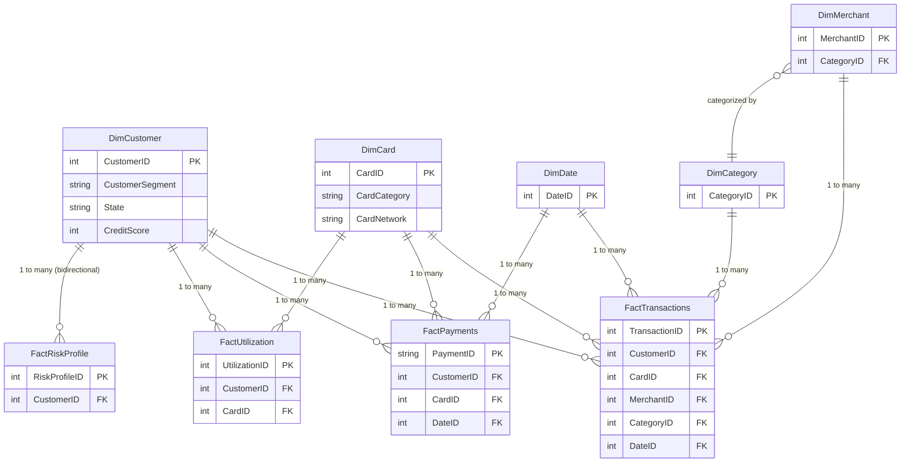
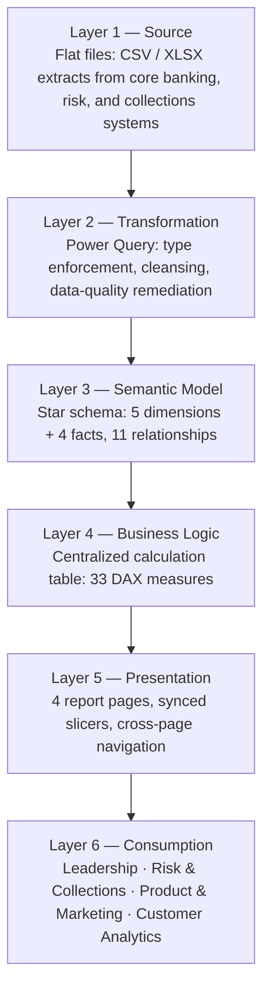

# Solution Architecture
## Credit Card Portfolio Analytics & Risk Intelligence

| | |
|---|---|
| **Document Type** | Architecture Specification |
| **Platform** | Microsoft Power BI Desktop |
| **Modeling Pattern** | Star Schema (Kimball dimensional model) |
| **Version** | 1.1 |
| **Related Documents** | [Business Requirements.md](./01_Business_Requirements.md), [Data Model.md](./14_Data_Model.md), [Technical Design.md](./09_Technical_Design.md) |

---

## 1. Architecture Summary

The solution is a single-file Power BI semantic model (`Credit Card Analytics DashbBoard Project.pbix`) implementing a governed **star schema**: five descriptive dimension tables surrounding four transactional fact tables, exposed through a centralized DAX measure layer to four audience-specific report pages.

> **Architect Note:** The architecture in this document describes the *logical* structure of the model — tables, relationships, and layering. Column-level grain, key definitions, and filter-propagation rules are documented separately in [Data Model.md](./14_Data_Model.md) to keep this document focused on structural decisions rather than schema detail.

## 2. Architectural Principles

| Principle | Implementation |
|---|---|
| **Single source of truth** | All KPIs are computed once, in one centralized DAX measure table, and reused across all four report pages |
| **Separation of concerns** | Descriptive attributes live in dimensions; transactional/event data lives in facts; business logic lives in DAX — never mixed |
| **Predictable filter propagation** | Single-direction cross-filtering is the default; bidirectional filtering is used exactly once, deliberately, where the business logic requires it |
| **Fix at source, not at display** | Data-quality defects (e.g., inconsistent risk labels) are corrected in Power Query, upstream of every visual and measure |
| **Design for scale** | The model is structured to absorb new fact tables (e.g., collections, fraud) without restructuring existing dimensions |

## 3. Alternatives Considered

An enterprise architecture decision is only as credible as the alternatives it rejected. The table below records the options evaluated before settling on the star-schema pattern described in this document.

| Alternative | Description | Why Rejected |
|---|---|---|
| Single denormalized flat table | Join all facts and dimensions into one wide table at build time | Multiplies row count through fan-out joins, destroys additive aggregation behavior for measures like `Total Spend`, and makes VertiPaq compression far less effective on repeated dimension attributes |
| Snowflake schema (normalized dimensions) | Split `DimMerchant`/`DimCategory` and similar into further normalized sub-dimensions | Adds relationship hops that increase DAX query complexity without a compensating benefit at this data volume; the two-table `DimMerchant → DimCategory` relationship already captures the necessary hierarchy |
| Fully bidirectional relationship model | Set every relationship to bidirectional filtering by default | Produces ambiguous, hard-to-debug filter propagation as the model grows; explicitly rejected in favor of a single, justified exception (Section 5) |
| One measure table per report page | Duplicate measure definitions locally per page for page-specific tuning | Breaks the single-source-of-truth principle and reintroduces the metric-drift problem this project was built to eliminate — see [Business Requirements.md §2](./01_Business_Requirements.md) |

> **Decision:** Star schema with a centralized measure table and single-direction relationships as the default, was selected as the pattern that best balances query performance, maintainability, and long-term extensibility for a model of this shape and audience mix.

## 4. Semantic Model Architecture

## 5. Fact-to-Dimension Relationship Matrix

| Fact Table | Related Dimensions | Cross-Filter Direction | Cardinality |
|---|---|---|---|
| FactTransactions | DimCustomer, DimCard, DimDate, DimMerchant, DimCategory | Single | One dimension row → many fact rows |
| FactPayments | DimCustomer, DimCard, DimDate | Single | One dimension row → many fact rows |
| FactUtilization | DimCustomer, DimCard | Single | One dimension row → many fact rows |
| FactRiskProfile | DimCustomer | **Bidirectional** | One dimension row → many fact rows |

> **Design Decision:** `FactRiskProfile → DimCustomer` is the single intentional exception to the single-direction rule. It allows a customer-level slicer (e.g., a segment or state filter on `DimCustomer`) to interactively narrow the risk-category breakdown on the Risk Analytics page, without that bidirectional behavior leaking into the transaction, payment, or utilization facts — which remain single-direction to preserve predictable filter propagation across the rest of the model.

> **Warning:** Bidirectional relationships evaluate filter propagation in both directions on every applicable query, which increases formula-engine planning cost. Extending bidirectional filtering to additional relationships without a specific, documented business need is a common cause of unpredictable slicer behavior and should be avoided — see [Performance Optimization.md §2](./10_Performance_Optimization.md).

## 6. Enterprise Fact Layer

| Component | Count |
|---|---:|
| Total Tables | 9 |
| Dimension Tables | 5 |
| Fact Tables | 4 |
| Relationships | 11 |
| DAX Measures (centralized) | 33 |
| Report Pages | 4 |
| Modeling Pattern | Star Schema |

Centralizing more than 50,000 business events into this governed Enterprise Fact Layer allows each dashboard to answer a different business question against the *same* underlying definitions of spend, risk, and repayment — eliminating the metric drift that occurs when each team maintains its own extract.

## 7. Layered Architecture View

## 8. Design Decisions & Trade-offs

| Decision | Alternative Considered | Rationale |
|---|---|---|
| Star schema over a single flat/denormalized table | Wide flat table | Reduces redundancy, isolates business logic in DAX, scales cleanly as new facts are added |
| Centralized disconnected calculation table for all 33 measures | Measures scattered across each fact table | One place to discover, audit, and maintain every certified metric |
| Fix data quality in Power Query | Patch/relabel in DAX or at the visual level | Ensures every downstream measure and visual inherits the corrected value automatically; avoids drift between visuals |
| Single bidirectional relationship (Risk↔Customer) | Fully bidirectional model | Bidirectional filtering everywhere makes filter propagation unpredictable at scale; the exception is scoped narrowly to where the business need justifies it |
| Import mode (not DirectQuery) | Live connection to source systems | Static extracts in this release prioritize query performance and dashboard responsiveness over real-time freshness — see [Technical Design.md §3](./09_Technical_Design.md) |

## 9. Future Architecture Risks

| Risk | Trigger Condition | Mitigation |
|---|---|---|
| Bidirectional relationship sprawl | New report requirements informally request "just make it bidirectional" to fix a filtering symptom | Require any new bidirectional relationship to be documented with the same rationale rigor as Section 5 before implementation |
| Fact table growth outpacing Import-mode refresh windows | `FactTransactions` or `FactPayments` scale by an order of magnitude | Evaluate Incremental Refresh and/or migration to Microsoft Fabric — see [Project Roadmap.md](./12_Project_Roadmap.md) |
| Measure table sprawl | Ad hoc page-specific measures introduced outside the centralized calculation table | Enforce the governance rule in [DAX Measures.md §1](./05_DAX_Measures.md): no measure duplicated across report pages |

## 10. Related Documents

- [Data Model.md](./14_Data_Model.md) — grain, keys, and filter-propagation detail underlying this architecture
- [Data Dictionary.md](./03_Data_Dictionary.md) — full column-level schema
- [Data Sources.md](./04_Data_Sources.md) — source system inventory and refresh cadence
- [Data Lineage.md](./16_Data_Lineage.md) — end-to-end lineage from source file to dashboard
- [Power Query Transformations.md](./08_Power_Query_Transformations.md) — transformation-layer detail
- [Technical Design.md](./09_Technical_Design.md) — implementation-level design decisions
- [Performance Optimization.md](./10_Performance_Optimization.md) — model performance tuning

---

## Version History

| Version | Date | Author | Change Description |
|---|---|---|---|
| 1.0 | 2025-12 | Alan Binu | Initial architecture specification |
| 1.1 | 2025-12 | Alan Binu | Added alternatives-considered analysis, future architecture risks, and cross-references to the expanded Data Model and Data Lineage documents |
