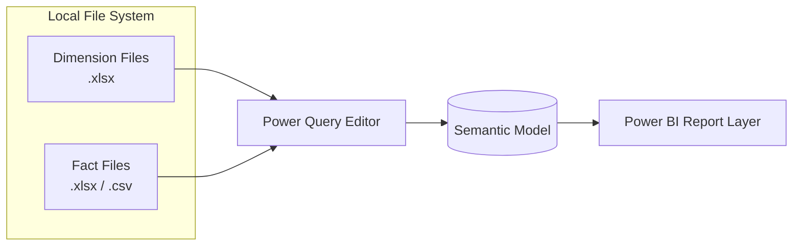

# Data Sources
## Credit Card Portfolio Analytics & Risk Intelligence

| | |
|---|---|
| **Document Type** | Data Sources & Ingestion Specification |
| **Version** | 1.1 |
| **Related Documents** | [Data Dictionary.md](./03_Data_Dictionary.md), [Data Lineage.md](./16_Data_Lineage.md), [Power Query Transformations.md](./08_Power_Query_Transformations.md), [Technical Design.md](./09_Technical_Design.md) |

---

## 1. Scope

This document inventories every source file consumed by the semantic model, the business process each represents, its ingestion method, and its refresh characteristics. It is the reference point for anyone repointing, refreshing, or replacing a source in the `.pbix` model, and the starting node of the lineage trail formalized in [Data Lineage.md](./16_Data_Lineage.md).

---

## 2. Source File Inventory

| # | File | Format | Business Process Represented | Target Table | Row Count |
|---|---|---|---|---|---:|
| 1 | `DimCustomer.csv.xlsx` | Excel Workbook | Customer master / KYC | DimCustomer | 1,000 |
| 2 | `DimCard.csv.xlsx` | Excel Workbook | Card product catalog | DimCard | 20 |
| 3 | `DimMerchant.csv.xlsx` | Excel Workbook | Merchant network master | DimMerchant | 500 |
| 4 | `DimCategory.csv.xlsx` | Excel Workbook | Spend category taxonomy | DimCategory | 12 |
| 5 | `DimDate.csv.xlsx` | Excel Workbook | Calendar / date master | DimDate | 1,096 |
| 6 | `FactTransactions.csv.xlsx` | Excel Workbook | Card spend / transaction events | FactTransactions | 50,000 |
| 7 | `FactPayments.csv` | CSV | Billing and repayment events | FactPayments | 24,682 |
| 8 | `FactUtilization.csv.xlsx` | Excel Workbook | Monthly credit utilization snapshots | FactUtilization | 39,780 |
| 9 | `FactRiskProfile.csv.xlsx` | Excel Workbook | Monthly risk assessment scoring | FactRiskProfile | 36,000 |

**Total ingested rows:** ~150,408 across 9 sources — consistent with the "150,000+ financial records" scope stated in the project README.

---

## 3. Ingestion Architecture

- **Connection type:** `Excel.Workbook()` for `.xlsx` sources; `Csv.Document()` for `FactPayments.csv`.
- **Storage mode:** Import (data is loaded into the Power BI in-memory VertiPaq engine at refresh time — not queried live). See [Technical Design.md §3](./09_Technical_Design.md) for the full Import-vs-DirectQuery decision record.
- **Load method:** All 9 source files reside in a single local project folder alongside the `.pbix` file, referenced by absolute or relative local file path in each query's `Source` step.

## 4. Source Format Rationale

| Source Type | Why This Format | Engineering Trade-off |
|---|---|---|
| Excel Workbook (`.xlsx`) | Preserves native data types (dates, decimals) more reliably than raw CSV on import, reducing type-conversion steps in Power Query | Larger file size and slightly slower parse than CSV at equivalent row counts; acceptable given the dimension tables and most fact tables in this model are well under 100K rows |
| CSV (`FactPayments`) | Lightweight, high-row-count fact table; CSV avoids Excel row-limit and file-size overhead for the largest single extract format used | Loses native typing — every column must be explicitly typed in Power Query rather than inherited from the source, which is why `FactPayments` receives the same explicit `Changed Type` treatment as every other table (see [Power Query Transformations.md §4.6](./08_Power_Query_Transformations.md)) |

> **Engineering Note:** Mixing source formats (`.xlsx` and `.csv`) within one model is a reasonable, common pattern when sources originate from different upstream systems or extract processes. What matters for model integrity is that every table receives the same rigor of explicit typing regardless of source format — see the standard transformation steps in [Power Query Transformations.md §3](./08_Power_Query_Transformations.md).

## 5. Refresh Model (Current State)

| Aspect | Current Implementation |
|---|---|
| Refresh trigger | Manual, on-demand ("Refresh" in Power BI Desktop) |
| Refresh frequency | Ad hoc / project milestone basis (portfolio project — not a live production feed) |
| Gateway | None configured; sources are local files, not accessible to the Power BI Service without a Personal or On-premises Data Gateway |
| Incremental refresh | Not configured (see [Project Roadmap.md](./12_Project_Roadmap.md) for planned adoption) |

> **Operational Note:** Because refresh is manual and full (not incremental), every refresh reprocesses all ~150,000 rows across all 9 tables. This is acceptable at current volume but is the primary reason Incremental Refresh is flagged as a near-term roadmap item rather than a nice-to-have — see [Project Roadmap.md §3](./12_Project_Roadmap.md) and [Performance Optimization.md §6](./10_Performance_Optimization.md).

> **Known Constraint:** Source file paths are currently hardcoded to a local development machine. Before this model is published to a shared workspace or distributed externally, the `Source` step of every query must be parameterized (see [Technical Design.md §6](./09_Technical_Design.md)) and the publishing steps in [Deployment Guide.md](./18_Deployment_Guide.md) followed.

## 6. Recommended Production Data Sources (Target State)

For a production deployment, each flat-file source in this table maps to a corresponding operational system of record:

| Current Extract | Recommended Production Source | Migration Consideration |
|---|---|---|
| DimCustomer | Core banking / CRM customer master | Requires PII handling and access-control review before direct connection |
| DimCard | Card product management system | Typically low-volume, low-change-frequency — a strong first candidate for direct connection |
| DimMerchant / DimCategory | Payment network / merchant acquiring platform | May require a merchant-category mapping service if the acquiring platform's taxonomy differs from the current `DimCategory` |
| DimDate | Generated via a Power Query or DAX date table function (no external source required) | No migration needed; recommend converting to a DAX `CALENDAR()`-based table for self-maintenance |
| FactTransactions | Card transaction processing / switch system | Highest-volume table; primary candidate for Incremental Refresh once connected |
| FactPayments | Billing and collections system | Second-highest volume; also a strong Incremental Refresh candidate |
| FactUtilization | Credit risk management system (derived/calculated) | Monthly grain reduces urgency for incremental refresh relative to the transaction-grain facts |
| FactRiskProfile | Risk scoring engine / bureau integration | Any migration should preserve the `RiskCategory` remediation logic documented in [Power Query Transformations.md §5.1](./08_Power_Query_Transformations.md), or replicate the fix upstream in the source system itself |

This migration path — from local flat files to governed, connected sources such as **Azure SQL** or **Microsoft Fabric** — is tracked as a roadmap item; see [Project Roadmap.md](./12_Project_Roadmap.md).

## 7. Data Quality Notes by Source

| Source | Known Issue at Ingestion | Resolution | Detail |
|---|---|---|---|
| FactRiskProfile | `RiskCategory` contained the inconsistent label `"Aggressive User"` instead of a `Critical Risk` naming convention | Corrected once in Power Query via `Table.ReplaceValue` | [Power Query Transformations.md](./08_Power_Query_Transformations.md) |
| FactPayments | A payment-to-spend ratio was observed exceeding 100% for a subset of records during validation | Traced to source and corrected before the measure was finalized | [Power Query Transformations.md](./08_Power_Query_Transformations.md) |

## 8. Source Validation Checklist

> **Best Practice:** Before trusting a refreshed model, confirm the following against each source — see the full acceptance checklist in [Testing & Validation.md](./17_Testing_Validation.md):

- [ ] Row counts match expected ranges per Section 2 (a large unexplained delta suggests a source extract problem, not a model problem)
- [ ] No new, unmapped categorical values appear in closed-set columns (`RiskCategory`, `PaymentStatus`, `CardCategory`, etc.)
- [ ] Key columns (`CustomerID`, `CardID`, `MerchantID`, `CategoryID`, `DateID`) contain no unexpected blanks or orphaned foreign keys
- [ ] `FactPayments[PaymentAmount]` does not exceed `FactPayments[BillAmount]` by an implausible margin (see the anomaly precedent in Section 7)

## 9. Related Documents

- [Data Dictionary.md](./03_Data_Dictionary.md) — column-level schema for every table listed here
- [Data Lineage.md](./16_Data_Lineage.md) — end-to-end lineage from these sources through to dashboards
- [Power Query Transformations.md](./08_Power_Query_Transformations.md) — transformation logic applied to each source
- [Technical Design.md](./09_Technical_Design.md) — parameterization and portability requirements
- [Deployment Guide.md](./18_Deployment_Guide.md) — steps for repointing sources on a new machine

---

## Version History

| Version | Date | Author | Change Description |
|---|---|---|---|
| 1.0 | 2025-12 | Alan Binu | Initial data source inventory |
| 1.1 | 2025-12 | Alan Binu | Added refresh-flow diagram, source validation checklist, migration considerations per source, and cross-references to the new Data Lineage and Deployment Guide documents |
