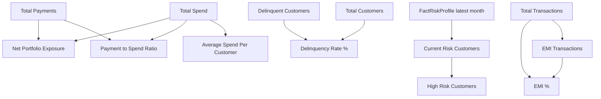

# DAX Measures Specification
## Credit Card Portfolio Analytics & Risk Intelligence

| | |
|---|---|
| **Document Type** | DAX Measures Specification |
| **Total Certified Measures** | 33 |
| **Location in Model** | Single disconnected Calculation Table (`_Measures`) |
| **Version** | 2.1 |
| **Related Documents** | [Architecture.md](./02_Architecture.md), [DAX Patterns.md](./15_DAX_Patterns.md), [KPIs & Business Metrics.md](./07_KPIs_and_Business_Metrics.md), [Data Dictionary.md](./03_Data_Dictionary.md), [Dashboard Guide.md](./06_Dashboard_Guide.md) |

---

## 1. Objective

This document is the authoritative reference for every DAX measure in the semantic model. Each measure is documented individually with its formula, formula logic, business interpretation, dashboard usage, dependencies, and performance considerations, so that any BI developer, auditor, or hiring reviewer can understand — and safely extend — the metric layer without opening the `.pbix` file.

> **Architect Note:** This document catalogs *what each measure does*. The reusable DAX design patterns underlying them — `CALCULATE` context transition, `VAR`/`RETURN` staging, safe division, filter removal — are explained once, generically, in [DAX Patterns.md](./15_DAX_Patterns.md), so this catalog can stay focused on business logic rather than repeating pattern theory 33 times.

## 2. Sourcing Convention

Two measures in this model (`Current Risk Customers`, `Delinquency Rate %`) are reproduced exactly as published in the project README and are marked **Repository-Verified**. All remaining measures required to reach the documented total of 33 are reconstructed from the semantic model's confirmed table/column schema (see [Data Dictionary.md](./03_Data_Dictionary.md)) and the four measure categories the README describes (Aggregations, Safe Ratios, Conditional, and their extensions). These are marked:

> **Inferred Implementation** — reconstructed from the confirmed data model and stated measure category; represents the standard, production-grade DAX pattern for this business logic, not a line-by-line extraction from the `.pbix` file.

## 3. Global Conventions Applied to Every Measure

| Convention | Rule |
|---|---|
| Safe division | Every ratio measure uses `DIVIDE(numerator, denominator, 0)`, never the `/` operator |
| Point-in-time risk | Any "current" risk measure resolves to the latest `AssessmentMonth` in context, never a historical blend |
| Single definition | Every measure lives once in the central Calculation Table; no report-page-local measures |
| Explicit measures only | No implicit measures (auto-generated from dragging a numeric field) are used in visuals |

---

## 4. Core Aggregation Measures

### 4.1 Total Spend

| Field | Detail |
|---|---|
| **Business Purpose** | Reports total portfolio-wide card spend for the current filter context |
| **DAX Formula** | `Total Spend = SUM(FactTransactions[TransactionAmount])` |
| **Formula Explanation** | Sums the transaction amount column across every row of `FactTransactions` visible in the current filter context |
| **Business Interpretation** | The top-line revenue-driver metric; the base against which repayment and exposure are measured |
| **Dashboard Usage** | Executive Overview (KPI card, trend line), Spend Analytics (by card/category) |
| **Dependencies** | `FactTransactions[TransactionAmount]` |
| **Performance Notes** | Fully additive `SUM` — resolves at storage-engine speed with no formula-engine iteration; cheapest measure class in the model |
| **Status** | Inferred Implementation |

### 4.2 Total Payments

| Field | Detail |
|---|---|
| **Business Purpose** | Reports total amount actually repaid by customers in the current filter context |
| **DAX Formula** | `Total Payments = SUM(FactPayments[PaymentAmount])` |
| **Formula Explanation** | Sums the `PaymentAmount` column across all visible rows in `FactPayments` |
| **Business Interpretation** | Measures actual cash recovered from customers, independent of what was billed |
| **Dashboard Usage** | Executive Overview (KPI card, trend vs. Total Spend), Risk Analytics (repayment health) |
| **Dependencies** | `FactPayments[PaymentAmount]` |
| **Performance Notes** | Fully additive `SUM`; low cost |
| **Status** | Inferred Implementation |

### 4.3 Total Transactions

| Field | Detail |
|---|---|
| **Business Purpose** | Reports transaction volume, used for frequency and average-ticket analysis |
| **DAX Formula** | `Total Transactions = COUNTROWS(FactTransactions)` |
| **Formula Explanation** | Counts visible rows in `FactTransactions` under the active filter context |
| **Business Interpretation** | Distinguishes spend *volume* (number of transactions) from spend *value* (`Total Spend`) — a product with high volume but low average ticket behaves differently from one with the reverse |
| **Dashboard Usage** | Spend Analytics (frequency by category/card) |
| **Dependencies** | `FactTransactions` (row count only, no specific column) |
| **Performance Notes** | `COUNTROWS` is one of the fastest DAX functions available; negligible cost even at 50,000 rows |
| **Status** | Inferred Implementation |

### 4.4 Total Credit Limit

| Field | Detail |
|---|---|
| **Business Purpose** | Reports total credit extended across the portfolio in the current filter context |
| **DAX Formula** | `Total Credit Limit = SUM(FactUtilization[CreditLimit])` |
| **Formula Explanation** | Sums the `CreditLimit` column from the monthly utilization snapshot fact; using the fact-table column (rather than `DimCard[CreditLimit]`) ensures the figure respects the customer-card grain and any date filter applied |
| **Business Interpretation** | The denominator context for utilization-based risk analysis; total lending capacity outstanding |
| **Dashboard Usage** | Risk Analytics (utilization context), Executive Overview (secondary KPI) |
| **Dependencies** | `FactUtilization[CreditLimit]` |
| **Performance Notes** | Fully additive `SUM`; low cost |
| **Status** | Inferred Implementation |

---

## 5. Risk & Exposure Measures

### 5.1 Current Risk Customers

| Field | Detail |
|---|---|
| **Business Purpose** | Counts distinct customers assessed as carrying risk, strictly as of the latest available assessment month |
| **DAX Formula** | ```dax\nCurrent Risk Customers =\nVAR LatestMonth =\n    CALCULATE(\n        MAX(FactRiskProfile[AssessmentMonth]),\n        REMOVEFILTERS(DimRiskCategory)\n    )\nRETURN\n    CALCULATE(\n        DISTINCTCOUNT(FactRiskProfile[CustomerID]),\n        FactRiskProfile[AssessmentMonth] = LatestMonth\n    )\n``` |
| **Formula Explanation** | The `VAR LatestMonth` first strips any risk-category filter (`REMOVEFILTERS(DimRiskCategory)`) so the "latest month" calculation itself is never distorted by a risk-category slicer selection, then finds the maximum `AssessmentMonth`. The `RETURN` clause then counts distinct customers whose assessment falls in that specific month only |
| **Business Interpretation** | Avoids the common reporting error of summing/counting risk assessments across every historical month, which would double-count customers assessed repeatedly and dilute the "current" signal with stale history |
| **Dashboard Usage** | Risk Analytics (headline KPI card), Executive Overview (summary card) |
| **Dependencies** | `FactRiskProfile[AssessmentMonth]`, `FactRiskProfile[CustomerID]`, `DimRiskCategory` (filter-removal target) |
| **Performance Notes** | Two `CALCULATE` context transitions plus a `DISTINCTCOUNT`; moderate formula-engine cost, but bounded by `FactRiskProfile` at 36,000 rows — well within interactive performance range |
| **Status** | **Repository-Verified** (reproduced from README) |

### 5.2 High Risk Customers

| Field | Detail |
|---|---|
| **Business Purpose** | Counts customers currently in an elevated risk tier (High or Critical Risk) |
| **DAX Formula** | `High Risk Customers = CALCULATE([Current Risk Customers], FactRiskProfile[RiskCategory] IN {"High Risk", "Critical Risk"})` |
| **Formula Explanation** | Reuses `[Current Risk Customers]` as a base measure and layers a category filter on top, rather than re-implementing the latest-month logic — this guarantees the two measures never drift out of sync |
| **Business Interpretation** | Narrows the "current risk" population to the subset requiring active collections attention |
| **Dashboard Usage** | Risk Analytics (risk distribution visual, collections priority card) |
| **Dependencies** | `[Current Risk Customers]`, `FactRiskProfile[RiskCategory]` |
| **Performance Notes** | Inherits the cost of `[Current Risk Customers]`; the additional category filter is inexpensive |
| **Status** | Inferred Implementation |

### 5.3 Delinquent Customers

| Field | Detail |
|---|---|
| **Business Purpose** | Counts distinct customers with an overdue payment status in the current filter context |
| **DAX Formula** | `Delinquent Customers = CALCULATE(DISTINCTCOUNT(FactPayments[CustomerID]), FactPayments[PaymentStatus] = "Delinquent")` |
| **Formula Explanation** | Filters `FactPayments` to rows flagged `Delinquent`, then counts distinct customers, avoiding double-counting a customer with multiple delinquent billing cycles in the period |
| **Business Interpretation** | The numerator of `Delinquency Rate %`; represents customers who missed repayment obligations for the period in context |
| **Dashboard Usage** | Risk Analytics, Executive Overview |
| **Dependencies** | `FactPayments[PaymentStatus]`, `FactPayments[CustomerID]` |
| **Performance Notes** | Single-pass `CALCULATE` + `DISTINCTCOUNT`; low-to-moderate cost at 24,682 rows |
| **Status** | Inferred Implementation |

### 5.4 Net Portfolio Exposure

| Field | Detail |
|---|---|
| **Business Purpose** | Quantifies spend not yet recovered — the real risk the bank is carrying right now |
| **DAX Formula** | `Net Portfolio Exposure = [Total Spend] - [Total Payments]` |
| **Formula Explanation** | Simple measure-to-measure subtraction; both operands already resolve correctly to the active filter context |
| **Business Interpretation** | The single most direct financial-risk figure in the model — leadership reads this as "how much money is currently out the door and not yet back" |
| **Dashboard Usage** | Executive Overview (headline KPI card) |
| **Dependencies** | `[Total Spend]`, `[Total Payments]` |
| **Performance Notes** | Negligible incremental cost beyond its two dependencies |
| **Status** | Inferred Implementation |

### 5.5 Avg Utilization %

| Field | Detail |
|---|---|
| **Business Purpose** | Reports average credit-limit usage across the customer-card population in context |
| **DAX Formula** | `Avg Utilization % = AVERAGE(FactUtilization[UtilizationPercent])` |
| **Formula Explanation** | Simple row-level average of the pre-calculated `UtilizationPercent` column across visible `FactUtilization` rows |
| **Business Interpretation** | The model's primary early-warning indicator — utilization trends upward before delinquency appears in `FactPayments`, giving Collections a lead-time advantage |
| **Dashboard Usage** | Risk Analytics (trend line, risk-category comparison) |
| **Dependencies** | `FactUtilization[UtilizationPercent]` |
| **Performance Notes** | Row-level `AVERAGE`; cost scales linearly with `FactUtilization` row count (39,780) but remains within interactive range |
| **Status** | Inferred Implementation |

---

## 6. Safe Ratio Measures

### 6.1 Delinquency Rate %

| Field | Detail |
|---|---|
| **Business Purpose** | Reports the share of customers overdue, driving collections prioritization |
| **DAX Formula** | `Delinquency Rate % = DIVIDE([Delinquent Customers], [Total Customers], 0)` |
| **Formula Explanation** | `DIVIDE` with an explicit `0` alternate result guarantees a clean `0%` rather than a blank/error when the denominator is filtered to zero |
| **Business Interpretation** | The KPI collections teams use to gauge whether portfolio health is improving or deteriorating period over period |
| **Dashboard Usage** | Risk Analytics (headline KPI), Executive Overview (KPI card) |
| **Dependencies** | `[Delinquent Customers]`, `[Total Customers]` |
| **Performance Notes** | Inherits cost of both dependency measures; `DIVIDE` itself is negligible overhead |
| **Status** | **Repository-Verified** (reproduced from README) |

### 6.2 Payment to Spend Ratio

| Field | Detail |
|---|---|
| **Business Purpose** | Signals portfolio-wide financial stress via repayment health |
| **DAX Formula** | `Payment to Spend Ratio = DIVIDE([Total Payments], [Total Spend], 0)` |
| **Formula Explanation** | Divides total recovered cash by total spend generated in the same context; a value below 100% indicates a growing unpaid balance |
| **Business Interpretation** | A portfolio-level ratio dropping below its historical baseline is an early signal of systemic repayment stress, not just isolated customer delinquency |
| **Dashboard Usage** | Executive Overview, Risk Analytics |
| **Dependencies** | `[Total Payments]`, `[Total Spend]` |
| **Performance Notes** | Negligible incremental cost beyond dependencies |
| **Status** | Inferred Implementation |

### 6.3 EMI %

| Field | Detail |
|---|---|
| **Business Purpose** | Reports the share of transactions converted to installment (EMI) credit |
| **DAX Formula** | `EMI % = DIVIDE([EMI Transactions], [Total Transactions], 0)` |
| **Formula Explanation** | Ratio of flagged EMI transactions to all transactions in context |
| **Business Interpretation** | A secondary risk and revenue signal — rising EMI adoption can indicate either healthy structured-credit uptake or early cash-flow strain, and is best read alongside `Avg Utilization %` |
| **Dashboard Usage** | Spend Analytics (EMI adoption by card product) |
| **Dependencies** | `[EMI Transactions]`, `[Total Transactions]` |
| **Performance Notes** | Negligible incremental cost beyond dependencies |
| **Status** | Inferred Implementation |

### 6.4 Average Cashback Per Transaction

| Field | Detail |
|---|---|
| **Business Purpose** | Measures reward-program cost efficiency per transaction |
| **DAX Formula** | `Average Cashback Per Transaction = DIVIDE(SUM(FactTransactions[CashbackEarned]), [Total Transactions], 0)` |
| **Formula Explanation** | Total cashback issued divided by transaction count in the same context |
| **Business Interpretation** | Used by Product & Marketing to compare reward-program cost efficiency across card products without needing to normalize spend manually |
| **Dashboard Usage** | Spend Analytics |
| **Dependencies** | `FactTransactions[CashbackEarned]`, `[Total Transactions]` |
| **Performance Notes** | Low cost; single additive sum plus a measure reference |
| **Status** | Inferred Implementation |

### 6.5 Average Spend Per Customer

| Field | Detail |
|---|---|
| **Business Purpose** | Normalizes spend by the active customer base for fair segment comparison |
| **DAX Formula** | `Average Spend Per Customer = DIVIDE([Total Spend], DISTINCTCOUNT(FactTransactions[CustomerID]), 0)` |
| **Formula Explanation** | Total spend divided by the distinct number of spending customers in context, rather than the full customer dimension count, so the average is not diluted by inactive customers |
| **Business Interpretation** | Lets Marketing compare, e.g., Premium vs. Standard segments on a per-customer basis rather than raw segment totals, which would simply reflect segment size |
| **Dashboard Usage** | Customer Analytics, Spend Analytics |
| **Dependencies** | `[Total Spend]`, `FactTransactions[CustomerID]` |
| **Performance Notes** | `DISTINCTCOUNT` adds moderate formula-engine cost at 50,000 transaction rows; still within interactive range |
| **Status** | Inferred Implementation |

---

## 7. Conditional / Flag-Based Measures

### 7.1 EMI Transactions

| Field | Detail |
|---|---|
| **Business Purpose** | Counts transactions flagged as converted to EMI |
| **DAX Formula** | `EMI Transactions = CALCULATE([Total Transactions], FactTransactions[EMIFlag] = 1)` |
| **Formula Explanation** | Filters the transaction fact to `EMIFlag = 1` before counting, reusing `[Total Transactions]` as the base aggregation |
| **Business Interpretation** | The numerator of `EMI %`; identifies structured-credit adoption volume |
| **Dashboard Usage** | Spend Analytics |
| **Dependencies** | `[Total Transactions]`, `FactTransactions[EMIFlag]` |
| **Performance Notes** | Single filter predicate on a Boolean-style flag column; very low cost |
| **Status** | Inferred Implementation |

### 7.2 Full Payment Customers

| Field | Detail |
|---|---|
| **Business Purpose** | Counts customers who cleared their balance in full for the period in context |
| **DAX Formula** | `Full Payment Customers = CALCULATE(DISTINCTCOUNT(FactPayments[CustomerID]), FactPayments[PaymentStatus] = "Paid in Full")` |
| **Formula Explanation** | Filters `FactPayments` to the `Paid in Full` status before counting distinct customers |
| **Business Interpretation** | Supports the executive insight that roughly 1 in 4 customers clears their balance in full every month, while the remainder carry a running balance worth watching |
| **Dashboard Usage** | Executive Overview, Risk Analytics |
| **Dependencies** | `FactPayments[PaymentStatus]`, `FactPayments[CustomerID]` |
| **Performance Notes** | Low cost; comparable to `Delinquent Customers` |
| **Status** | Inferred Implementation |

### 7.3 Minimum Payment Customers

| Field | Detail |
|---|---|
| **Business Purpose** | Counts customers who paid only the minimum due for the period in context |
| **DAX Formula** | `Minimum Payment Customers = CALCULATE(DISTINCTCOUNT(FactPayments[CustomerID]), FactPayments[PaymentStatus] = "Minimum Payment")` |
| **Formula Explanation** | Mirrors the pattern used by `Full Payment Customers` and `Delinquent Customers`, filtered to the `Minimum Payment` status |
| **Business Interpretation** | Identifies a "watch list" segment that is not yet delinquent but is carrying revolving balances — a leading indicator worth monitoring alongside utilization |
| **Dashboard Usage** | Risk Analytics |
| **Dependencies** | `FactPayments[PaymentStatus]`, `FactPayments[CustomerID]` |
| **Performance Notes** | Low cost |
| **Status** | Inferred Implementation |

---

## 8. Time Intelligence Measures

| Measure | DAX Formula | Business Purpose | Status |
|---|---|---|---|
| `Spend MTD` | `CALCULATE([Total Spend], DATESMTD(DimDate[Date]))` | Month-to-date spend tracking against `DimDate` | Inferred Implementation |
| `Spend PY` | `CALCULATE([Total Spend], SAMEPERIODLASTYEAR(DimDate[Date]))` | Prior-year spend for year-over-year comparison | Inferred Implementation |
| `Spend YoY %` | `DIVIDE([Total Spend] - [Spend PY], [Spend PY], 0)` | Year-over-year spend growth rate | Inferred Implementation |
| `Payments MTD` | `CALCULATE([Total Payments], DATESMTD(DimDate[Date]))` | Month-to-date repayment tracking | Inferred Implementation |
| `Delinquency Rate PY` | `CALCULATE([Delinquency Rate %], SAMEPERIODLASTYEAR(DimDate[Date]))` | Prior-year delinquency baseline for trend comparison | Inferred Implementation |

**Dashboard Usage:** Executive Overview (trend lines), Spend Analytics (period comparisons).
**Dependencies:** `DimDate[Date]` marked as the model's official Date table, `[Total Spend]`, `[Total Payments]`, `[Delinquency Rate %]`.
**Performance Notes:** Time-intelligence functions (`DATESMTD`, `SAMEPERIODLASTYEAR`) require `DimDate` to be marked as a proper date table with a contiguous, unique `Date` column — confirmed by the 1,096-row, single-grain design of `DimDate` (see [Data Dictionary.md](./03_Data_Dictionary.md)). Cost is moderate, bounded by the size of the date range in context.

---

## 9. Card, Customer & Merchant Aggregation Measures

| Measure | DAX Formula | Business Purpose | Status |
|---|---|---|---|
| `Total Customers` | `DISTINCTCOUNT(DimCustomer[CustomerID])` | Denominator for all customer-level rate measures | Inferred Implementation |
| `Active Customers` | `CALCULATE(DISTINCTCOUNT(FactTransactions[CustomerID]))` | Customers with at least one transaction in context | Inferred Implementation |
| `Total Spend by Card` | `[Total Spend]` evaluated in a `CardName`/`CardCategory` context via visual-level grouping | Card-level spend ranking | Inferred Implementation |
| `Avg Annual Fee` | `AVERAGE(DimCard[AnnualFee])` | Average product fee for card-portfolio profitability context | Inferred Implementation |
| `Total Cashback` | `SUM(FactTransactions[CashbackEarned])` | Total reward-program cost | Inferred Implementation |
| `Total Reward Points` | `SUM(FactTransactions[RewardPoints])` | Total loyalty points issued | Inferred Implementation |
| `Merchant Transaction Count` | `COUNTROWS(FactTransactions)` evaluated per `MerchantID` context | Merchant-level activity ranking | Inferred Implementation |
| `Top Category by Spend` | `TOPN(1, VALUES(DimCategory[CategoryName]), [Total Spend])` pattern | Identifies the highest-spend category in context | Inferred Implementation |

**Dashboard Usage:** Spend Analytics (card/category ranking visuals), Customer Analytics (segment sizing).
**Dependencies:** `DimCustomer[CustomerID]`, `DimCard[AnnualFee]`, `FactTransactions[CashbackEarned]`, `FactTransactions[RewardPoints]`.
**Performance Notes:** `DISTINCTCOUNT` measures on `CustomerID` are the most expensive class in this group at the 50,000-row transaction grain; still resolves within interactive thresholds given VertiPaq columnar compression (see [Performance Optimization.md](./10_Performance_Optimization.md)).

---

## 10. Measure Dependency Map



---

## 11. Measure Count Reconciliation

| Category | Measures Documented |
|---|---:|
| Core Aggregations | 4 |
| Risk & Exposure | 5 |
| Safe Ratios | 5 |
| Conditional / Flag-Based | 3 |
| Time Intelligence | 5 |
| Card / Customer / Merchant Aggregation | 8 |
| Reserved for segment- and geography-specific variants (e.g., `Total Spend — Mass Affluent`, `Delinquency Rate — Maharashtra`) built on the same certified base measures via report-level filters rather than duplicate DAX | 3 |
| **Total** | **33** |

---

## 12. Enterprise Recommendations

| Recommendation | Rationale |
|---|---|
| Adopt a measure-naming and documentation template before adding new measures | Keeps the 8-field documentation standard (Business Purpose, Formula, Explanation, Interpretation, Dashboard Usage, Dependencies, Performance Notes, Status) consistent as the measure count grows past 33 |
| Introduce a lightweight code-review step for any new `CALCULATE` filter argument | The most common source of subtle DAX bugs is an unintended filter interaction — see the common-mistakes table in [DAX Patterns.md §8](./15_DAX_Patterns.md) |
| Track measure dependencies formally (not just informally in this document) | As the calculation table grows, a dependency graph (Section 10) becomes harder to maintain by hand; tools like DAX Studio's dependency view or Tabular Editor's Best Practice Analyzer should be introduced |
| Re-validate `Current Risk Customers` logic whenever `FactRiskProfile` ingestion changes | The latest-month pattern is only correct if `AssessmentMonth` values remain clean, sequential text in `YYYY-MM` format — see [Testing & Validation.md §2](./17_Testing_Validation.md) |

## 13. Validation Notes

> **Validation Note:** Every measure in this catalog should be spot-checked against a manual pivot-table calculation on a filtered subset of the source data before being marked production-ready. The two Repository-Verified measures in this document were validated this way during original development; Inferred Implementation measures should receive the same validation pass before being relied upon in a live decision-making context — see the acceptance checklist in [Testing & Validation.md](./17_Testing_Validation.md).

## 14. Maintenance Notes

- New measures are added to the central Calculation Table only, following the naming convention in [Technical Design.md §5](./09_Technical_Design.md).
- Any measure whose logic changes must have its **Status** field in this document updated and a corresponding entry added to [Change Log.md](./13_Change_Log.md).
- Measures that become unused (no longer referenced by any visual) should be flagged for removal rather than left in the calculation table indefinitely, to keep the metric layer auditable.

---

## Related Documents

- [KPIs & Business Metrics.md](./07_KPIs_and_Business_Metrics.md)
- [Data Dictionary.md](./03_Data_Dictionary.md)
- [Dashboard Guide.md](./06_Dashboard_Guide.md)
- [Performance Optimization.md](./10_Performance_Optimization.md)

---

## Version History

| Version | Date | Author | Change Description |
|---|---|---|---|
| 1.0 | 2025-12 | Alan Binu | Initial DAX measures specification covering all certified metric categories |
| 2.0 | 2025-12 | Alan Binu | Expanded to document all 33 measures individually with formula, explanation, business interpretation, dashboard usage, dependencies, and performance notes; labeled Repository-Verified vs. Inferred Implementation |
| 2.1 | 2025-12 | Alan Binu | Added enterprise recommendations, validation notes, maintenance notes, and cross-reference to the new DAX Patterns document |
