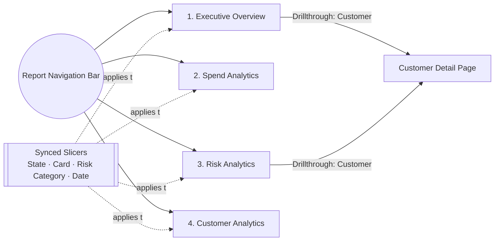
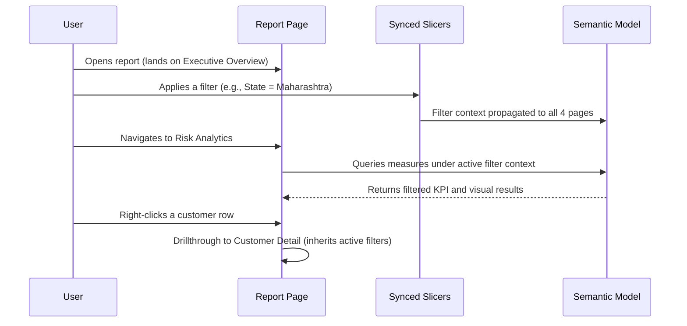

# Dashboard Guide
## Credit Card Portfolio Analytics & Risk Intelligence

| | |
|---|---|
| **Document Type** | End-User & Analyst Dashboard Guide |
| **Report Pages** | 4 |
| **Version** | 2.1 |
| **Related Documents** | [KPIs & Business Metrics.md](./07_KPIs_and_Business_Metrics.md), [DAX Measures.md](./05_DAX_Measures.md), [Business Requirements.md](./01_Business_Requirements.md), [Testing & Validation.md](./17_Testing_Validation.md) |

---

## 1. Overview

This guide is the operating manual for the four Power BI report pages in `Credit Card Analytics Dashboard.pbix`. For each page it documents purpose, KPIs, visuals, filters, navigation, drillthrough behavior, the business questions it answers, the executive insights it surfaces, a recommended analyst workflow, and recommended actions for the owning business function.

---

## 2. Global Navigation Model

| Global Feature | Behavior |
|---|---|
| **Synced slicers** | State, Card, Risk Category, and Date filters are synchronized across all four pages via Power BI's *Sync Slicers* pane — a filter set on one page persists when navigating to another |
| **One-click navigation** | A navigation bar/button set on every page allows direct movement between the four pages without resetting active filters |
| **Cross-highlighting** | Selecting a data point on one visual cross-highlights related visuals on the same page (default Power BI interaction) |
| **Drillthrough** | Right-click (or a dedicated button) on a customer-level data point routes to a Customer Detail drillthrough view carrying the selected `CustomerID` as filter context |
| **Tooltips** | Hovering KPI cards surfaces the underlying DAX-driven trend or comparison value as a tooltip, without requiring a page change |

---

## 2A. Report Interaction Lifecycle

> **Implementation Note:** Because slicers are synced globally (Section 2), the filter context a user builds on one page is never lost when navigating — this is what makes the four-page structure feel like one cohesive analytical workspace rather than four disconnected reports.

---

## 3. Page 1 — Executive Overview

### 3.1 Purpose
A single-glance health check of the entire credit card portfolio, built for leadership who need a directional read — growing or shrinking, healthy or stressed — without interpreting transaction-level or risk-model detail.

### 3.2 KPIs Displayed

| KPI | Measure | Reference |
|---|---|---|
| Total Spend | `[Total Spend]` | [DAX Measures.md §4.1](./05_DAX_Measures.md) |
| Total Payments | `[Total Payments]` | [DAX Measures.md §4.2](./05_DAX_Measures.md) |
| Net Portfolio Exposure | `[Net Portfolio Exposure]` | [DAX Measures.md §5.4](./05_DAX_Measures.md) |
| Delinquency Rate % | `[Delinquency Rate %]` | [DAX Measures.md §6.1](./05_DAX_Measures.md) |
| Current Risk Customers | `[Current Risk Customers]` | [DAX Measures.md §5.1](./05_DAX_Measures.md) |
| Payment to Spend Ratio | `[Payment to Spend Ratio]` | [DAX Measures.md §6.2](./05_DAX_Measures.md) |

### 3.3 Visuals

| Visual | Type | Purpose |
|---|---|---|
| KPI Card Row | Multi-row card | At-a-glance top-line metrics |
| Spend vs. Payments Trend | Line chart over `DimDate[MonthName]` | Shows whether repayment is keeping pace with spend |
| Risk Category Snapshot | Donut/bar chart | High-level distribution of customers by `RiskCategory` |
| Portfolio Exposure Trend | Area/line chart | Tracks `Net Portfolio Exposure` over time |

### 3.4 Filters
State, Card, Risk Category, Date (all synced globally — see Section 2).

### 3.5 Navigation
Entry point of the report. Links out to Spend Analytics, Risk Analytics, and Customer Analytics via the navigation bar.

### 3.6 Drillthrough
None initiated from this page directly; this page is a landing/summary view. Users typically drill down by navigating to Risk Analytics or Spend Analytics for causal detail behind a KPI movement.

### 3.7 Business Questions Answered
- Is total spend growing or contracting period over period?
- Is the portfolio recovering what it lends, or is exposure widening?
- How many customers currently sit in an at-risk category?

### 3.8 Executive Insights
- Roughly 1 in 4 customers clears their balance in full every month — the other 3 carry a running balance worth watching.
- Net Portfolio Exposure is the figure leadership should track quarter over quarter as the single clearest signal of underlying portfolio risk.

### 3.9 Analyst Workflow
1. Start here to confirm whether the portfolio's headline numbers are within expected range.
2. If `Delinquency Rate %` or `Net Portfolio Exposure` has moved unexpectedly, navigate to **Risk Analytics** to identify which risk segment is driving the change.
3. If `Total Spend` has moved unexpectedly, navigate to **Spend Analytics** to identify which card product or category is driving the change.

### 3.10 Recommended Actions
- **Leadership:** Treat a sustained decline in `Payment to Spend Ratio` as an early portfolio-wide stress signal, not just a Collections issue.
- **Finance:** Use `Net Portfolio Exposure` trend as an input to provisioning and reserve discussions.

---

## 4. Page 2 — Spend Analytics

### 4.1 Purpose
Evaluates card-product performance for Product & Marketing — which cards drive spend volume, which drive EMI conversion, and which are most reward-cost-efficient.

### 4.2 KPIs Displayed

| KPI | Measure | Reference |
|---|---|---|
| Total Spend (by Card/Category) | `[Total Spend]` | [DAX Measures.md §4.1](./05_DAX_Measures.md) |
| Average Spend Per Customer | `[Average Spend Per Customer]` | [DAX Measures.md §6.5](./05_DAX_Measures.md) |
| EMI % | `[EMI %]` | [DAX Measures.md §6.3](./05_DAX_Measures.md) |
| Average Cashback Per Transaction | `[Average Cashback Per Transaction]` | [DAX Measures.md §6.4](./05_DAX_Measures.md) |
| Total Transactions | `[Total Transactions]` | [DAX Measures.md §4.3](./05_DAX_Measures.md) |

### 4.3 Visuals

| Visual | Type | Purpose |
|---|---|---|
| Spend by Card Category | Bar chart | Ranks `CardCategory` (Entry-level, Premium, Cashback, etc.) by total spend |
| Spend by Merchant Category | Treemap/bar | Breaks spend down by `DimCategory[CategoryName]` |
| EMI Adoption by Card | Bar chart | `[EMI %]` by `CardName` |
| Cashback Efficiency | Scatter/bar | `[Average Cashback Per Transaction]` by card product |
| Channel Split | Donut | `TransactionType` — Online vs. POS |

### 4.4 Filters
State, Card, Risk Category, Date (globally synced); page-local filter on `MerchantType` (Online/POS) and `CardNetwork`.

### 4.5 Navigation
Accessible from the navigation bar on every page; typically reached from Executive Overview when spend has moved unexpectedly.

### 4.6 Drillthrough
Right-click on a card product bar to drill through to a card-level detail view filtered to that `CardID`, showing transaction-level detail for that product.

### 4.7 Business Questions Answered
- Which card products actually earn their keep in terms of spend generated versus fees and reward cost?
- Is EMI adoption concentrated in specific products, and does that align with the intended product positioning?
- Which spend categories dominate portfolio volume?

### 4.8 Executive Insights
- Entry-level cards generate nearly half of total portfolio spend (₹89.85M) despite the lowest credit limits and fees — spend volume does not track product tier the way product strategy might assume.

### 4.9 Analyst Workflow
1. Identify top and bottom card products by `Total Spend`.
2. Cross-check `EMI %` and `Average Cashback Per Transaction` for the same products to understand cost-to-serve.
3. Cross-reference with **Risk Analytics** to confirm high-spend products aren't also disproportionately high-risk.

### 4.10 Recommended Actions
- **Product:** Reassess credit-limit and fee structures on Entry-level cards given their outsized share of portfolio spend.
- **Marketing:** Prioritize retention offers on products with high `Average Spend Per Customer` and low `EMI %` (indicating healthy, non-stressed usage).

---

## 5. Page 3 — Risk Analytics

### 5.1 Purpose
The operational dashboard for Risk & Collections. Built to answer who is at risk **right now**, not last quarter — the core motivation behind the `Current Risk Customers` measure design (see [DAX Measures.md §5.1](./05_DAX_Measures.md)).

### 5.2 KPIs Displayed

| KPI | Measure | Reference |
|---|---|---|
| Current Risk Customers | `[Current Risk Customers]` | [DAX Measures.md §5.1](./05_DAX_Measures.md) |
| High Risk Customers | `[High Risk Customers]` | [DAX Measures.md §5.2](./05_DAX_Measures.md) |
| Delinquency Rate % | `[Delinquency Rate %]` | [DAX Measures.md §6.1](./05_DAX_Measures.md) |
| Avg Utilization % | `[Avg Utilization %]` | [DAX Measures.md §5.5](./05_DAX_Measures.md) |
| Minimum Payment Customers | `[Minimum Payment Customers]` | [DAX Measures.md §7.3](./05_DAX_Measures.md) |

### 5.3 Visuals

| Visual | Type | Purpose |
|---|---|---|
| Risk Category Distribution | Stacked bar | Low / Medium / High / Critical Risk customer counts |
| Utilization vs. Risk Category | Clustered bar | Compares `Avg Utilization %` across risk tiers |
| Delinquency Trend | Line chart | `Delinquency Rate %` over `AssessmentMonth` |
| Risk by State/Segment | Map / matrix | Enabled by the model's single bidirectional relationship (`FactRiskProfile ↔ DimCustomer`) |
| Watch List Table | Table visual | Customers in `Minimum Payment` status, sortable by `UtilizationPercent` |

### 5.4 Filters
State, Card, Risk Category, Date (globally synced); page-local filter on `AssessmentMonth` for point-in-time risk review.

### 5.5 Navigation
Reachable from every page's navigation bar; the primary landing page for Collections' daily/weekly review cadence.

### 5.6 Drillthrough
Right-click on any customer row or risk-category segment to drill through to a Customer Risk Detail page showing that customer's full `FactRiskProfile` and `FactUtilization` history alongside their payment record.

### 5.7 Business Questions Answered
- Which customers are at risk as of the most recent assessment, not blended across history?
- Does rising utilization precede delinquency for this portfolio, and by how much lead time?
- Which states or segments concentrate the most risk?

### 5.8 Executive Insights
- High-risk and critical-risk customers both run utilization near 90% — a leading indicator visible in `FactUtilization` before it appears as a missed payment in `FactPayments`. This is the central "act before delinquency" use case the solution was built to support.

### 5.9 Analyst Workflow
1. Filter to the latest `AssessmentMonth` (default behavior of `[Current Risk Customers]`).
2. Sort the Watch List table by `Avg Utilization %` descending to prioritize outreach.
3. Cross-reference flagged customers against `Delinquent Customers` from the prior period to validate whether utilization is in fact predictive for this portfolio.
4. Drill through to individual customers for case-level collections planning.

### 5.10 Recommended Actions
- **Collections:** Prioritize outreach to customers crossing the ~90% utilization threshold before their `PaymentStatus` deteriorates, rather than waiting for a missed payment.
- **Risk Management:** Periodically validate whether the `UtilizationPercent` threshold used for prioritization still predicts delinquency as the portfolio composition shifts.

---

## 6. Page 4 — Customer Analytics

### 6.1 Purpose
Profiles the customer base along value, geography, and demographic dimensions to support Segmentation & Retention strategy.

### 6.2 KPIs Displayed

| KPI | Measure | Reference |
|---|---|---|
| Total Customers | `[Total Customers]` | [DAX Measures.md §9](./05_DAX_Measures.md) |
| Active Customers | `[Active Customers]` | [DAX Measures.md §9](./05_DAX_Measures.md) |
| Average Spend Per Customer (by Segment) | `[Average Spend Per Customer]` | [DAX Measures.md §6.5](./05_DAX_Measures.md) |
| Customer Count by Segment | `DISTINCTCOUNT` over `DimCustomer[CustomerSegment]` context | [Data Dictionary.md](./03_Data_Dictionary.md) |

### 6.3 Visuals

| Visual | Type | Purpose |
|---|---|---|
| Segment Distribution | Donut chart | `CustomerSegment` share of total base |
| Geographic Distribution | Map (state-level) | Customer count by `State` |
| Demographic Breakdown | Bar/matrix | `Age`, `Occupation`, `Industry`, `EmploymentType` |
| Segment × State Matrix | Matrix visual | Cross-tabulation for targeted regional campaigns |

### 6.4 Filters
State, Card, Risk Category, Date (globally synced); page-local filter on `CustomerSegment`, `Industry`, and `EmploymentType`.

### 6.5 Navigation
Reachable from every page's navigation bar; typically the entry point for Marketing/Retention planning sessions.

### 6.6 Drillthrough
Right-click on a segment or state to drill through to a Customer List detail page filtered to that segment/state combination, exportable for campaign targeting.

### 6.7 Business Questions Answered
- Who are our customers, and which value segment do they belong to?
- Where are customers geographically concentrated?
- Which occupations/industries index highest for a given segment?

### 6.8 Executive Insights
- **Mass Affluent** customers form the largest segment at 42.3% of the base — the clearest target for retention spend.
- **Maharashtra** is the single largest state by customer count, well ahead of every other region.

### 6.9 Analyst Workflow
1. Identify the largest segments and states by customer count.
2. Cross-reference segment with `Average Spend Per Customer` (from Spend Analytics) to distinguish "large" segments from "valuable" segments.
3. Drill through to build a target list for a specific segment/state combination.

### 6.10 Recommended Actions
- **Retention Marketing:** Prioritize Mass Affluent customers for loyalty/retention investment given both their scale and the segment's typical growth trajectory toward Premium.
- **Regional Strategy:** Weight new product launches and regional campaigns toward Maharashtra given its outsized share of the customer base, while monitoring smaller states for emerging concentration.

---

## 7. Slicer Reference (Consolidated)

| Slicer | Field Source | Applies To | Sync Group |
|---|---|---|---|
| State | `DimCustomer[State]` | All 4 pages | Global |
| Card | `DimCard[CardName]` / `CardCategory` | All 4 pages | Global |
| Risk Category | `FactRiskProfile[RiskCategory]` | All 4 pages | Global |
| Date | `DimDate[Date]` / `[MonthName]` | Executive Overview, Spend Analytics, Risk Analytics | Global |
| Assessment Month | `FactRiskProfile[AssessmentMonth]` | Risk Analytics | Page-local |
| Customer Segment | `DimCustomer[CustomerSegment]` | Customer Analytics | Page-local |
| Merchant Type | `DimMerchant[MerchantType]` | Spend Analytics | Page-local |

---

## 8. Usage Notes for Report Consumers

- Filters set on any page persist across navigation; clear a slicer explicitly for a reset view.
- `Current Risk Customers` and related risk KPIs always reflect the **latest** assessment month present in the current filter context, not an average across the full date range selected.
- Ratio-based KPIs (`Delinquency Rate %`, `Payment to Spend Ratio`, `EMI %`) display `0`, not a blank or error, when a filter combination returns no underlying rows — this is intentional (see [DAX Measures.md, Section 3](./05_DAX_Measures.md)).
- Drillthrough pages inherit all filters active at the point of drillthrough, in addition to the specific data point clicked.

---

## 9. Known Constraints

| Constraint | Detail |
|---|---|
| No Row-Level Security | Every user with access to the `.pbix` currently sees the full portfolio across all states and segments — see [Technical Design.md §7](./09_Technical_Design.md) |
| Drillthrough pages are illustrative | The Customer Detail and Card Detail drillthrough views described in this guide follow standard Power BI drillthrough design; verify their exact configuration against the live `.pbix` before relying on this guide as an exhaustive UI reference |
| Static data horizon | All trend visuals are bounded by the ~3-year `DimDate` range in the current extract — see [Data Dictionary.md §7](./03_Data_Dictionary.md) |

## 10. Best Practices for Report Consumers

> **Best Practice:** Set the broadest filter first (e.g., State), then narrow (e.g., Card, then Risk Category) — this avoids momentarily empty visuals while multiple slicers are still being adjusted.

> **Best Practice:** When comparing a KPI across two periods, use the Date slicer rather than relying on a visual's default trailing window, to ensure the comparison is intentional rather than incidental.

> **Warning:** Selecting a very narrow filter combination (e.g., a single state *and* a single card *and* a single risk category) can return zero rows for some visuals. This is expected — the ratio measures in this model are designed to display `0`, not an error, under an empty context (see [DAX Measures.md §3](./05_DAX_Measures.md)) — but count-based KPI cards may appear misleadingly blank in the same scenario. Widen the filter if a card appears unexpectedly empty.

## 11. Developer Notes

- All four pages should be reviewed together whenever a new measure is added to the calculation table, since a measure originally built for one page (e.g., Risk Analytics) is frequently reused on another (e.g., Executive Overview) — see the measure-reuse pattern in [DAX Measures.md §10](./05_DAX_Measures.md).
- Visual-level filters (page-local slicers listed in Section 7) should be reviewed for redundancy with global slicers before publishing a new page, to avoid confusing "double filtering" behavior.

---

## Related Documents

- [KPIs & Business Metrics.md](./07_KPIs_and_Business_Metrics.md)
- [DAX Measures.md](./05_DAX_Measures.md)
- [Business Requirements.md](./01_Business_Requirements.md)
- [Architecture.md](./02_Architecture.md)

---

## Version History

| Version | Date | Author | Change Description |
|---|---|---|---|
| 1.0 | 2025-12 | Alan Binu | Initial dashboard guide covering all 4 report pages |
| 2.0 | 2025-12 | Alan Binu | Expanded every page with visuals, filters, navigation, drillthrough, business questions, executive insights, analyst workflow, and recommended actions |
| 2.1 | 2025-12 | Alan Binu | Added report interaction lifecycle diagram, known constraints, consumer best practices, and developer notes |
