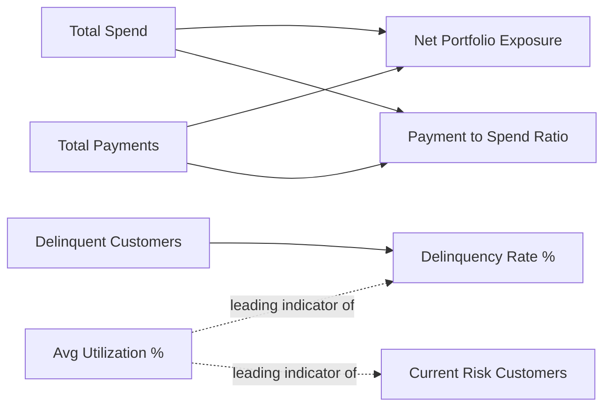

# KPIs & Business Metrics
## Credit Card Portfolio Analytics & Risk Intelligence

| | |
|---|---|
| **Document Type** | KPI & Business Metrics Catalog |
| **Version** | 1.1 |
| **Related Documents** | [DAX Measures.md](./05_DAX_Measures.md), [DAX Patterns.md](./15_DAX_Patterns.md), [Dashboard Guide.md](./06_Dashboard_Guide.md), [Business Requirements.md](./01_Business_Requirements.md) |

---

## 1. Objective

This document defines every certified business KPI in plain business language — what it means, why it matters, who owns it, and what a good or concerning value looks like. It is the business-facing companion to [DAX Measures.md](./05_DAX_Measures.md), which documents the technical implementation of each metric.

---

## 2. KPI Catalog

### 2.1 Total Spend

| | |
|---|---|
| **Definition** | Total value of all card transactions in the period/filter context |
| **Business Owner** | Product & Marketing |
| **Used On** | Executive Overview, Spend Analytics |
| **Why It Matters** | The top-line demand signal for the card portfolio; the base against which repayment and exposure are measured |
| **Directional Read** | Growth is generally positive, but must be read alongside `Payment to Spend Ratio` — spend growth without matching repayment growth increases exposure |

### 2.2 Total Payments

| | |
|---|---|
| **Definition** | Total value actually repaid by customers in the period/filter context |
| **Business Owner** | Risk & Collections |
| **Used On** | Executive Overview |
| **Why It Matters** | Measures real cash recovery, independent of what was billed |
| **Directional Read** | Should track proportionally with `Total Spend`; a widening gap signals stress |

### 2.3 Net Portfolio Exposure

| | |
|---|---|
| **Definition** | Spend not yet recovered — `Total Spend − Total Payments` |
| **Business Owner** | Risk & Finance |
| **Used On** | Executive Overview |
| **Why It Matters** | The real risk carried right now — the single figure leadership tracks as "how exposed is the bank at this moment" |
| **Directional Read** | Rising exposure without a corresponding rise in spend volume is a red flag |

### 2.4 Delinquency Rate %

| | |
|---|---|
| **Definition** | Share of customers overdue on repayment, out of the total customer base |
| **Business Owner** | Risk & Collections |
| **Used On** | Executive Overview, Risk Analytics |
| **Why It Matters** | Drives collections prioritization and portfolio-quality reporting |
| **Directional Read** | A sustained upward trend indicates deteriorating portfolio quality; should be monitored against `Avg Utilization %` as a leading indicator |

### 2.5 Current Risk Customers

| | |
|---|---|
| **Definition** | Count of distinct customers assessed as carrying risk, as of the **latest** monthly risk assessment only |
| **Business Owner** | Risk & Collections |
| **Used On** | Risk Analytics, Executive Overview |
| **Why It Matters** | Avoids a diluted, historical read — leadership and Collections need to know who is at risk *today*, not a blended count across every month on record |
| **Directional Read** | Compare month-over-month, not against a cumulative total, since the measure always resets to the latest assessment period |

### 2.6 Avg Utilization %

| | |
|---|---|
| **Definition** | Average outstanding balance as a percentage of assigned credit limit, across the customer-card population |
| **Business Owner** | Risk & Collections |
| **Used On** | Risk Analytics |
| **Why It Matters** | Early warning, before delinquency hits — utilization trends upward ahead of missed payments, giving Collections a lead-time advantage |
| **Directional Read** | High-risk and critical-risk customers both cluster near 90% utilization in this portfolio — a practical threshold for proactive outreach |

### 2.7 Payment to Spend Ratio

| | |
|---|---|
| **Definition** | Total payments received divided by total spend generated, in the same period |
| **Business Owner** | Finance & Risk |
| **Used On** | Executive Overview |
| **Why It Matters** | Signals portfolio-wide financial stress at a macro level, distinct from individual customer delinquency |
| **Directional Read** | A ratio meaningfully below 100% (or below its historical baseline) suggests systemic repayment lag |

### 2.8 EMI %

| | |
|---|---|
| **Definition** | Share of transactions converted to installment (EMI) credit |
| **Business Owner** | Product & Marketing, Risk |
| **Used On** | Spend Analytics |
| **Why It Matters** | Rising EMI adoption can reflect healthy structured-credit uptake or early cash-flow strain — best interpreted alongside utilization trends |
| **Directional Read** | Contextual — evaluate jointly with `Avg Utilization %` and `Delinquency Rate %`, not in isolation |

### 2.9 Average Cashback Per Transaction / Average Spend Per Customer

| | |
|---|---|
| **Definition** | Reward cost efficiency per transaction, and spend normalized per active customer |
| **Business Owner** | Product & Marketing |
| **Used On** | Spend Analytics |
| **Why It Matters** | Enables fair, apples-to-apples comparison of card products and customer segments regardless of population size |
| **Directional Read** | Used comparatively across products/segments rather than against a single fixed target |

---

## 2A. KPI Relationship Map

> **Architecture Note:** The dotted lines above are *business* leading-indicator relationships observed in the data (utilization trending upward ahead of delinquency), not DAX dependencies — they are documented here because they are the analytical justification for why `Avg Utilization %` sits on the Risk Analytics page alongside `Delinquency Rate %`, even though the two measures do not share a formula dependency.

## 3. Executive Insights Derived From These KPIs

| Insight | Supporting KPI(s) | Source Page |
|---|---|---|
| Entry-level cards generate nearly half of total portfolio spend (₹89.85M) | `Total Spend` by `CardCategory` | Spend Analytics |
| High-risk and critical-risk customers both run utilization near 90% — a leading indicator visible before delinquency shows in payment data | `Avg Utilization %`, `RiskCategory` | Risk Analytics |
| **Mass Affluent** customers are the largest segment at 42.3% — the clearest target for retention spend | Customer count by `CustomerSegment` | Customer Analytics |
| **Maharashtra** is the single largest state by customer count, well ahead of every other region | Customer count by `State` | Customer Analytics |
| Roughly 1 in 4 customers clears their balance in full every month — the other 3 carry a running balance worth watching | `Full Payment Customers`, `PaymentStatus` distribution | Executive Overview |

---

## 4. KPI Ownership Matrix

| KPI | Executive | Product & Marketing | Risk & Collections | Customer Analytics |
|---|:---:|:---:|:---:|:---:|
| Total Spend | ✔ | ✔ | | |
| Total Payments | ✔ | | ✔ | |
| Net Portfolio Exposure | ✔ | | ✔ | |
| Delinquency Rate % | ✔ | | ✔ | |
| Current Risk Customers | ✔ | | ✔ | |
| Avg Utilization % | | | ✔ | |
| Payment to Spend Ratio | ✔ | | ✔ | |
| EMI % | | ✔ | ✔ | |
| Average Cashback Per Transaction | | ✔ | | |
| Average Spend Per Customer | | ✔ | | ✔ |
| Customer Segment Distribution | | ✔ | | ✔ |
| Geographic Distribution | | | | ✔ |

---

## 5. Metric Governance Principles

| Principle | Statement |
|---|---|
| One definition per metric | Every KPI in this catalog maps to exactly one certified DAX measure — see [DAX Measures.md](./05_DAX_Measures.md) — reused across every page and every audience |
| Present-tense risk reporting | Risk KPIs always resolve to the latest assessment period, never a historical blend, to avoid diluting the current signal |
| Graceful degradation | All ratio KPIs return `0` rather than a broken visual under an empty filter context |
| Business-first naming | KPI names describe the business question they answer (e.g., "Current Risk Customers," not "RiskProfile_Count_v2") |

---

## 6. Enterprise Recommendations

| Recommendation | Rationale |
|---|---|
| Publish a KPI certification badge/label in the Power BI Service for measures in this catalog | Signals to report consumers which KPIs are governed and centrally owned versus ad hoc |
| Review KPI thresholds (e.g., the ~90% utilization observation) periodically, not just at initial build | Thresholds derived from a static extract may drift as the underlying portfolio composition changes over time |
| Require KPI Owner sign-off (Section 4) before a certified measure's formula changes | Prevents a change intended for one dashboard from silently altering the same KPI's meaning on another dashboard |

## 7. Operational Considerations

> **Operational Note:** Because `Current Risk Customers` and related risk KPIs resolve to the latest `AssessmentMonth` present in the data, the "current" view shown by the report is only as current as the most recent refresh — see [Data Sources.md §5](./04_Data_Sources.md). Report consumers should confirm the refresh timestamp before treating a risk KPI as same-day accurate in a production deployment.

---

## Related Documents

- [DAX Measures.md](./05_DAX_Measures.md) — technical implementation of every KPI listed here
- [Dashboard Guide.md](./06_Dashboard_Guide.md) — where each KPI appears and how to read it in context
- [Business Requirements.md](./01_Business_Requirements.md) — the business objectives these KPIs were designed to satisfy

---

## Version History

| Version | Date | Author | Change Description |
|---|---|---|---|
| 1.0 | 2025-12 | Alan Binu | Initial KPI & business metrics catalog |
| 1.1 | 2025-12 | Alan Binu | Added KPI relationship map, enterprise recommendations, and operational considerations |
