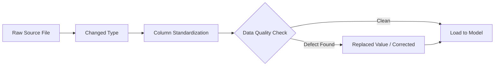
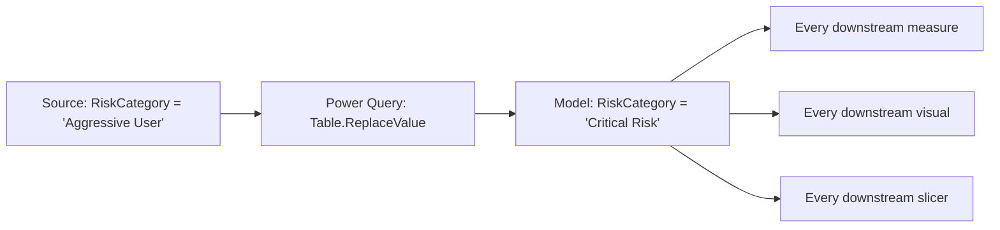
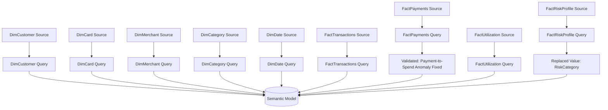
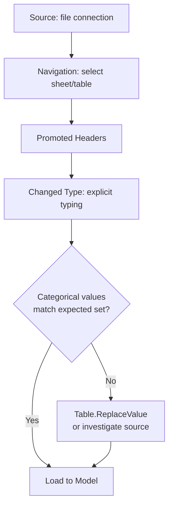

# Power Query Transformations
## Credit Card Portfolio Analytics & Risk Intelligence

| | |
|---|---|
| **Document Type** | ETL / Transformation Layer Specification |
| **Tool** | Power Query (M Language) |
| **Version** | 1.1 |
| **Related Documents** | [Data Sources.md](./04_Data_Sources.md), [Data Lineage.md](./16_Data_Lineage.md), [Data Dictionary.md](./03_Data_Dictionary.md), [Architecture.md](./02_Architecture.md) |

---

## 1. Transformation Strategy

This document specifies the transformation logic applied to each source file between ingestion and the semantic model, and captures the two data-quality defects identified and remediated during development — both fixed at the source, not patched downstream.

---

## 2. Transformation Layer Principles

| Principle | Statement |
|---|---|
| Explicit typing, never inferred | Every table has its column data types explicitly set in Power Query — auto-detection is never relied upon for production tables |
| Fix at source | Any data-quality defect discovered is corrected in the query that loads the table, so every downstream measure and visual inherits the fix automatically |
| No transformation logic in DAX | Cleansing, relabeling, and type correction happen in Power Query; DAX is reserved for business-logic aggregation |
| Reproducible steps | Each query is a linear, auditable step sequence (Power Query's Applied Steps pane) rather than ad hoc manual edits |



---

## 3. Standard Transformation Steps (Applied to Every Table)

| Step | Purpose |
|---|---|
| `Source` | Connects to the file (`Excel.Workbook()` or `Csv.Document()`) — see [Data Sources.md](./04_Data_Sources.md) |
| `Navigation` | Selects the correct worksheet/table from the source workbook |
| `Promoted Headers` | Promotes the first row to column headers |
| `Changed Type` | Explicitly sets the data type of every column (Int64, Text, Decimal, Date) — never left to auto-detection |
| `Renamed Columns` (where applicable) | Standardizes column naming to match the model's naming convention (e.g., PascalCase, consistent ID suffixes) |

---

## 4. Table-Specific Transformation Notes

### 4.1 DimCustomer
- `JoinDate` explicitly typed as `Date` (not `Date/Time`) to align with the calendar grain used elsewhere in the model.
- `CustomerSegment`, `Occupation`, `Industry`, `Sector`, `EmploymentType`, `MaritalStatus` typed as `Text` and validated against a small, closed set of categorical values — no free-text drift observed.

### 4.2 DimCard
- `CreditLimit`, `AnnualFee`, `MinAge`, `MinCreditScore` typed as `Int64`.
- `CardCategory` and `CardNetwork` validated as closed categorical sets (6 categories, 4 networks respectively).

### 4.3 DimMerchant / DimCategory
- `CategoryID` in `DimMerchant` explicitly typed as `Int64` to match the join key type in `DimCategory` and `FactTransactions`, preventing a text-vs-numeric key mismatch at the relationship layer.

### 4.4 DimDate
- Fully derived calendar attributes (`Year`, `Quarter`, `Month`, `MonthName`, `Day`, `DayOfWeek`, `DayName`, `IsWeekend`) are validated for internal consistency against the `Date` column — e.g., `IsWeekend = 1` only where `DayName` is Saturday or Sunday.
- Marked as the model's official **Date Table** in Power BI (`Mark as Date Table`), a prerequisite for the time-intelligence DAX measures described in [DAX Measures.md, Section 8](./05_DAX_Measures.md).

### 4.5 FactTransactions
- `EMIFlag` typed as `Int64` (0/1 flag) rather than `Text`, so it can be used directly as a numeric filter condition in DAX (`FactTransactions[EMIFlag] = 1`).
- `TransactionAmount` and `CashbackEarned` typed as `Decimal Number` to preserve fractional currency precision.

### 4.6 FactPayments
- Loaded from CSV (`Csv.Document()`), requiring an explicit delimiter and encoding check not needed for the Excel-sourced tables.
- `DueDate` and `PaymentDate` typed as `Date`; `DaysPastDate` typed as `Int64`.
- `PaymentStatus` validated as a closed categorical set: `Paid in Full`, `Partial Payment`, `Minimum Payment`, `Delinquent`.

### 4.7 FactUtilization
- `SnapshotMonth` retained as `Text` in `YYYY-MM` format (not converted to `Date`) to match the same monthly-grain convention used in `FactRiskProfile[AssessmentMonth]`, simplifying month-level joins and comparisons between the two risk-adjacent fact tables.
- `UtilizationPercent` typed as `Decimal Number`.

### 4.8 FactRiskProfile
- `AssessmentMonth` retained as `Text` (`YYYY-MM`), consistent with `FactUtilization[SnapshotMonth]`.
- Subject to the primary data-quality remediation documented in Section 5 below.

---

## 5. Data Quality Remediation — Detailed Specification

### 5.1 Risk Category Relabeling (FactRiskProfile)

**Defect identified:** The raw source data labeled the highest-risk customer segment as `"Aggressive User"`, inconsistent with the naming convention used by the other three categories: `Low Risk`, `Medium Risk`, `High Risk`.

**Business impact if left uncorrected:** Any visual, slicer, or measure filtering on `RiskCategory` would either exclude the highest-risk segment (if a developer filtered on the `"...Risk"` naming pattern) or display an inconsistent, unprofessional label directly to Risk and Executive audiences.

**Fix — applied once, in Power Query, at the source:**

```m
#"Replaced Value" = Table.ReplaceValue(
    #"Changed Type",
    "Aggressive User",
    "Critical Risk",
    Replacer.ReplaceText,
    {"RiskCategory"}
)
```

**Why this approach, not a DAX-level fix:** Correcting the label in Power Query means the fix is applied exactly once, before the table is loaded into the model. Every measure (`High Risk Customers`, `Current Risk Customers`), every visual, and every slicer built afterward automatically inherits the corrected label — there is no risk of one report page showing `"Aggressive User"` while another shows `"Critical Risk"`, which is the failure mode that occurs when the same fix is implemented independently in multiple DAX measures or visual-level filters.



### 5.2 Payment-to-Spend Ratio Anomaly (FactPayments)

**Defect identified:** During validation of the `Payment to Spend Ratio` measure, a subset of records produced a ratio exceeding 100% — a value that is not business-plausible for a repayment-to-spend relationship at the customer level, and would have been visible to end users as an implausible KPI.

**Resolution:** The anomaly was traced back to the source `FactPayments` extract and corrected before the measure was finalized, rather than being masked with a display-layer cap or a `MIN(..., 1)` clamp inside the DAX measure itself.

**Why this approach:** Clamping the ratio in DAX would have hidden the underlying data issue rather than resolved it, and would have silently understated the true ratio for the affected records in any other measure or visual referencing the same rows. Fixing it at the source data preserves a single, trustworthy version of `FactPayments` for every downstream consumer.

---

## 6. Query Dependency Overview



Each query is independent (no cross-query merges are required, since all relationships are established at the model layer rather than via Power Query merges) — this keeps the transformation layer simple and each table's refresh isolated from the others.

---

## 6A. Power Query Workflow (Per Table)



> **Best Practice:** Step E in the workflow above is not automated in the current build — it was performed manually during development, which is exactly how the `"Aggressive User"` and payment-anomaly defects (Section 5) were caught. A production deployment should formalize this as an automated data-quality gate rather than relying on manual review at build time — see [Testing & Validation.md §5](./17_Testing_Validation.md) and [Project Roadmap.md §3](./12_Project_Roadmap.md).

## 7. Refresh Behavior

| Aspect | Behavior |
|---|---|
| Query folding | Not applicable — flat file sources do not support query folding; all transformation steps execute in the Power Query engine, not pushed to a source-side query |
| Refresh order | Independent per table; no explicit dependency ordering required since no query references another query's output |
| Error handling | Type-mismatch or missing-file errors surface immediately in the Power Query editor at refresh time, before the model load completes |

---

## 8. Engineering Notes

| Note | Detail |
|---|---|
| No query folding available | Flat-file sources mean every transformation step executes inside the Power Query mashup engine on the client machine, not pushed down to a source database — worth remembering when reasoning about refresh duration on a much larger dataset |
| No merge/append queries | Every table loads independently; relationships are established at the model layer, not via Power Query `Table.NestedJoin` — this keeps the transformation layer simple but means referential integrity between tables (e.g., an orphaned `CustomerID` in a fact table) is not caught until relationship validation in the model — see [Testing & Validation.md §3](./17_Testing_Validation.md) |
| Two data-quality fixes, one pattern | Both remediations in Section 5 follow the same principle — correct at the earliest possible point in the pipeline — even though one is a categorical relabel and the other is a numeric anomaly; this consistency is itself a design decision worth preserving as the model grows |

## 9. Best Practices Applied

> **Best Practice:** Explicit typing on every column, every table, no exceptions — including the CSV source, which does not carry native types the way the Excel sources do.

> **Best Practice:** Data-quality fixes are implemented as a discrete, named Applied Step (e.g., `#"Replaced Value"`) rather than folded into an earlier step, so the fix is visible and auditable in the Power Query Applied Steps pane without needing to inspect the underlying M code.

> **Warning:** `Table.ReplaceValue` performs an exact, case-sensitive text match. If the upstream source ever introduces a variant spelling or casing of `"Aggressive User"`, the current step will silently fail to catch it, and the inconsistent label will pass through to the model uncorrected. A production pipeline should validate the *complete* set of distinct `RiskCategory` values against an expected list on every refresh, not just replace the one known variant — see the source validation checklist in [Data Sources.md §8](./04_Data_Sources.md).

---

## Related Documents

- [Data Sources.md](./04_Data_Sources.md) — source file inventory referenced by these queries
- [Data Dictionary.md](./03_Data_Dictionary.md) — post-transformation column-level schema
- [Technical Design.md](./09_Technical_Design.md) — parameterization requirements for production deployment

---

## Version History

| Version | Date | Author | Change Description |
|---|---|---|---|
| 1.0 | 2025-12 | Alan Binu | Initial Power Query transformation specification, including both documented data-quality remediations |
| 1.1 | 2025-12 | Alan Binu | Added Power Query workflow diagram, engineering notes, best practices, and a warning on the exact-match limitation of the current remediation step |
