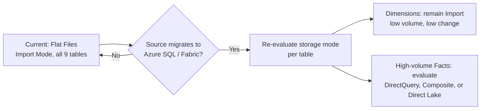
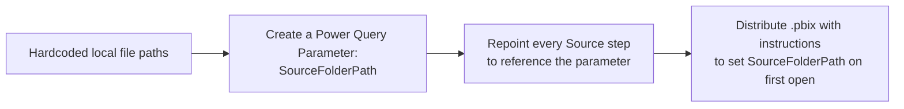
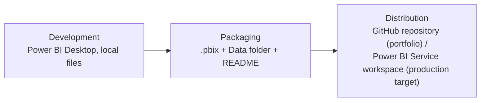

# Technical Design Document
## Credit Card Portfolio Analytics & Risk Intelligence

| | |
|---|---|
| **Document Type** | Technical Design Document (TDD) |
| **Platform** | Power BI Desktop |
| **Version** | 1.1 |
| **Related Documents** | [Architecture.md](./02_Architecture.md), [Data Model.md](./14_Data_Model.md), [Performance Optimization.md](./10_Performance_Optimization.md), [Deployment Guide.md](./18_Deployment_Guide.md) |

---

## 1. Overview

This document captures implementation-level technical decisions — storage mode, relationship configuration, naming conventions, security posture, and deployment readiness — that sit below the conceptual architecture described in [Architecture.md](./02_Architecture.md) and above the day-to-day transformation detail in [Power Query Transformations.md](./08_Power_Query_Transformations.md).

## 2. Scope

This TDD covers the technical stack, storage-mode decision and its alternatives, relationship configuration, naming conventions, parameterization gap, security posture, and deployment model. It does not cover business requirements ([Business Requirements.md](./01_Business_Requirements.md)) or measure-level DAX logic ([DAX Measures.md](./05_DAX_Measures.md) / [DAX Patterns.md](./15_DAX_Patterns.md)).

## 3. Technical Stack

| Layer | Technology |
|---|---|
| Data ingestion | Power Query (M language) |
| Data modeling | Power BI semantic model (Tabular / VertiPaq engine) |
| Business logic | DAX (Data Analysis Expressions) |
| Presentation | Power BI report pages (4), native visuals |
| File format | `.pbix` (single-file, self-contained solution) |

## 4. Implementation Strategy — Storage Mode

The single most consequential technical decision in this solution is the choice of **Import mode** across all nine tables. This section documents that decision with the rigor an enterprise review would expect: the alternatives considered, the trade-offs accepted, and the conditions under which the decision should be revisited.

### 4.1 Options Evaluated

| Option | Description |
|---|---|
| **Import mode** (selected) | All source data is loaded into Power BI's in-memory VertiPaq columnar engine at refresh time. Queries against visuals are answered entirely from memory. |
| **DirectQuery** | Power BI issues native queries against the source system for every visual interaction; no data is cached in VertiPaq. |
| **Composite model** | Some tables in Import mode, others in DirectQuery, typically used to keep large fact tables live while caching smaller, slower-changing dimensions. |
| **Direct Lake** (Microsoft Fabric) | A newer mode that reads Delta Lake table files directly without a traditional Import load, combining near-DirectQuery freshness with near-Import performance — only available against a Fabric/OneLake source, not applicable to this project's local flat-file sources. |

### 4.2 Why Import Mode

| Consideration | Import Mode | DirectQuery (rejected here) |
|---|---|---|
| Query performance | Sub-second to low-second visual response, since VertiPaq answers from compressed in-memory data | Every visual interaction issues a live query against the source; latency depends entirely on source system responsiveness |
| Data freshness | As fresh as the last refresh (currently manual) | Always live, reflecting the source system in real time |
| Source system load | Zero query load on the source after refresh completes | Every filter/slicer change generates a new source-system query — significant load at scale |
| DAX feature support | Full DAX surface area available, including complex `CALCULATE`/iterator patterns | Many DAX functions are restricted or behave differently under DirectQuery; some patterns used in this model (e.g., the `VAR`/`REMOVEFILTERS` pattern in `Current Risk Customers`) would need re-validation |
| Source compatibility | Works against flat files (`.xlsx`, `.csv`) with no additional infrastructure | Requires a queryable source (database, API) — **not supported against flat files at all**, which alone rules it out for the current source architecture |

> **Decision:** Import mode was selected primarily because it is the only mode flat-file sources support, and secondarily because it delivers the query performance this model's four-page, heavily-sliced interaction pattern requires. This is not a close call given the current source architecture — but the trade-offs below are documented because they become live questions the moment sources migrate to a queryable system (see Section 4.5 and [Project Roadmap.md](./12_Project_Roadmap.md)).

### 4.3 Memory and VertiPaq Implications

| Factor | Implication for This Model |
|---|---|
| In-memory footprint | ~150,000 rows across 9 tables compress to a small in-memory footprint under VertiPaq's columnar compression — well within Power BI Desktop's default memory limits on standard developer hardware |
| Column cardinality | Low-cardinality categorical columns (`RiskCategory`, `CardCategory`, `PaymentStatus`) compress extremely efficiently; high-cardinality columns (`CustomerName`, `TransactionID`) compress less well and should never be used as visual-level grouping axes — see [Performance Optimization.md §3](./10_Performance_Optimization.md) |
| Full in-memory reload on refresh | Because there is no incremental refresh configured (Section 4.4), every refresh discards and rebuilds the entire in-memory model — acceptable at current volume, but a scaling constraint to plan around |

### 4.4 Refresh Implications

Import mode ties data freshness directly to refresh cadence. In the current build:

- Refresh is **manual and on-demand** (see [Data Sources.md §5](./04_Data_Sources.md)).
- There is no scheduled refresh, gateway, or incremental refresh partition configured.
- Every refresh is a **full reload** of all nine tables — acceptable today, but the first constraint that will need to be addressed as fact table volume grows (see [Performance Optimization.md §6](./10_Performance_Optimization.md) and [Project Roadmap.md §4](./12_Project_Roadmap.md)).

### 4.5 Future Scalability

> **Enterprise Recommendation:** If this model migrates from local flat files to a connected source such as Azure SQL or Microsoft Fabric, Import mode should be re-evaluated table-by-table rather than assumed to remain the right choice for every table. A **Composite model** — keeping the five (mostly static, low-volume) dimension tables in Import mode while evaluating DirectQuery or Direct Lake for the highest-volume fact tables (`FactTransactions`, `FactPayments`) — is the natural next step once a queryable, governed source exists. This decision should be revisited explicitly as part of the Azure SQL / Fabric migration roadmap item, not defaulted silently.

## 5. Relationship Configuration

| Setting | Value | Rationale |
|---|---|---|
| Default cross-filter direction | Single | Predictable filter propagation — a filter on a dimension flows to its facts, not the reverse, avoiding ambiguous or circular filter paths |
| Exception | `FactRiskProfile ↔ DimCustomer` set to **Bidirectional** | Deliberately scoped to allow customer-level slicers to interactively filter risk segmentation without affecting the rest of the model — see [Architecture.md §5](./02_Architecture.md) and [Data Model.md §5](./14_Data_Model.md) |
| Cardinality | One (dimension) to Many (fact), throughout | Standard star-schema cardinality; no many-to-many relationships in the current model |
| Inactive relationships | None currently defined | No role-playing dimension scenario (e.g., a second date relationship) is required in the current scope |

## 6. Naming Conventions

| Object Type | Convention | Example |
|---|---|---|
| Dimension tables | `Dim<Entity>` | `DimCustomer`, `DimCard` |
| Fact tables | `Fact<Process>` | `FactTransactions`, `FactRiskProfile` |
| Primary keys | `<Entity>ID` | `CustomerID`, `CardID` |
| Measures | Plain business language, Title Case, no prefixes | `Total Spend`, `Delinquency Rate %` |
| Calculation table | `_Measures` (disconnected) | Underscore prefix sorts it to the top of the field list, signaling "not a data table" |

## 7. Design Decisions — Parameterization & Portability (Known Gap)

**Current state:** Every Power Query `Source` step references an absolute or relative local file path, established during development on a single machine.

**Risk:** The `.pbix` will fail to refresh — or silently load stale cached data — when opened on any machine other than the original development environment, or when published to a shared Power BI Service workspace without a configured gateway.

**Required remediation before external distribution:**

1. Create a single Power Query **Parameter** (e.g., `SourceFolderPath`, type Text).
2. Repoint every table's `Source` step to build its file path from that parameter rather than a literal string.
3. On distribution, the consuming user updates the parameter once (via *Transform Data → Edit Parameters*) instead of editing nine individual queries.

This is flagged in the project README as the single highest-value remaining fix before the model is shared publicly, is tracked as a near-term item in [Project Roadmap.md](./12_Project_Roadmap.md), and is walked through step-by-step in [Deployment Guide.md §3](./18_Deployment_Guide.md).

## 8. Security Posture (Current State)

| Control | Status |
|---|---|
| Row-Level Security (RLS) | Not implemented in the current release |
| Object-Level Security (OLS) | Not implemented |
| Workspace-level access control | Not applicable — solution currently distributed as a standalone `.pbix` file, not published to a governed workspace |

**Target state:** RLS roles scoped by `State` (regional leadership) and by `CustomerSegment` (segment-owning teams) are planned — see [Project Roadmap.md §3](./12_Project_Roadmap.md).

> **Important:** RLS filters are applied at the DAX query layer, downstream of the bidirectional relationship on `FactRiskProfile ↔ DimCustomer`. When RLS is introduced, its interaction with that bidirectional relationship must be explicitly tested — bidirectional relationships combined with RLS are a documented source of unexpected data leakage in Power BI if not validated carefully. This is captured as a required test case in [Testing & Validation.md §3](./17_Testing_Validation.md) once RLS is implemented.

## 9. Deployment Model

| Environment | Current Approach |
|---|---|
| Development | Power BI Desktop, local file sources |
| Distribution (current) | `.pbix` file shared directly via GitHub repository, alongside source data files |
| Production target | Publish to a governed Power BI Service workspace, connected sources via gateway, scheduled refresh (see [Project Roadmap.md](./12_Project_Roadmap.md) and [Deployment Guide.md](./18_Deployment_Guide.md)) |

## 10. File Inventory

See [Project Structure.md](./19_Project_Structure.md) for the complete, exhaustive file-and-folder inventory. Summary:

| File | Purpose |
|---|---|
| `Credit Card Analytics Dashboard.pbix` | The complete Power BI solution — model, DAX, and 4 report pages |
| `Credit_Card_Portfolio_Updated.pptx` | Executive presentation summarizing the solution |
| `Data/Dimension Tables/` | Source files for all 5 dimension tables |
| `Data/Fact Tables/` | Source files for all 4 fact tables |
| `Images/` | Screenshots and diagrams referenced in the README and this Documentation folder |

## 11. Design Constraints

| Constraint | Detail |
|---|---|
| Single-file solution | No external `.pbit` template or shared dataset — the entire model, DAX layer, and reports live in one `.pbix` |
| No external services | No Azure, Fabric, or gateway dependency in the current release; fully self-contained for portfolio/demonstration purposes |
| Static extracts | Source data represents a point-in-time snapshot, not a live feed — see [Data Sources.md §5](./04_Data_Sources.md) |

## 12. Architect Notes

> **Architect Note:** The decisions in this document (Import mode, single-direction relationships by default, centralized measure table) are individually simple, but their combination is what produces a model that is fast, predictable, and auditable at once. Any future change to one of these decisions — for example, introducing DirectQuery for a single table — should be re-evaluated against all three properties, not just the property the change was intended to improve.

---

## Related Documents

- [Architecture.md](./02_Architecture.md)
- [Data Model.md](./14_Data_Model.md)
- [Data Sources.md](./04_Data_Sources.md)
- [Performance Optimization.md](./10_Performance_Optimization.md)
- [Deployment Guide.md](./18_Deployment_Guide.md)
- [Project Roadmap.md](./12_Project_Roadmap.md)
- [Project Structure.md](./19_Project_Structure.md)

---

## Version History

| Version | Date | Author | Change Description |
|---|---|---|---|
| 1.0 | 2025-12 | Alan Binu | Initial technical design document |
| 1.1 | 2025-12 | Alan Binu | Expanded storage-mode decision into a full alternatives-and-trade-offs analysis (options evaluated, memory/VertiPaq implications, refresh implications, future scalability); added security-posture interaction note for the planned RLS rollout; cross-referenced new enterprise documents |
