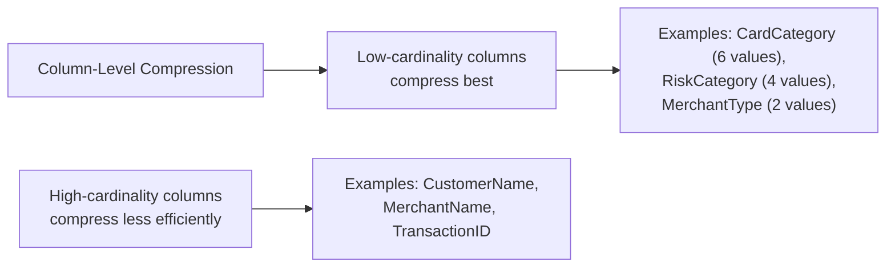
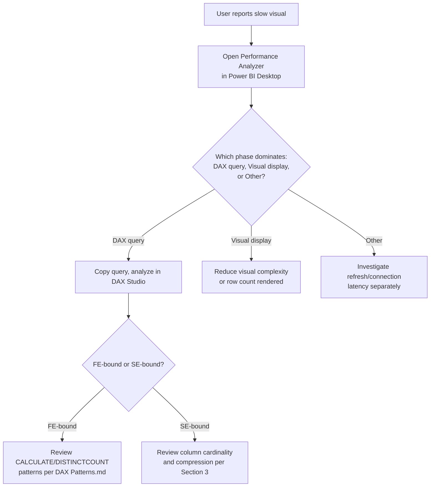
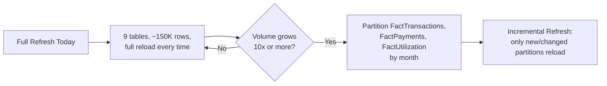

# Performance Optimization
## Credit Card Portfolio Analytics & Risk Intelligence

| | |
|---|---|
| **Document Type** | Performance Optimization Reference |
| **Version** | 1.1 |
| **Related Documents** | [Architecture.md](./02_Architecture.md), [Data Model.md](./14_Data_Model.md), [DAX Measures.md](./05_DAX_Measures.md), [DAX Patterns.md](./15_DAX_Patterns.md), [Technical Design.md](./09_Technical_Design.md) |

---

## 1. Objectives

Performance work on this model has one measurable goal: keep every visual interaction on every page under roughly three seconds at the current data volume (~150,000 rows across nine tables), without sacrificing the correctness guarantees documented in [DAX Measures.md](./05_DAX_Measures.md) — a fast measure that returns the wrong number is not a performance win. This document explains the engine-level reasoning behind the decisions already reflected in the model, and provides a checklist for the volumes it will need to absorb next (see [Project Roadmap.md](./12_Project_Roadmap.md)).

## 2. Optimization Philosophy

Three principles guide every performance decision in this model, in priority order:

1. **Correctness first.** A measure is never simplified purely for speed if the simplification changes its business meaning — the `Current Risk Customers` latest-month pattern (see [DAX Measures.md §5.1](./05_DAX_Measures.md)) is more expensive than a naive `DISTINCTCOUNT`, and that cost is accepted because the naive version is simply wrong.
2. **Model-level fixes before query-level fixes.** A relationship or column-type problem fixed once in the model benefits every measure and visual that touches it; a query-level workaround benefits only the one visual it was applied to. This is the same "fix at source" philosophy applied to data quality in [Power Query Transformations.md](./08_Power_Query_Transformations.md), extended to performance.
3. **Measure the right thing.** Performance work starts from Performance Analyzer output (Section 8), not intuition about which visual "feels slow."

## 3. Engine Considerations — VertiPaq Storage

Power BI's Tabular engine (VertiPaq) is a columnar, in-memory store. Two engine-level facts drive most of the decisions in this document:

| VertiPaq Fact | Practical Consequence for This Model |
|---|---|
| Compression is applied per column, and improves as distinct-value count (cardinality) decreases | Categorical columns like `RiskCategory` (4 values), `CardCategory` (6 values), and `PaymentStatus` (4 values) compress to a tiny fraction of their row count; surrogate keys and free-text columns do not |
| Aggregations resolve fastest when they touch few, low-cardinality columns | `SUM`/`COUNTROWS` measures like `Total Spend` and `Total Transactions` are effectively free at this scale; `DISTINCTCOUNT` measures touching `CustomerID` are the most expensive common pattern in the model |
| Relationships are resolved via compressed dictionary encoding on the key columns | Explicit integer typing on every key column (Section 4) is not a stylistic preference — it is what allows relationships to resolve efficiently |

| Column Type | Cardinality in This Model | Compression Behavior |
|---|---|---|
| Categorical dimension attributes (`CardCategory`, `RiskCategory`, `PaymentStatus`) | Low (2–6 distinct values) | Compress extremely well; cheap to filter and group by |
| Surrogate keys (`CustomerID`, `CardID`, `TransactionID`) | High | Necessary for relationships but should never be used as a grouping axis in a visual if a lower-cardinality attribute (e.g., `CustomerSegment`) can answer the same business question |
| Free-text columns (`CustomerName`, `MerchantName`) | High | Retained for drillthrough/detail views only — never used in a slicer or as a chart axis, where a lower-cardinality attribute should be preferred |

## 4. Performance-by-Design Decisions Already Applied

| Decision | Performance Benefit |
|---|---|
| Star schema over a flat denormalized table | VertiPaq compresses repeated dimension values far more efficiently than a wide flat table with repeated attribute columns; joins resolve against small, highly-compressible key columns |
| Explicit column typing in Power Query | Prevents the engine from carrying oversized or ambiguous data types (e.g., text-typed numeric keys), which bloats column storage and slows relationship resolution |
| Single-direction relationships as the default | Bidirectional filtering forces the engine to evaluate filter propagation in both directions on every query — reserved for the one case (`FactRiskProfile ↔ DimCustomer`) where it is business-required, not applied model-wide — see [Architecture.md §5](./02_Architecture.md) |
| `DIVIDE()` instead of `/` | Avoids exception-handling overhead from divide-by-zero errors during query evaluation, in addition to its correctness benefit |
| Measures built on other measures (e.g., `Net Portfolio Exposure` referencing `[Total Spend]` and `[Total Payments]`) | Lets the engine reuse cached intermediate results within a single query plan rather than recomputing base aggregations redundantly |
| Centralized calculation table for all 33 measures | No duplicate, slightly-different versions of the same measure exist across report pages competing for cache space |

## 5. Formula Engine vs. Storage Engine

DAX query execution splits work between two engines, and understanding which one dominates a given measure explains most of the performance behavior in this model:

| Engine | Role | Measures in This Model Dominated By It |
|---|---|---|
| **Storage Engine (SE)** | Scans compressed columnar data, performs simple aggregations (`SUM`, `COUNT`, basic filters) | `Total Spend`, `Total Payments`, `Total Transactions`, `Avg Utilization %` |
| **Formula Engine (FE)** | Handles row-by-row iteration, complex `CALCULATE` context transitions, `VAR` staging, and anything the Storage Engine cannot resolve natively | `Current Risk Customers` (context transition + `REMOVEFILTERS`), `DISTINCTCOUNT`-based measures |

> **Performance Note:** FE-bound operations are single-threaded and cannot be parallelized the way SE scans can. This is precisely why `DISTINCTCOUNT` and multi-step `CALCULATE` patterns are flagged as the "moderate cost" tier in Section 6 — not because they are inefficient DAX, but because they necessarily engage the Formula Engine.

## 6. Measure-Level Performance Notes

| Measure Class | Relative Cost | Engine | Example | Note |
|---|---|---|---|---|
| Fully additive `SUM` / `COUNTROWS` | Lowest | SE | `Total Spend`, `Total Transactions` | Resolves almost entirely at the storage-engine level |
| `AVERAGE` over a fact column | Low | SE | `Avg Utilization %` | Linear scan cost, still cheap at current fact table sizes |
| `DISTINCTCOUNT` | Moderate | FE | `Active Customers`, `Average Spend Per Customer` (denominator) | The most expensive common pattern in this model; acceptable at 50,000 rows but the first candidate to monitor if `FactTransactions` grows an order of magnitude |
| `CALCULATE` with `VAR` and `REMOVEFILTERS` | Moderate | FE | `Current Risk Customers` | Two context transitions; still bounded and fast at 36,000 `FactRiskProfile` rows — see the full pattern breakdown in [DAX Patterns.md §2](./15_DAX_Patterns.md) |
| Measure-on-measure composition | Low incremental cost | Mixed | `Net Portfolio Exposure`, `Payment to Spend Ratio` | Reuses already-computed base measures rather than re-aggregating raw columns |

## 7. Report-Level Performance Practices

| Practice | Applied In This Model |
|---|---|
| Limit visuals per page | Each of the 4 pages is scoped to a single audience's core questions rather than combining every metric on one page — see [Dashboard Guide.md](./06_Dashboard_Guide.md) |
| Synced slicers instead of duplicated filter panels | One set of slicer state drives all 4 pages, avoiding redundant filter-context recalculation per page |
| Avoid high-cardinality fields on visual axes | Card- and category-level breakdowns use `CardCategory`/`CategoryName` (low cardinality) rather than `CardID`/`MerchantID` directly on chart axes |
| Drillthrough for record-level detail | Customer- and transaction-level detail is isolated to drillthrough pages rather than rendered on every summary page, keeping summary-page visuals aggregation-only |

## 8. Diagnostic Workflow

| Tool | Use |
|---|---|
| Power BI **Performance Analyzer** | Captures per-visual DAX query duration during interactive use; the first diagnostic step for any reported slowness |
| **DAX Studio** (external) | Deep query-plan and storage/formula engine timing analysis for individual measures |
| **VertiPaq Analyzer** (external) | Column-level cardinality and compression audit — useful for validating Section 3's assumptions as the model grows |

## 9. Refresh Performance

| Factor | Current State | Note |
|---|---|---|
| Refresh trigger | Manual, on-demand | See [Data Sources.md §5](./04_Data_Sources.md) |
| Table load order | Independent, no cross-query dependencies | Enables parallel query evaluation during refresh |
| Incremental refresh | Not configured | Recommended once `FactTransactions` or `FactPayments` grow to a scale where full reload becomes time-prohibitive |

## 10. Scaling Checklist (For Future Growth)

Use this checklist before onboarding materially larger data volumes (e.g., a full year of daily transaction feeds at production bank scale):

- [ ] Configure **Incremental Refresh** on `FactTransactions`, `FactPayments`, and `FactUtilization`, partitioned by month.
- [ ] Re-audit every `DISTINCTCOUNT` measure for necessity; replace with pre-aggregated flag columns where possible.
- [ ] Confirm no new bidirectional relationships have been introduced without explicit business justification (see [Architecture.md §5](./02_Architecture.md)).
- [ ] Move from Import mode toward a Direct Lake or Composite model if source data migrates to Microsoft Fabric (see [Technical Design.md §4.5](./09_Technical_Design.md)).
- [ ] Re-validate visual-level query performance using Performance Analyzer in Power BI Desktop after any measure or relationship change.

## 11. Enterprise Recommendations

> **Enterprise Recommendation:** Establish a standing performance budget (e.g., "no visual exceeds 3 seconds at P95") and re-test against it as part of the release checklist whenever a new measure or relationship is added — not only when a user complains. Performance regressions in Tabular models are typically incremental and easy to miss one change at a time; a budget with a repeatable test (Section 8) catches drift before it becomes a production incident.

## 12. Future Risks

| Risk | Trigger | Mitigation |
|---|---|---|
| `DISTINCTCOUNT`-heavy measures degrade non-linearly at scale | `FactTransactions` or `FactPayments` grow by an order of magnitude | Introduce pre-aggregated "active customer" flag columns to shift work from FE to SE |
| Bidirectional relationship performance cost compounds with RLS | RLS is implemented on `DimCustomer` (see [Technical Design.md §8](./09_Technical_Design.md)) | Benchmark query performance with RLS + bidirectional filtering active before production rollout |
| Manual full refresh becomes a scheduling bottleneck | Refresh duration exceeds an acceptable maintenance window | Prioritize Incremental Refresh (Section 9) ahead of other roadmap items once this threshold is approached |

---

## Related Documents

- [Architecture.md](./02_Architecture.md)
- [Data Model.md](./14_Data_Model.md)
- [DAX Measures.md](./05_DAX_Measures.md)
- [DAX Patterns.md](./15_DAX_Patterns.md)
- [Technical Design.md](./09_Technical_Design.md)
- [Project Roadmap.md](./12_Project_Roadmap.md)

---

## Version History

| Version | Date | Author | Change Description |
|---|---|---|---|
| 1.0 | 2025-12 | Alan Binu | Initial performance optimization reference |
| 1.1 | 2025-12 | Alan Binu | Restructured around Objectives/Philosophy/Engine Considerations framing; added Formula Engine vs. Storage Engine analysis, diagnostic workflow diagram, enterprise recommendation, and future risks |
