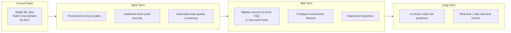

# Project Roadmap
## Credit Card Portfolio Analytics & Risk Intelligence

| | |
|---|---|
| **Document Type** | Forward-Looking Roadmap |
| **Version** | 1.0 |
| **Related Documents** | [Technical Design.md](./09_Technical_Design.md), [Lessons Learned.md](./11_Lessons_Learned.md), [Architecture.md](./02_Architecture.md) |

---

## 1. Purpose

This document sequences the planned evolution of the solution from its current portfolio-project state toward a production-grade, enterprise-deployed Business Intelligence platform. Items are grouped by horizon and cross-referenced to the architectural and technical gaps identified elsewhere in this documentation set.

---

## 2. Roadmap Overview

---

## 3. Near-Term Initiatives

| Initiative | Description | Rationale |
|---|---|---|
| **Parameterize source file paths** | Replace hardcoded local `Source` steps in every Power Query with a single `SourceFolderPath` parameter | Currently the single highest-value fix before the model can be safely shared or opened on another machine — see [Technical Design.md, Section 6](./09_Technical_Design.md) |
| **Implement Row-Level Security (RLS)** | Define roles scoped by `State` (regional leadership) and `CustomerSegment` (segment-owning teams) | No RLS exists today; required before the model is distributed to a multi-stakeholder audience with differing data-access rights — see [Technical Design.md, Section 7](./09_Technical_Design.md) |
| **Automated data-quality monitoring** | Introduce systematic validation (e.g., Power Query column-quality profiling or a scheduled validation script) run on every refresh | The two data-quality defects fixed in this release (see [Power Query Transformations.md, Section 5](./08_Power_Query_Transformations.md)) were caught manually; a production pipeline needs this to be automatic, not dependent on a developer noticing an implausible KPI |

## 4. Mid-Term Initiatives

| Initiative | Description | Rationale |
|---|---|---|
| **Migrate data sources to Azure SQL or Microsoft Fabric** | Move from static local flat-file extracts to a governed, connected data platform | Enables scheduled refresh, larger data volumes, and eliminates the local-file portability problem entirely — see [Data Sources.md, Section 6](./04_Data_Sources.md) |
| **Configure Incremental Refresh** | Partition `FactTransactions`, `FactPayments`, and `FactUtilization` by month for incremental load | Required once data volume grows beyond what a full reload can handle efficiently — see [Performance Optimization.md, Section 6](./10_Performance_Optimization.md) |
| **Build deployment pipelines** | Introduce a structured release process (e.g., Power BI Deployment Pipelines across Dev/Test/Prod workspaces) | Moves the solution from a single-file distribution model to a governed, versioned release process suitable for ongoing production use |

## 5. Long-Term Initiatives

| Initiative | Description | Rationale |
|---|---|---|
| **Integrate AI-driven credit risk prediction** | Replace or augment the sourced `RiskScore`/`RiskCategory` fields with a predictive model trained on transaction, utilization, and payment history | Current risk fields are treated as a black-box input from an upstream system; a production risk platform would validate and potentially improve on that scoring methodology — see [Lessons Learned.md, Section 4](./11_Lessons_Learned.md) |
| **Real-time / near-real-time refresh** | Move toward event-driven or high-frequency refresh for transaction and utilization data | Would close the gap between "latest monthly assessment" (current model) and true real-time risk visibility, extending the "act before delinquency" use case described in [Dashboard Guide.md](./06_Dashboard_Guide.md) |

## 6. Roadmap-to-Gap Traceability

| Roadmap Item | Gap It Closes | Documented In |
|---|---|---|
| Parameterize source paths | Hardcoded local file paths | [Technical Design.md](./09_Technical_Design.md) |
| Row-Level Security | No access control by region/segment | [Technical Design.md](./09_Technical_Design.md) |
| Automated data-quality monitoring | Manual defect discovery | [Lessons Learned.md](./11_Lessons_Learned.md) |
| Azure SQL / Fabric migration | Static flat-file sources | [Data Sources.md](./04_Data_Sources.md) |
| Incremental Refresh | Full-reload-only refresh model | [Performance Optimization.md](./10_Performance_Optimization.md) |
| Deployment pipelines | No Dev/Test/Prod separation | [Technical Design.md](./09_Technical_Design.md) |
| AI-driven risk prediction | Risk fields are sourced, not modeled | [Lessons Learned.md](./11_Lessons_Learned.md) |

## 7. Prioritization Rationale

Initiatives are sequenced so that **portability and governance precede scale**: parameterization and RLS are addressed before any migration effort, since distributing or scaling an ungoverned model would only compound the current gaps. Performance-related work (incremental refresh) is scheduled to follow the source migration, since it depends on having a connected, query-foldable source rather than static flat files.

---

## Related Documents

- [Technical Design.md](./09_Technical_Design.md)
- [Performance Optimization.md](./10_Performance_Optimization.md)
- [Lessons Learned.md](./11_Lessons_Learned.md)
- [Data Sources.md](./04_Data_Sources.md)

---

## Version History

| Version | Date | Author | Change Description |
|---|---|---|---|
| 1.0 | 2025-12 | Alan Binu | Initial project roadmap, sequenced into near-term, mid-term, and long-term horizons |
