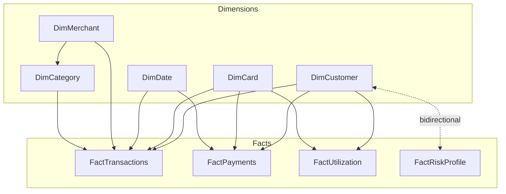

# Data Model

## Credit Card Portfolio Analytics & Risk Intelligence

| | |
|---|---|
| **Document Type** | Semantic Data Model Specification |
| **Modeling Pattern** | Star Schema (Kimball dimensional model) |
| **Version** | 1.0 |
| **Related Documents** | [Architecture.md](./02_Architecture.md), [Data Dictionary.md](./03_Data_Dictionary.md), [DAX Patterns.md](./15_DAX_Patterns.md), [Testing & Validation.md](./17_Testing_Validation.md) |

---

## 1. Scope

[Architecture.md](./02_Architecture.md) describes the *logical* shape of the solution — layers, principles, alternatives considered. This document goes one level deeper: it is the authoritative reference for table **grain**, **key structure**, and **filter-propagation behavior** — the details a developer needs before writing a relationship or a measure, not before drawing a box on an architecture diagram.

Column-by-column business definitions live in [Data Dictionary.md](./03_Data_Dictionary.md); this document stays focused on how tables relate to each other, not what each column means.

## 2. Star Schema Overview

The model is a single, ungoverned-by-snowflaking star schema: five dimension tables surround four fact tables, with all cross-table joins resolved through a single hop (with one two-table exception described in Section 4).



> **Design Decision:** A star schema — rather than a snowflake or a single flat table — was chosen because it keeps every fact table one hop from the dimension a report author needs to slice by, while still isolating descriptive attributes from transactional events. The full alternatives-considered analysis lives in [Architecture.md §3](./02_Architecture.md); this document assumes that decision and documents its consequences at the table level.

## 3. Table Grain Reference

Grain — "what one row represents" — is the single most important fact about a table, because it determines which measures are safe to write against it and which will silently double-count.

| Table | Grain | Primary Key | Row Count |
|---|---|---|---:|
| DimCustomer | One row per customer | `CustomerID` | 1,000 |
| DimCard | One row per card product | `CardID` | 20 |
| DimMerchant | One row per merchant | `MerchantID` | 500 |
| DimCategory | One row per spend category | `CategoryID` | 12 |
| DimDate | One row per calendar day | `DateID` | 1,096 |
| FactTransactions | One row per card transaction | `TransactionID` | 50,000 |
| FactPayments | One row per repayment/billing cycle event, per customer-card | `PaymentID` | 24,682 |
| FactUtilization | One row per customer-card, per calendar month | `UtilizationID` | 39,780 |
| FactRiskProfile | One row per customer, per calendar month | `RiskProfileID` | 36,000 |

> **Implementation Note:** `FactUtilization` and `FactRiskProfile` are both monthly-snapshot facts, but at different grains — `FactUtilization` is customer-**card**-month, while `FactRiskProfile` is customer-month only (no card dimension). A measure that joins the two implicitly through `CustomerID` alone is comparing a card-level snapshot to a customer-level one; see the divergence note on `UtilizationPercent` in [Data Dictionary.md §11](./03_Data_Dictionary.md).

## 4. Relationship Inventory

| # | From (Many) | To (One) | Key | Cross-Filter Direction | Cardinality |
|---|---|---|---|---|---|
| 1 | FactTransactions | DimCustomer | CustomerID | Single | Many-to-one |
| 2 | FactTransactions | DimCard | CardID | Single | Many-to-one |
| 3 | FactTransactions | DimDate | DateID | Single | Many-to-one |
| 4 | FactTransactions | DimMerchant | MerchantID | Single | Many-to-one |
| 5 | FactTransactions | DimCategory | CategoryID | Single | Many-to-one |
| 6 | FactPayments | DimCustomer | CustomerID | Single | Many-to-one |
| 7 | FactPayments | DimCard | CardID | Single | Many-to-one |
| 8 | FactPayments | DimDate | DateID | Single | Many-to-one |
| 9 | FactUtilization | DimCustomer | CustomerID | Single | Many-to-one |
| 10 | FactUtilization | DimCard | CardID | Single | Many-to-one |
| 11 | FactRiskProfile | DimCustomer | CustomerID | **Bidirectional** | Many-to-one |
| — | DimMerchant | DimCategory | CategoryID | Single | Many-to-one (dimension-to-dimension) |

Eleven fact-to-dimension relationships, plus the one dimension-to-dimension relationship (`DimMerchant → DimCategory`) that keeps merchant category lookups a single hop away without normalizing further — see the snowflake-schema rejection in [Architecture.md §3](./02_Architecture.md).

## 5. Filter Propagation Rules

| Rule | Applied Where | Why |
|---|---|---|
| Single-direction is the default | All relationships except #11 | A filter on a dimension (e.g., `DimCustomer[State] = "Kerala"`) narrows the connected fact rows; a filter or selection on a fact table never flows back up to filter the dimension. This keeps every relationship's behavior predictable without inspecting each one individually. |
| Bidirectional is the deliberate, scoped exception | `FactRiskProfile ↔ DimCustomer` only | Lets a customer-level slicer (segment, state) narrow the risk-category breakdown on the Risk Analytics page. Scoped to this single relationship so the behavior doesn't propagate into transaction, payment, or utilization facts. |
| No inactive relationships | N/A — none exist in the current model | There is no role-playing dimension scenario (e.g., a second `DimDate` relationship for `DueDate` vs. `TransactionDate`) in the current scope; if one is introduced, it must use `USERELATIONSHIP()` explicitly rather than relying on an ambiguous default. |

```mermaid
sequenceDiagram
    participant Slicer as DimCustomer Slicer (State)
    participant FR as FactRiskProfile
    participant FT as FactTransactions
    Slicer->>FR: Filters propagate (bidirectional relationship)
    Slicer->>FT: Filters propagate (single direction: Dim -> Fact)
    FR-->>Slicer: No propagation back (would require FT to filter Dim, which never happens)
    Note over Slicer,FT: Only the Risk relationship is bidirectional;<br/>every other fact stays single-direction.
```

## 6. Slowly Changing Attributes

Two attributes exist in more than one table at different points in time, and both are documented here explicitly because they are a common source of "why don't these two numbers match" questions from report consumers.

| Attribute | Appears In | Behavior |
|---|---|---|
| `CreditScore` | `DimCustomer` (onboarding snapshot) and `FactRiskProfile` (per assessment month) | Expected to diverge over time as the bureau score changes after onboarding. Report authors must be explicit about which one a visual uses — see [Data Dictionary.md §3](./03_Data_Dictionary.md). |
| `UtilizationPercent` | `FactUtilization` (customer-card-month) and `FactRiskProfile` (customer-month, sourced independently by the risk-scoring process) | Minor divergence between the two is expected, not a data-quality defect, given the difference in grain and source — see [Testing & Validation.md §5](./17_Testing_Validation.md). |

> **Best Practice:** Neither attribute was modeled as a formal Type 2 slowly-changing dimension (with effective-dated rows) in this release — both are handled as simple duplicated snapshots. A Type 2 SCD pattern for `DimCustomer` is a reasonable target-state improvement if the model needs to answer "what was this customer's segment *at the time* of a given transaction" — see [Project Roadmap.md](./12_Project_Roadmap.md).

## 7. Common Modeling Mistakes (and How This Model Avoids Them)

| Mistake | Consequence | How This Model Avoids It |
|---|---|---|
| Using `DimCard[CreditLimit]` for exposure measures | Reports the product default, not what was actually underwritten for the customer | `Net Portfolio Exposure` and related measures reference `FactUtilization[CreditLimit]` — see [Data Dictionary.md §4](./03_Data_Dictionary.md) |
| Extending bidirectional filtering "to fix a slicer" | Ambiguous, hard-to-debug filter propagation as the model grows | Bidirectional filtering is scoped to exactly one relationship, with a documented rationale — see Section 5 and [Architecture.md §9](./02_Architecture.md) |
| Joining `FactUtilization` and `FactRiskProfile` on `CustomerID` alone and assuming equivalent grain | Silently mixes a card-level snapshot with a customer-level one | Documented explicitly in Section 3 above |
| Counting risk assessments across every historical month | Double-counts customers assessed repeatedly, diluting the "current" signal | `Current Risk Customers` isolates the latest `AssessmentMonth` via `REMOVEFILTERS` before counting — see [DAX Patterns.md §4](./15_DAX_Patterns.md) |

## 8. Related Documents

- [Architecture.md](./02_Architecture.md) — layered architecture and alternatives considered
- [Data Dictionary.md](./03_Data_Dictionary.md) — column-level detail
- [DAX Patterns.md](./15_DAX_Patterns.md) — reusable DAX patterns that depend on this relationship structure
- [Performance Optimization.md](./10_Performance_Optimization.md) — VertiPaq implications of this schema
- [Testing & Validation.md](./17_Testing_Validation.md) — relationship and grain validation checklist

---

## Version History

| Version | Date | Author | Change Description |
|---|---|---|---|
| 1.0 | 2025-12 | Alan Binu | Initial data model specification: grain reference, relationship inventory, filter-propagation rules, slowly-changing-attribute notes |
