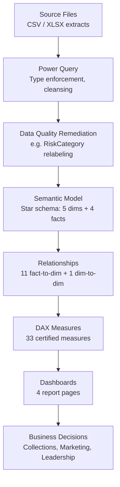
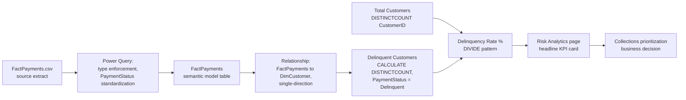

# Data Lineage

## Credit Card Portfolio Analytics & Risk Intelligence

| | |
|---|---|
| **Document Type** | End-to-End Data Lineage Reference |
| **Version** | 1.0 |
| **Related Documents** | [Data Sources.md](./04_Data_Sources.md), [Power Query Transformations.md](./08_Power_Query_Transformations.md), [Architecture.md](./02_Architecture.md), [DAX Measures.md](./05_DAX_Measures.md) |

---

## 1. Why Lineage Gets Its Own Document

Every other document in this repository describes one layer of the solution in depth. This document exists to trace a single thread through all of them — from a raw source file, through transformation and modeling, to the number a business user reads on a dashboard — so that a data-quality question ("why does this KPI say what it says?") can be answered by walking one document instead of six.

## 2. End-to-End Lineage Overview



This is the same six-layer structure introduced in [Architecture.md §7](./02_Architecture.md); this document exists to walk it end-to-end for specific, named examples rather than describing it in the abstract.

## 3. Worked Example — `Delinquency Rate %`

Tracing one certified KPI through every layer illustrates how the lineage works in practice.



| Stage | What Happens | Documented In |
|---|---|---|
| Source | `FactPayments.csv` extract, one row per repayment/billing event | [Data Sources.md §2](./04_Data_Sources.md) |
| Transformation | Type enforcement; `PaymentStatus` values standardized | [Power Query Transformations.md §4.6](./08_Power_Query_Transformations.md) |
| Model | Loaded into `FactPayments`, related to `DimCustomer` (single-direction) | [Data Model.md §4](./14_Data_Model.md) |
| Measure | `Delinquent Customers` filters to `PaymentStatus = "Delinquent"`; `Delinquency Rate %` divides it by `Total Customers` via `DIVIDE()` | [DAX Measures.md §6.1](./05_DAX_Measures.md), [DAX Patterns.md §2](./15_DAX_Patterns.md) |
| Presentation | Headline KPI card on the Risk Analytics page | [Dashboard Guide.md §5](./06_Dashboard_Guide.md) |
| Decision | Drives collections outreach prioritization | [Business Requirements.md §3](./01_Business_Requirements.md) (BO-2) |

## 4. Worked Example — Risk Category Correction

This example traces a data-quality fix rather than a metric, because it illustrates the model's "fix at source" principle end-to-end.

```mermaid
flowchart LR
    S1[FactRiskProfile source\nRiskCategory = "Aggressive User"] --> PQ1[Power Query\nReplaced Value step]
    PQ1 --> M1[FactRiskProfile\nRiskCategory = "Critical Risk"]
    M1 --> ALL[Every downstream measure,\nvisual, and slicer\ninherits the corrected label\nautomatically]
```

Because the correction happens once, in Power Query, upstream of the semantic model, every measure and visual that touches `RiskCategory` — from the `High Risk Customers` measure to a slicer on the Risk Analytics page — sees the corrected `"Critical Risk"` label without any additional patching. Full detail: [Power Query Transformations.md §5.1](./08_Power_Query_Transformations.md).

## 5. Lineage by Fact Table

| Fact Table | Source File | Key Transformations | Primary Consuming Measures | Primary Consuming Dashboard(s) |
|---|---|---|---|---|
| FactTransactions | Source extract (XLSX) | Type enforcement, EMI flag standardization | `Total Spend`, `Total Transactions`, `EMI %`, `Average Cashback Per Transaction` | Executive Overview, Spend Analytics |
| FactPayments | Source extract (CSV) | Type enforcement, `PaymentStatus` standardization, payment-to-spend anomaly correction | `Total Payments`, `Delinquent Customers`, `Delinquency Rate %`, `Payment to Spend Ratio` | Executive Overview, Risk Analytics |
| FactUtilization | Source extract (XLSX) | Type enforcement | `Avg Utilization %`, `Total Credit Limit` | Risk Analytics |
| FactRiskProfile | Source extract (XLSX) | Type enforcement, `RiskCategory` relabeling (`"Aggressive User"` → `"Critical Risk"`) | `Current Risk Customers`, `High Risk Customers` | Risk Analytics, Executive Overview |

Full source-file inventory and format rationale: [Data Sources.md](./04_Data_Sources.md).

## 6. Why This Matters — Auditability

> **Governance Note:** The reason this lineage can be traced cleanly in five steps is a direct consequence of two architectural decisions documented elsewhere: data-quality fixes happen once, at the transformation layer ([Architecture.md §2](./02_Architecture.md)), and every measure lives once, in a centralized calculation table ([DAX Measures.md §1](./05_DAX_Measures.md)). A model that patched values at the visual layer, or duplicated measures per report page, would make this kind of lineage trace impossible to do reliably — see [Change Log.md](./13_Change_Log.md) for how changes to any layer are tracked.

## 7. Related Documents

- [Data Sources.md](./04_Data_Sources.md)
- [Power Query Transformations.md](./08_Power_Query_Transformations.md)
- [Data Model.md](./14_Data_Model.md)
- [DAX Measures.md](./05_DAX_Measures.md)
- [Dashboard Guide.md](./06_Dashboard_Guide.md)

---

## Version History

| Version | Date | Author | Change Description |
|---|---|---|---|
| 1.0 | 2025-12 | Alan Binu | Initial data lineage reference with worked examples for a certified KPI and a data-quality correction |
