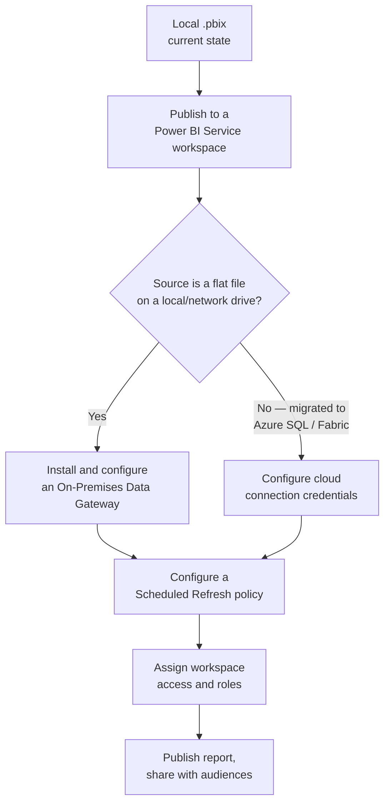

# Deployment Guide

## Credit Card Portfolio Analytics & Risk Intelligence

| | |
|---|---|
| **Document Type** | Setup & Deployment Guide |
| **Version** | 1.0 |
| **Related Documents** | [Technical Design.md](./09_Technical_Design.md), [Data Sources.md](./04_Data_Sources.md), [Project Structure.md](./19_Project_Structure.md) |

---

## 1. Objective

This guide walks a new user — a reviewer, a hiring manager, or a developer picking up the project — through opening the delivered `.pbix`, pointing it at their own copy of the source data, and refreshing it successfully. It also documents the path from local `.pbix` to a governed Power BI Service deployment, which is the current release's target state rather than its shipped state.

## 2. Current Distribution Model

The solution today is distributed as a single self-contained `.pbix` file alongside its source `Data/` folder, via GitHub — see [Technical Design.md §9](./09_Technical_Design.md). There is no gateway, scheduled refresh, or governed workspace in the current release.

## 3. First-Time Setup

1. **Clone or download the repository**, preserving the folder structure — the `.pbix` expects the `Data/` folder to sit alongside it (see [Project Structure.md](./19_Project_Structure.md)).
2. **Open the `.pbix`** in Power BI Desktop.
3. **Update the source file path.** Because Power Query `Source` steps currently reference the original development machine's file path (the parameterization gap documented in [Technical Design.md §7](./09_Technical_Design.md)), the fastest path today is:
   - Go to **Transform Data → Data Source Settings**.
   - Select each source, choose **Change Source**, and repoint it to the local copy of the corresponding file under `Data/`.
4. **Refresh.** Use **Home → Refresh** to reload all nine tables from the newly pointed-to sources.

> **Enterprise Recommendation:** Step 3 above is a manual workaround for the current release. The target-state fix — a single `SourceFolderPath` parameter repointing all nine `Source` steps at once — is diagrammed and specified in full in [Technical Design.md §7](./09_Technical_Design.md), and tracked as the highest-priority near-term item in [Project Roadmap.md](./12_Project_Roadmap.md). Once implemented, first-time setup collapses to a single parameter edit instead of nine individual source changes.

## 4. Refreshing the Model

| Aspect | Current State |
|---|---|
| Refresh trigger | Manual, on-demand (Home → Refresh in Power BI Desktop) |
| Refresh scope | Full reload of all nine tables — no incremental refresh partition is configured |
| Refresh frequency | As needed by the developer/reviewer; no schedule |

See [Data Sources.md §5](./04_Data_Sources.md) for the current-state refresh model, and [Performance Optimization.md §9](./10_Performance_Optimization.md) for refresh performance characteristics.

## 5. Path to Power BI Service Deployment (Target State)

| Step | Detail |
|---|---|
| Publish | Publish the `.pbix` to a Power BI Service workspace via **File → Publish** in Power BI Desktop |
| Gateway | If sources remain local flat files, an **On-Premises Data Gateway** must be installed and configured so the Service can reach them for scheduled refresh |
| Scheduled refresh | Configure a refresh schedule in the Service against the semantic model's dataset settings — not available for a `.pbix` that has never been published |
| Workspace access | Assign viewer/contributor roles per the stakeholder groups in [Business Requirements.md §4](./01_Business_Requirements.md) |
| Row-Level Security | Once RLS roles are implemented (see [Project Roadmap.md §3](./12_Project_Roadmap.md)), assign users to roles in the Service under **Security** |

> **Operational Consideration:** None of the steps in this section are implemented in the current release — this section documents the deployment path deliberately left open by the architecture, not a completed rollout. See [Technical Design.md §9](./09_Technical_Design.md) for the current-vs-target environment comparison.

## 6. Troubleshooting

| Symptom | Likely Cause | Resolution |
|---|---|---|
| Refresh fails immediately with a file-not-found error | Source file paths still point to the original development machine | Repoint sources per Section 3, Step 3 |
| Model opens but shows stale/cached data | The `.pbix` was opened without a refresh after cloning | Run **Home → Refresh** after confirming source paths |
| Visuals load slowly on first open | Expected on first load while VertiPaq builds its in-memory cache; not indicative of a defect | See [Performance Optimization.md](./10_Performance_Optimization.md) |
| Slicers on one page don't affect another | Expected behavior outside the Risk Analytics page for the intentional single-direction relationships | See [Data Model.md §5](./14_Data_Model.md) — this is a documented design decision, not a bug |

## 7. Related Documents

- [Technical Design.md](./09_Technical_Design.md)
- [Data Sources.md](./04_Data_Sources.md)
- [Project Structure.md](./19_Project_Structure.md)
- [Project Roadmap.md](./12_Project_Roadmap.md)
- [Performance Optimization.md](./10_Performance_Optimization.md)

---

## Version History

| Version | Date | Author | Change Description |
|---|---|---|---|
| 1.0 | 2025-12 | Alan Binu | Initial deployment guide covering first-time setup, refresh, target-state Service deployment, and troubleshooting |
