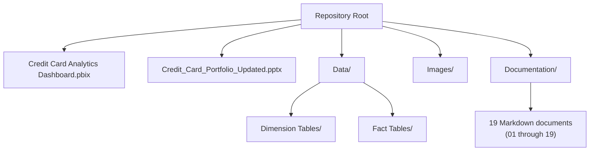
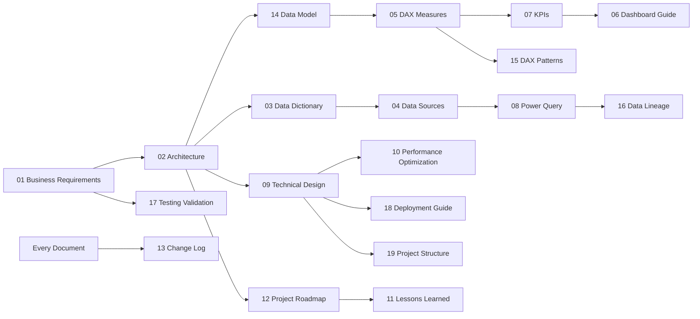

# Project Structure

## Credit Card Portfolio Analytics & Risk Intelligence

| | |
|---|---|
| **Document Type** | Repository & File Inventory |
| **Version** | 1.0 |
| **Related Documents** | [Technical Design.md](./09_Technical_Design.md), [Deployment Guide.md](./18_Deployment_Guide.md) |

---

## 1. How This Document Is Organized

[Technical Design.md §10](./09_Technical_Design.md) gives a summary-level file inventory. This document is the exhaustive companion — every folder, its purpose, and how the pieces depend on each other — so a new contributor or reviewer can navigate the repository without opening every file to find out what it's for.

## 2. Top-Level Layout

## 3. Root-Level Files

| File | Purpose | Dependencies |
|---|---|---|
| `Credit Card Analytics Dashboard.pbix` | The complete Power BI solution — semantic model, DAX measure layer, and 4 report pages | Reads from `Data/` on refresh; see [Data Sources.md](./04_Data_Sources.md) |
| `Credit_Card_Portfolio_Updated.pptx` | Executive presentation summarizing the solution for a non-technical audience | Sourced from the same KPIs documented in [KPIs & Business Metrics.md](./07_KPIs_and_Business_Metrics.md) |

## 4. `Data/` Folder

| Subfolder | Contents | Consuming Tables |
|---|---|---|
| `Data/Dimension Tables/` | Source files for all 5 dimension tables | `DimCustomer`, `DimCard`, `DimMerchant`, `DimCategory`, `DimDate` — see [Data Dictionary.md §2](./03_Data_Dictionary.md) |
| `Data/Fact Tables/` | Source files for all 4 fact tables | `FactTransactions`, `FactPayments`, `FactUtilization`, `FactRiskProfile` — see [Data Dictionary.md §2](./03_Data_Dictionary.md) |

Full source-file-to-table mapping and format rationale: [Data Sources.md](./04_Data_Sources.md).

## 5. `Images/` Folder

Screenshots and diagrams referenced from the README and from the Documentation folder (e.g., dashboard page captures referenced in [Dashboard Guide.md](./06_Dashboard_Guide.md)).

## 6. `Documentation/` Folder — File Inventory

| # | File | Covers |
|---|---|---|
| 01 | `01_Business_Requirements.md` | Business case, objectives, stakeholders, scope, functional/non-functional requirements |
| 02 | `02_Architecture.md` | Solution architecture, layered view, alternatives considered |
| 03 | `03_Data_Dictionary.md` | Column-level schema for all 9 tables |
| 04 | `04_Data_Sources.md` | Source file inventory, ingestion architecture, refresh model |
| 05 | `05_DAX_Measures.md` | All 33 certified DAX measures, individually documented |
| 06 | `06_Dashboard_Guide.md` | Page-by-page dashboard usage guide |
| 07 | `07_KPIs_and_Business_Metrics.md` | KPI catalog and business interpretation |
| 08 | `08_Power_Query_Transformations.md` | ETL / transformation-layer specification |
| 09 | `09_Technical_Design.md` | Implementation-level technical decisions |
| 10 | `10_Performance_Optimization.md` | VertiPaq, formula-engine, and report-level performance guidance |
| 11 | `11_Lessons_Learned.md` | Project retrospective |
| 12 | `12_Project_Roadmap.md` | Near-, mid-, and long-term roadmap |
| 13 | `13_Change_Log.md` | Solution and documentation change history |
| 14 | `14_Data_Model.md` | Grain, keys, relationships, filter propagation |
| 15 | `15_DAX_Patterns.md` | Reusable DAX design patterns |
| 16 | `16_Data_Lineage.md` | Source-to-dashboard lineage, worked examples |
| 17 | `17_Testing_Validation.md` | Acceptance checklist and validation methodology |
| 18 | `18_Deployment_Guide.md` | Setup, refresh, and Service deployment path |
| 19 | `19_Project_Structure.md` | This document |

## 7. Documentation Cross-Reference Map

> **Best Practice:** This documentation set is intentionally cross-referenced rather than self-contained per file — each document states what it covers and defers to the appropriate sibling document for adjacent detail, rather than duplicating it. When adding a new document, add both a forward reference (in the documents it builds on) and a "Related Documents" section (pointing to the documents it builds on), matching the pattern above.

## 8. Related Documents

- [Technical Design.md](./09_Technical_Design.md) — summary file inventory and design constraints
- [Deployment Guide.md](./18_Deployment_Guide.md) — how the files in this structure are used during setup
- [Change Log.md](./13_Change_Log.md) — history of changes to this structure

---

## Version History

| Version | Date | Author | Change Description |
|---|---|---|---|
| 1.0 | 2025-12 | Alan Binu | Initial project structure inventory covering root files, Data/ and Images/ folders, and the full 19-document Documentation set |
