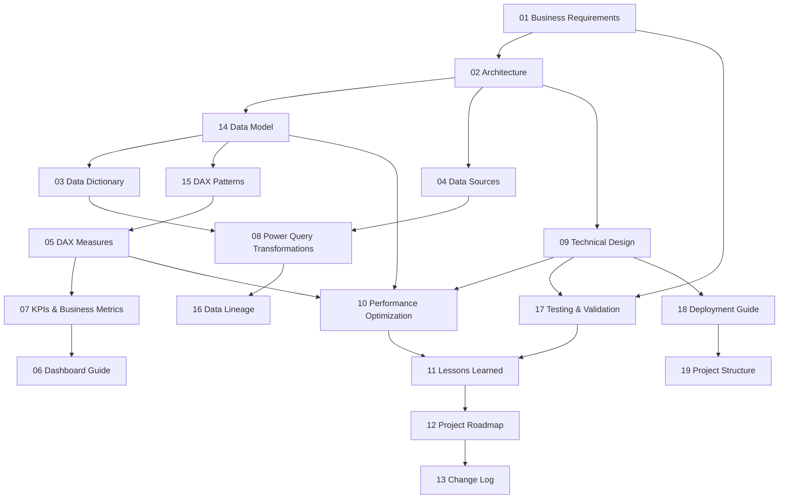

# 📚 Enterprise Documentation Portal

## Credit Card Portfolio Analytics & Risk Intelligence

### Comprehensive Business Intelligence Engineering Documentation

Enterprise grade technical documentation covering the complete lifecycle of a Microsoft Power BI solution, from business requirements and semantic modeling to DAX engineering, ETL, testing, deployment, governance, and long term maintenance.

---

| | |
|---|---|
| **Document Type** | Enterprise Documentation Portal |
| **Scope** | Complete `Documentation/` Knowledge Base |
| **Documents** | **19 Technical Documents** |
| **Platform** | Microsoft Power BI |
| **Version** | 2.1 |
| **Related Resource** | [Repository README](../README.md) |

---

> [!NOTE]
>
> This folder serves as the complete engineering knowledge base for the **Credit Card Portfolio Analytics & Risk Intelligence** solution.
>
> The repository **README** introduces the project at a high level, while this documentation explains every design decision, architecture choice, DAX implementation, ETL process, validation strategy, deployment approach, and future roadmap in enterprise level detail.

> [!TIP]
>
> **New to this repository?**
>
> Start with the **Repository README** for a quick overview, then return here and follow one of the recommended reading paths based on your role.

---

## 📊 Documentation at a Glance

| 📌 Metric | 📈 Value |
|------------|---------:|
| 📄 Technical Documents | **19** |
| 📚 Documentation Lines | **3,214+** |
| 📊 Dashboard Pages | **4** |
| 🧮 Certified DAX Measures | **33** |
| 🗃 Semantic Model Tables | **9** |
| 🔗 Relationships | **11** |
| 📈 Business KPIs | **10+** |
| 🚀 Repository Status | **Enterprise Portfolio** |

---

## 📖 Documentation Overview

A Business Intelligence solution is not just a `.pbix` file — it is a lifecycle, and this suite documents all of it:

| Lifecycle Stage | Covered In |
|---|---|
| **Business Requirements** | Why the solution exists, who asked for it, what it must do |
| **Architecture** | How the solution is structured, end to end |
| **Data Modeling** | The star schema — tables, grain, relationships |
| **Power Query / ETL** | How raw files become model-ready tables |
| **Semantic Model & DAX** | The 33-measure calculation layer business logic lives in |
| **Dashboard Design** | The four report pages and how each is meant to be used |
| **Performance** | Why the model behaves the way it does at scale |
| **Testing** | How correctness was validated before calling anything "certified" |
| **Deployment** | How to stand this solution up from a clean checkout |
| **Governance** | Naming, versioning, and documentation-maintenance conventions |
| **Project Maintenance** | Change history, lessons learned, and forward roadmap |

If the repository README is the product page, this folder is the engineering design record behind it.

---

## 🗂 Documentation Structure

| # | Document | Purpose | Primary Audience | Reading Order |
|---|---|---|---|---|
| 01 | [Business Requirements](./01_Business_Requirements.md) | Defines the business problem, stakeholders, and functional/non-functional requirements the solution was built to satisfy | Hiring Manager, BI Architect | 1 |
| 02 | [Architecture](./02_Architecture.md) | Describes the end-to-end solution architecture — source, transform, model, serve — and the reasoning behind each layer | BI Architect, Power BI Developer | 2 |
| 03 | [Data Dictionary](./03_Data_Dictionary.md) | Column-level reference for all 9 tables in the semantic model | Power BI Developer, Data Analyst | 3 |
| 04 | [Data Sources](./04_Data_Sources.md) | Inventories every source file, its business process, and its ingestion/refresh characteristics | Data Engineer, Power BI Developer | 4 |
| 05 | [DAX Measures](./05_DAX_Measures.md) | Full specification of all 33 certified measures, grouped by technique | Power BI Developer, BI Architect | 5 |
| 06 | [Dashboard Guide](./06_Dashboard_Guide.md) | Operating manual for all four report pages — purpose, KPIs, visuals, workflow | Business User, Data Analyst | 6 |
| 07 | [KPIs & Business Metrics](./07_KPIs_and_Business_Metrics.md) | Plain-business-language catalog of every certified KPI — meaning, ownership, thresholds | Business User, Hiring Manager | 7 |
| 08 | [Power Query Transformations](./08_Power_Query_Transformations.md) | ETL logic per table, including both identified data-quality defects and their fixes | Data Engineer, Power BI Developer | 8 |
| 09 | [Technical Design](./09_Technical_Design.md) | Implementation-level decisions: storage mode, relationship configuration, naming, security posture | BI Architect, Power BI Developer | 9 |
| 10 | [Performance Optimization](./10_Performance_Optimization.md) | Engine-level reasoning behind model performance at current and projected scale | BI Architect, Data Engineer | 10 |
| 11 | [Lessons Learned](./11_Lessons_Learned.md) | Retrospective — what worked, what was harder than expected, what would change next time | Hiring Manager, BI Architect | 11 |
| 12 | [Project Roadmap](./12_Project_Roadmap.md) | Forward-looking plan from portfolio-project state to production-grade deployment | Hiring Manager, BI Architect | 12 |
| 13 | [Change Log](./13_Change_Log.md) | Version history of the solution and this documentation set, using adapted Semantic Versioning | All audiences | 13 |
| 14 | [Data Model](./14_Data_Model.md) | The star schema itself — grain, relationship rationale, filter-propagation behavior | BI Architect, Power BI Developer | 3a |
| 15 | [DAX Patterns](./15_DAX_Patterns.md) | The reusable DAX techniques (safe division, context transition, time intelligence) behind the 33 measures | Power BI Developer | 5a |
| 16 | [Data Lineage](./16_Data_Lineage.md) | Traces a single thread from raw source file to on-dashboard number, across every layer | Data Engineer, BI Architect | 8a |
| 17 | [Testing & Validation](./17_Testing_Validation.md) | How model correctness was validated, consolidated into a single executable checklist | Power BI Developer, BI Architect | 9a |
| 18 | [Deployment Guide](./18_Deployment_Guide.md) | Step-by-step setup from clean checkout to a refreshed, working report | Power BI Developer, Data Engineer | 14 |
| 19 | [Project Structure](./19_Project_Structure.md) | Exhaustive file-and-folder inventory of the repository | New Contributor, Reviewer | 15 |

<b>Why documents 14–19 aren't numbered 03a, 05a, etc.</b>

Documents 14–19 were added after the original 13-document set to fill specific depth gaps (a dedicated data model spec, reusable DAX pattern reference, lineage trace, testing checklist, deployment guide, and file inventory). They're numbered sequentially by *addition order*, not topical order, which is why the Reading Order column above resequences them logically (3a, 5a, 8a, 9a) rather than following the filename numbers 14–19 literally. Filenames are stable identifiers; the Reading Order column is the actual recommended path.

### Document Metadata Summary

Each document versions independently. This is the current state of the set:

| # | Document | Version | Lines |
|---|---|:---:|---:|
| 01 | Business Requirements | 1.1 | 180 |
| 02 | Architecture | 1.1 | 216 |
| 03 | Data Dictionary | 1.1 | 260 |
| 04 | Data Sources | 1.1 | 132 |
| 05 | DAX Measures | 2.1 | 380 |
| 06 | Dashboard Guide | 2.1 | 342 |
| 07 | KPIs & Business Metrics | 1.1 | 196 |
| 08 | Power Query Transformations | 1.1 | 207 |
| 09 | Technical Design | 1.1 | 194 |
| 10 | Performance Optimization | 1.1 | 165 |
| 11 | Lessons Learned | 1.0 | 75 |
| 12 | Project Roadmap | 1.0 | 98 |
| 13 | Change Log | 1.1 | 99 |
| 14 | Data Model | 1.0 | 147 |
| 15 | DAX Patterns | 1.0 | 117 |
| 16 | Data Lineage | 1.0 | 99 |
| 17 | Testing & Validation | 1.0 | 99 |
| 18 | Deployment Guide | 1.0 | 95 |
| 19 | Project Structure | 1.0 | 113 |
| — | **Total** | — | **3,214** |

`DAX Measures` and `Dashboard Guide` carry the highest version numbers (2.1) — both underwent a Major Revision after initial release, expanding from summary-level coverage to full per-item documentation (every measure individually; every dashboard page in full), per [Change Log §3](./13_Change_Log.md).

---

## 🧭 Recommended Reading Paths

Not every audience needs every document. Start here.

**Recruiter (5 minutes)** — *is this candidate worth a closer look?*
1. [Business Requirements](./01_Business_Requirements.md) — skim §1–2 only
2. [Dashboard Guide](./06_Dashboard_Guide.md) — skim the four page summaries
3. [Lessons Learned](./11_Lessons_Learned.md)

**Hiring Manager** — *can this person reason like a BI architect, not just build charts?*
1. [Business Requirements](./01_Business_Requirements.md)
2. [KPIs & Business Metrics](./07_KPIs_and_Business_Metrics.md)
3. [Dashboard Guide](./06_Dashboard_Guide.md)
4. [Lessons Learned](./11_Lessons_Learned.md)
5. [Project Roadmap](./12_Project_Roadmap.md)

**Business User / Stakeholder** — *how do I use this, and what do the numbers mean?*
1. [Dashboard Guide](./06_Dashboard_Guide.md)
2. [KPIs & Business Metrics](./07_KPIs_and_Business_Metrics.md)
3. [Business Requirements](./01_Business_Requirements.md)

**Power BI Developer (onboarding onto this model)** — *how is it built, so I can extend it safely?*
1. [Architecture](./02_Architecture.md)
2. [Data Model](./14_Data_Model.md)
3. [Data Dictionary](./03_Data_Dictionary.md)
4. [Power Query Transformations](./08_Power_Query_Transformations.md)
5. [DAX Patterns](./15_DAX_Patterns.md)
6. [DAX Measures](./05_DAX_Measures.md)
7. [Technical Design](./09_Technical_Design.md)
8. [Deployment Guide](./18_Deployment_Guide.md)

**Data Analyst** — *what can I trust when I build off this model?*
1. [Dashboard Guide](./06_Dashboard_Guide.md)
2. [KPIs & Business Metrics](./07_KPIs_and_Business_Metrics.md)
3. [Data Dictionary](./03_Data_Dictionary.md)
4. [DAX Measures](./05_DAX_Measures.md)

**BI Architect (full technical review)** — *would I sign off on this design?*
1. [Business Requirements](./01_Business_Requirements.md)
2. [Architecture](./02_Architecture.md)
3. [Data Model](./14_Data_Model.md)
4. [Technical Design](./09_Technical_Design.md)
5. [Performance Optimization](./10_Performance_Optimization.md)
6. [Testing & Validation](./17_Testing_Validation.md)
7. [Project Roadmap](./12_Project_Roadmap.md)

**Data Engineer** — *where does the data come from, and how does it get here?*
1. [Data Sources](./04_Data_Sources.md)
2. [Power Query Transformations](./08_Power_Query_Transformations.md)
3. [Data Lineage](./16_Data_Lineage.md)
4. [Deployment Guide](./18_Deployment_Guide.md)

---

## 🔗 Documentation Relationships

Read top to bottom for the full solution lifecycle, or jump in using the reading paths above — every document's own header states which others it depends on via its **Related Documents** row.

---

## 📊 Repository Coverage

This suite documents the solution completely:

| Area | Documented In |
|---|---|
| Business Requirements | 01 |
| Solution & Data Architecture | 02, 14 |
| Semantic Modeling | 03, 14 |
| ETL / Power Query | 04, 08, 16 |
| DAX & Business Logic | 05, 15, 07 |
| Dashboard / UX Design | 06 |
| Performance Engineering | 10 |
| Testing & Correctness | 17 |
| Deployment | 18 |
| Governance & Structure | 19, 13 |
| Retrospective & Roadmap | 11, 12 |

Nineteen documents, **3,214 lines** of technical documentation, covering every layer between a raw `.xlsx` file and a number a business user reads on a dashboard.

---

## 📐 Documentation Standards

Every document in this suite follows the same conventions:

- **Metadata header** — a table stating Document Type, Version, and Related Documents, immediately under the title.
- **Cross-references, not duplication** — if two documents would otherwise repeat the same explanation, one owns it and the other links to it. [DAX Patterns](./15_DAX_Patterns.md) exists specifically so [DAX Measures](./05_DAX_Measures.md) doesn't re-explain `DIVIDE` thirty-three times.
- **Mermaid diagrams** where a diagram communicates structure faster than prose — architecture flow, schema relationships, lineage trails.
- **Versioning** — each document versions independently (see its metadata header); the solution and documentation set version together in [Change Log](./13_Change_Log.md).
- **Verified facts only** — every number, table name, and measure definition traces back to the actual `.pbix` file, not to assumption or convention.
- **Consistent terminology** — "certified measure," "semantic model," "grain," and similar terms mean the same thing in every document; see [Data Model §1](./14_Data_Model.md) and [DAX Measures §1](./05_DAX_Measures.md) for the definitions in force.

---

## ✅ Verification & Traceability

Every fact in this documentation set is traceable to one of three sources:

1. **The `.pbix` file itself** — table names, row/column counts, relationships, and all 33 DAX measures, extracted directly from the model rather than reconstructed from memory.
2. **The source data files** — the values referenced in business examples (spend figures, risk percentages, segment splits) trace back to the actual `Dim*` / `Fact*` files in the repository root.
3. **This documentation set's own cross-references** — where one document states a fact owned by another (e.g., a KPI definition, a relationship's cardinality), it links to the owning document rather than restating and risking drift.

Where a detail could not be verified directly — for example, an implementation choice that is standard practice but not independently confirmable from the file alone — the source document says so explicitly (see, for instance, the Repository-Verified vs. Inferred Implementation labeling in [DAX Measures §2](./05_DAX_Measures.md)). Nothing in this suite presents an assumption as a confirmed fact.

---

## 📚 Glossary

Terms used consistently across this documentation set:

| Term | Definition |
|---|---|
| **Semantic model** | The Power BI data model (tables, relationships, and measures) that report visuals query against — distinct from the raw source files |
| **Grain** | The level of detail one row in a table represents (e.g., FactTransactions' grain is one row per transaction) |
| **Certified measure** | A DAX measure documented, tested, and approved as the single source of truth for a metric — see [DAX Measures §1](./05_DAX_Measures.md) |
| **Cross-filter direction** | Whether a relationship's filter propagates one way (Single) or both ways (Both/Bidirectional) between two tables |
| **Star schema** | A dimensional model with fact tables (events/transactions) surrounded by dimension tables (descriptive attributes), as opposed to a single flattened table |
| **Context transition** | The DAX mechanism by which a row context (e.g., inside `CALCULATE`) becomes a filter context — see [DAX Patterns](./15_DAX_Patterns.md) |
| **Lineage** | The traceable path a piece of data takes from its source file to its final appearance on a dashboard — see [Data Lineage](./16_Data_Lineage.md) |
| **Repository-Verified** | A fact confirmed directly from the `.pbix` file or source data, as opposed to a reasonable but unconfirmed inference — see [DAX Measures §2](./05_DAX_Measures.md) |

---

## 🛠 Maintenance

This documentation is a living artifact, not a one-time deliverable. Future contributors should:

- **Update the Change Log first.** Any change to the model, a measure, or a dashboard page gets an entry in [13_Change_Log.md](./13_Change_Log.md) before it gets merged.
- **Keep cross-references synchronized.** If a document is renamed, split, or removed, update every **Related Documents** row that points to it — a broken internal reference is treated as a documentation defect, not a cosmetic issue.
- **Update version numbers deliberately.** Follow the adapted Semantic Versioning convention in [Change Log §1](./13_Change_Log.md): MAJOR for architecture/model changes, MINOR for new dashboards or measures, PATCH for corrections.
- **Maintain terminology.** Don't introduce a new synonym for a term already defined elsewhere in the suite — extend the existing definition instead.
- **Avoid duplicate explanations.** If you're about to explain something a linked document already covers, link to it instead of repeating it.

---

## 📜 License

This documentation is provided under the same license as the repository — see the root [LICENSE](../LICENSE) file. Documentation content may be reused and adapted under those terms; retain attribution to the original repository where practical.

---

## 🎯 Closing

---

## ⭐ Thank You for Exploring the Documentation

This documentation suite demonstrates enterprise Business Intelligence engineering practices using Microsoft Power BI, Power Query, DAX, semantic modeling, data modeling, ETL, testing, deployment, and governance.

Every document has been designed to reflect real world engineering standards while remaining practical for developers, analysts, architects, and hiring managers.

### Continue Exploring

🏠 **Main Repository:** [Repository README](../README.md)

📊 **Power BI Solution:** `Credit Card Analytics Dashboard.pbix`

📚 **Documentation Suite:** 19 Enterprise Documents

⭐ If you found this project valuable, consider giving the repository a star.

