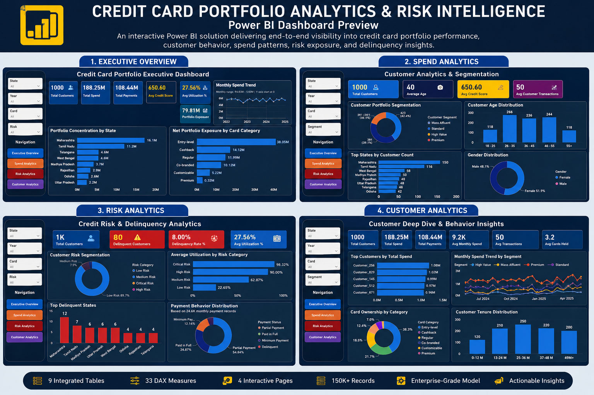
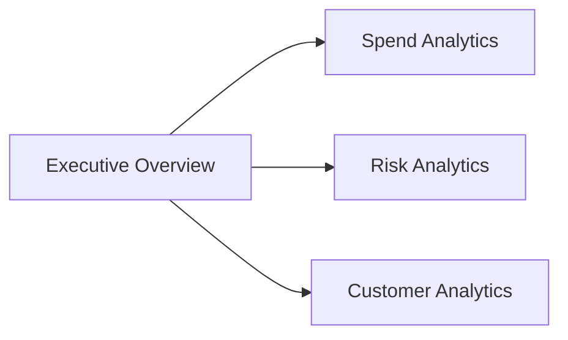
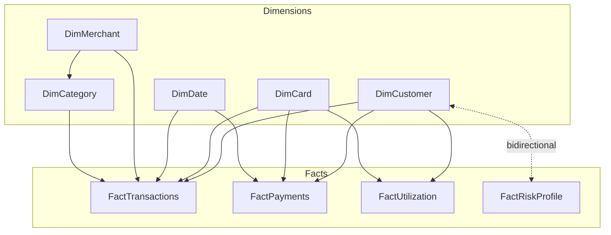

<div align="center">

# ⚡ Power BI Enterprise Analytics Solution

### Credit Card Portfolio Analytics & Risk Intelligence
**Semantic Model · DAX Layer · Interactive Dashboards**


*A single self-contained `.pbix` file combining a governed star-schema semantic model, a 33-measure DAX layer, and four interactive report pages.*

</div>

---

> [!NOTE]
> This document is the **landing page for the `PowerBI/` folder only**. It describes the Power BI solution file itself — model, DAX, and reports. For dataset details, see the [Dataset Portal](../Data/README.md). For architecture and design rationale, see the [Documentation suite](../Documentation/README.md).

> [!WARNING]
> **Filename inconsistency detected during review.** The file in this folder is named `Credit_Card_Analytics_DashbBoard_Project.pbix`. [`09_Technical_Design.md §10`](../Documentation/09_Technical_Design.md) documents it as `Credit Card Analytics Dashboard.pbix` — a different name. This README refers to the file by its **actual current filename**; reconcile the naming in the file system or the documentation before external distribution.

---

## 📘 Project Overview

The `PowerBI/` folder contains the complete Power BI solution for this project as a single self-contained `.pbix` file:

```
Credit_Card_Analytics_DashbBoard_Project.pbix   (~3.0 MB)
```

This one file **is** the entire analytical solution. Opening it in Power BI Desktop gives you:

| Layer | Contents |
|---|---|
| **Power Query** | All 9 source-to-table transformations (see [Power Query Layer](#-power-query-layer)) |
| **Data Model** | The 9-table star schema and its 12 relationships (see [Semantic Model](#-semantic-model)) |
| **DAX Layer** | 33 certified business measures in a centralized calculation table (see [DAX Layer](#-dax-layer)) |
| **Report Pages** | 4 interactive dashboard pages (see [Report Pages](#-report-pages)) |
| **Visualizations** | Cards, bar/column/line/donut charts, combo charts, slicers, and navigation buttons |

There is no separate `.pbit` template, no external dataset file, and no shared Power BI Service dataset — model, DAX, and reports are packaged together in this one binary.

---
---

## 📸 Solution Preview

> A consolidated preview of all four interactive Power BI dashboards included in this solution.

<p align="center">
  
</p>

The solution consists of four interactive report pages:

- 📊 Executive Overview
- 💳 Spend Analytics
- ⚠️ Risk Analytics
- 👥 Customer Analytics

A complete high resolution export is also available in:

📄 **credit-card-portfolio-analytics.pdf**


## 🗂️ Folder Structure

```
PowerBI/
│
├── README.md                                          # This file
└── Credit_Card_Analytics_DashbBoard_Project.pbix       # Complete Power BI solution
```

| File | Purpose |
|---|---|
| `README.md` | Landing page for this folder — architecture, features, and usage instructions |
| `Credit_Card_Analytics_DashbBoard_Project.pbix` | The full solution: Power Query, semantic model, DAX measures, and 4 report pages, all in one file |

---

## 🧩 Power BI Features

| Feature | Status | Notes |
|---|---|---|
| **Data Import** | ✅ Implemented | All 9 tables loaded via Import mode (VertiPaq in-memory engine) |
| **Power Query (M)** | ✅ Implemented | `Excel.Workbook()` for 8 `.xlsx` sources, `Csv.Document()` for `FactPayments.csv` |
| **Star Schema** | ✅ Implemented | 5 dimensions, 4 facts, 12 relationships (see [Semantic Model](#-semantic-model)) |
| **DAX Measures** | ✅ Implemented | 33 measures in a centralized `_Measures` calculation table |
| **Calculated Columns** | ⚠️ Not verified | Not confirmed in the current build; the model's `DataModel` binary is compressed and not inspectable without SSAS tooling — see [DAX Measures.md](../Documentation/05_DAX_Measures.md) for the authoritative list |
| **Relationships** | ✅ Implemented | Single-direction by default; one bidirectional exception (`FactRiskProfile ↔ DimCustomer`) |
| **Slicers** | ✅ Implemented | 4 slicers present on every one of the 4 report pages |
| **Cross Filtering** | ✅ Implemented | Standard Power BI visual-interaction behavior; active across all report pages |
| **Tooltips** | ✅ Implemented | Default hover tooltips configured on report visuals |
| **Interactive Navigation** | ✅ Implemented | 4 action-button visuals per page, used for page-to-page navigation |
| **Bookmarks** | ❌ Not implemented | No bookmarks exist in the current file — see [Known Limitations](#️-known-limitations) |
| **Drillthrough** | ❌ Not implemented | No drillthrough target pages exist in the current file — see [Known Limitations](#️-known-limitations) |
| **Performance Optimization** | 📄 Documented separately | See [Performance Optimization.md](../Documentation/10_Performance_Optimization.md) for VertiPaq compression and cardinality guidance |

> [!IMPORTANT]
> This table reflects what was verified by inspecting the actual `.pbix` file (its Report Layout JSON) during this review, not just what was originally planned. Bookmarks and Drillthrough were part of the original feature wishlist but are not present in the current build.

---

## 📊 Report Pages

The report contains **4 pages**, confirmed directly from the file:



### 1. Executive Overview
The landing page. 6 KPI cards, 2 bar charts, 1 line chart, and 4 slicers give a portfolio-wide summary at a glance — the entry point before drilling into a specific analytical area.

### 2. Spend Analytics
Focused on transaction and spending behavior. Combines KPI cards with a clustered bar chart, a clustered column chart, a line chart, and a line-and-clustered-column combo chart to analyze spend patterns across categories, cards, and time.

### 3. Risk Analytics
Surfaces the credit-risk view of the portfolio. KPI cards alongside a clustered bar chart and two donut charts break down risk categories and delinquency signals sourced from `FactRiskProfile` and `FactPayments`.

### 4. Customer Analytics
Segments the customer base. KPI cards, a bar chart, a column chart, and two donut charts profile customers by segment, geography, and behavior, drawing primarily from `DimCustomer` and its related facts.

> [!NOTE]
> Every page carries the same 4-slicer, 4-action-button navigation pattern, giving a consistent interaction model across the whole report.

---

## ⭐ Semantic Model

| Metric | Value |
|---|---|
| Dimension Tables | 5 |
| Fact Tables | 4 |
| Total Tables | 9 |
| Fact-to-Dimension Relationships | 11 |
| Dimension-to-Dimension Relationships | 1 (`DimMerchant → DimCategory`) |
| **Total Relationships** | **12** |
| Schema Pattern | Star Schema (Kimball dimensional model) |
| Storage Mode | Import Mode (all 9 tables) |
| Calculation Table | `_Measures` (disconnected, hosts all 33 measures) |



The single bidirectional relationship — `FactRiskProfile ↔ DimCustomer` — lets a customer-level slicer narrow the risk-category breakdown on the Risk Analytics page without affecting any other fact table. Every other relationship is single-direction, dimension-to-fact. Full detail in [Data Model.md](../Documentation/14_Data_Model.md).

---

## 🧮 DAX Layer

| Aspect | Detail |
|---|---|
| Total Measures | 33 certified business measures |
| Location | Centralized in a disconnected `_Measures` calculation table |
| Purpose | KPIs and reusable business metrics referenced across all 4 report pages |
| Confirmed Pattern | `VAR` + `REMOVEFILTERS()` — used in the `Current Risk Customers` measure to isolate the latest `AssessmentMonth` before counting, avoiding double-counting across historical assessments |

> [!IMPORTANT]
> The full measure catalog, including specific use of `DIVIDE()`, `CALCULATE()`, `FILTER()`, and context-transition patterns, is documented in **[DAX Measures.md](../Documentation/05_DAX_Measures.md)** and **[DAX Patterns.md](../Documentation/15_DAX_Patterns.md)**. This README reflects only what has been independently confirmed; refer to those documents for the authoritative, measure-by-measure DAX reference.

---

## 🔄 Power Query Layer

| Aspect | Implementation |
|---|---|
| **Data Sources** | 9 local files — 8 Excel workbooks (`.xlsx`) and 1 CSV (`FactPayments.csv`) — see [Data Sources.md](../Documentation/04_Data_Sources.md) |
| **Connection Functions** | `Excel.Workbook()` for `.xlsx` sources, `Csv.Document()` for the CSV source |
| **Type Conversions** | Every table receives an explicit `Changed Type` step; the CSV source requires full explicit typing since it doesn't inherit native types the way Excel sources do |
| **Cleaning** | `FactRiskProfile[RiskCategory]` — the inconsistent source label `"Aggressive User"` corrected once, at the source, to `"Critical Risk"` via `Table.ReplaceValue` |
| **Data Validation** | A payment-to-spend anomaly (`PaymentAmount` exceeding `BillAmount`) identified and corrected in `FactPayments` before measures were finalized |
| **Refresh Logic** | Manual, full reload of all 9 queries on every refresh — no incremental refresh configured |


Full transformation-by-transformation detail lives in [Power Query Transformations.md](../Documentation/08_Power_Query_Transformations.md).

---

## 💻 Requirements

| Requirement | Recommendation |
|---|---|
| **Application** | Power BI Desktop (latest version recommended) |
| **Operating System** | Windows 10 or Windows 11 — Power BI Desktop is Windows-only |
| **Memory** | 8 GB RAM minimum; 16 GB recommended for comfortable authoring |
| **Disk Space** | ~3 MB for the `.pbix` file itself; allow additional headroom for Power BI Desktop's own working files |

> [!NOTE]
> The compressed data model is compact (~3 MB), and at ~150,000 total rows across 9 tables it compresses well under VertiPaq's columnar engine — see [Technical Design.md §4.3](../Documentation/09_Technical_Design.md). Standard developer hardware is sufficient; the requirements above are general Power BI Desktop guidance, not project-specific benchmarks.

---

## ▶️ How to Open

1. **Open Power BI Desktop.**
2. **Open the file** — `File → Open Report` and select `Credit_Card_Analytics_DashbBoard_Project.pbix`.
3. **Update the source location if required.** Every Power Query `Source` step currently references a hardcoded local file path from the original development machine — see [Refresh Process](../Data/README.md#-refresh-process) in the Dataset Portal. If the source files aren't in that exact location, edit each query's `Source` step (`Transform Data → Edit Queries`) to point at your local `Data/` folder.
4. **Refresh** — `Home → Refresh` to reload all 9 tables from their current source location.
5. **Explore the report** — start on the Executive Overview page and use the navigation buttons or page tabs to move between Spend Analytics, Risk Analytics, and Customer Analytics.

---

## ⚠️ Known Limitations

> [!CAUTION]
> This solution is a **portfolio and demonstration project**, not a production banking system.

- **Local file sources only** — no connected database, API, or cloud source.
- **Manual refresh** — no scheduled or automatic refresh is configured.
- **No gateway configured** — the model cannot refresh once published to a shared Power BI Service workspace without one.
- **No Row-Level Security (RLS) or Object-Level Security (OLS)** implemented in the current release.
- **No bookmarks** exist anywhere in the current report.
- **No drillthrough pages** exist anywhere in the current report.
- **Hardcoded source paths** — no `SourceFolderPath` parameter has been implemented yet (see [Data Sources.md](../Documentation/04_Data_Sources.md)).
- **Filename inconsistency** between this file and its name in `09_Technical_Design.md` (see the callout at the top of this document).

---

## 🚀 Future Improvements

| Improvement | Description |
|---|---|
| **Power BI Service** | Publish to a governed workspace instead of distributing the `.pbix` directly |
| **Microsoft Fabric / Direct Lake** | Evaluate migrating high-volume fact tables off Import mode once a Fabric/OneLake source exists |
| **Azure SQL** | Migrate flat-file sources to a governed, queryable database |
| **Incremental Refresh** | Reduce full-reload cost on `FactTransactions` and `FactPayments` as volume grows |
| **Deployment Pipelines** | Formal Dev/Test/Prod promotion once published to the Service |
| **Row-Level Security (RLS)** | Planned roles scoped by `State` and `CustomerSegment` — must be explicitly tested against the existing bidirectional relationship |
| **Scheduled Refresh** | Requires a configured gateway once sources move off local files |
| **Bookmarks & Drillthrough** | Not present in the current build; candidates for a future navigation and exploration enhancement |

Full detail in [Project Roadmap.md](../Documentation/12_Project_Roadmap.md).

---

## 📚 Related Documentation

| Document | Description |
|---|---|
| [Repository README](../README.md) | Repository-wide overview |
| [Documentation Suite](../Documentation/README.md) | Full 19-document enterprise documentation index |
| [Dataset Portal](../Data/README.md) | Source datasets consumed by this model |
| [Architecture.md](../Documentation/02_Architecture.md) | Layered architecture and alternatives considered |
| [Technical Design.md](../Documentation/09_Technical_Design.md) | Storage mode, relationship configuration, parameterization |
| [Data Model.md](../Documentation/14_Data_Model.md) | Table grain, keys, and relationship inventory |
| [Power Query Transformations.md](../Documentation/08_Power_Query_Transformations.md) | Transformation logic per source |
| [DAX Measures.md](../Documentation/05_DAX_Measures.md) | Full measure catalog |
| [Dashboard Guide.md](../Documentation/06_Dashboard_Guide.md) | Page-by-page dashboard walkthrough |
| [Testing & Validation.md](../Documentation/17_Testing_Validation.md) | Validation methodology |
| [Deployment Guide.md](../Documentation/18_Deployment_Guide.md) | Steps for repointing sources on a new machine |

---

<div align="center">

## ❤️ Thank You

Thank you for exploring this Power BI solution.

This `.pbix` file represents the complete analytical solution — the semantic model, the Power Query ETL layer, the DAX calculation layer, and four interactive dashboards, all in one place.

**Continue Exploring**

**[📁 Repository](../README.md)** &nbsp;•&nbsp; **[📖 Documentation](../Documentation/README.md)** &nbsp;•&nbsp; **[📂 Dataset](../Data/README.md)**

*Built with ❤️ using Power BI, Power Query, DAX, and enterprise dimensional modeling.*

</div>
