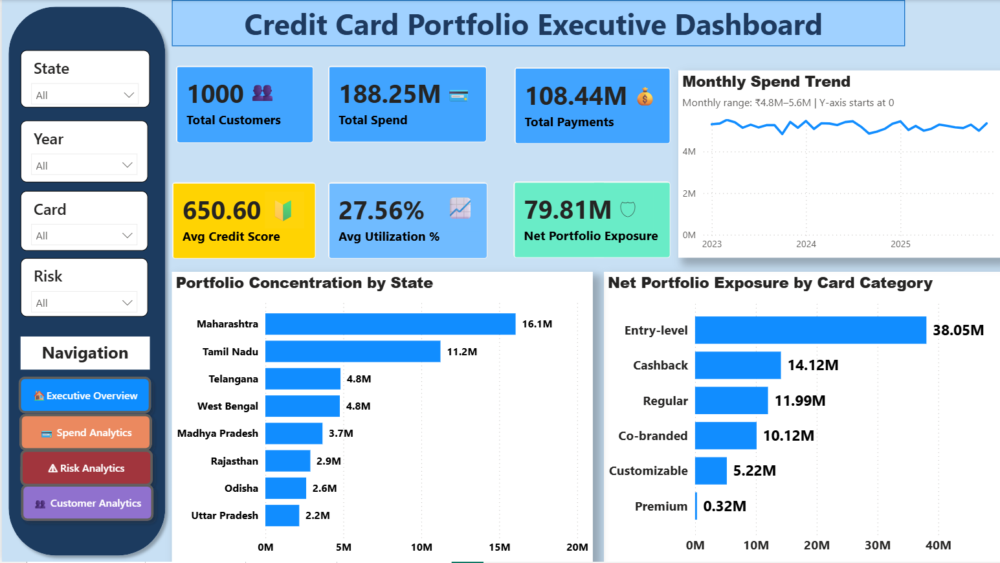
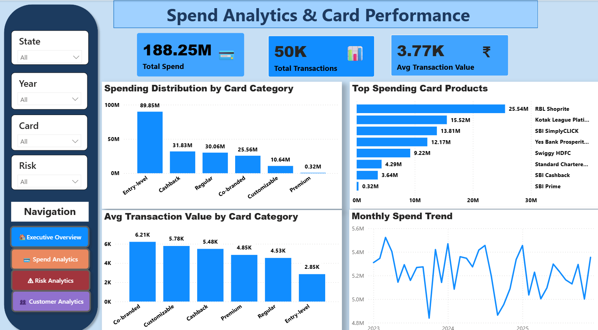
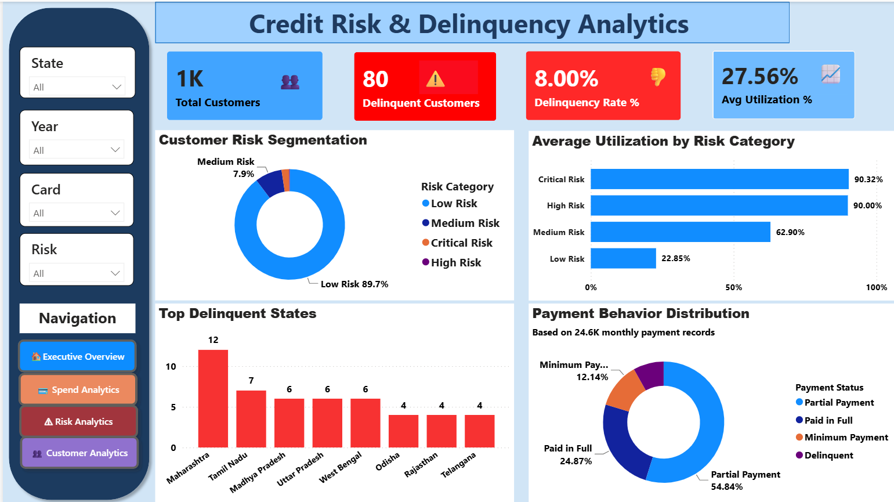
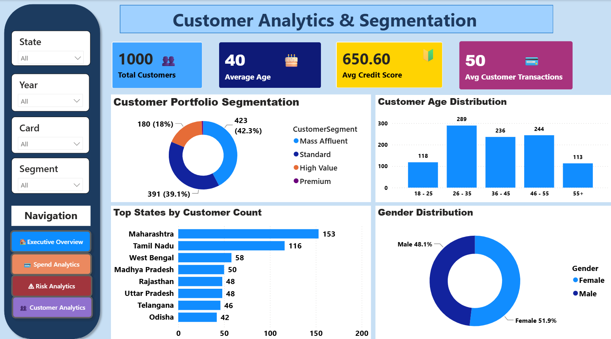
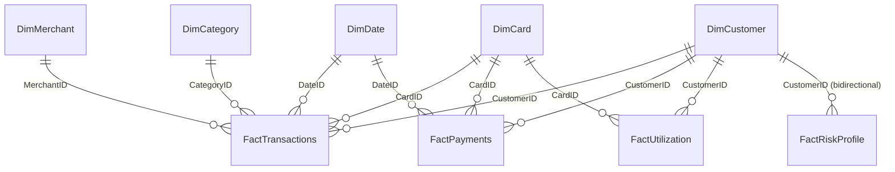

<p align="center">
  
</p>

<div align="center">

# 💳 Credit Card Portfolio Analytics & Risk Intelligence

### Enterprise Power BI Platform for Credit Risk, Portfolio Performance & Customer Intelligence

Transforming **150,000+ financial records** into executive ready business intelligence using **Power BI**, **Power Query**, **Star Schema Modeling**, and **Production Grade DAX**.

<br>


</div>

<br>

<div align="center">

| 👥 Customers | 💳 Transactions | 📊 Dashboard Pages | 🧮 DAX Measures |
|:---:|:---:|:---:|:---:|
| **1,000** | **50,000** | **4** | **33** |

</div>

---

## See It First

<div align="center">









</div>

---

## The Problem

Banks process millions of credit card transactions every day. Without centralized analytics, spotting a high-risk customer, tracking repayment behavior, or understanding spend trends means rebuilding a pivot table every time the question changes.

By the time risk shows up in a delinquency report, it's already too late to act on it.

## The Solution

A single Power BI model that turns four disconnected data sources — transactions, payments, utilization, risk assessments — into one governed source of truth.

One risk definition. One spend definition. Four audiences, each with a dashboard built for their decision, not a shared compromise.

<details>
<summary><b>How it's built, end to end</b></summary>


Raw Excel/CSV → Power Query cleaning (including a real data-quality fix, detailed below) → star-schema model → centralized DAX layer → four audience-specific report pages.

</details>

---

## Four Dashboards, Four Decisions

| Page | Built For | Answers |
|---|---|---|
| **Executive Overview** | Leadership | Is the portfolio healthy and growing? |
| **Spend Analytics** | Product & Marketing | Which cards actually earn their keep? |
| **Risk Analytics** | Risk & Collections | Who's at risk, right now — not last quarter? |
| **Customer Analytics** | Segmentation & Retention | Who are our customers, and where are they? |

Every page shares synced slicers (state, card, risk, date) and one-click navigation — set a filter once, it holds everywhere.

---

## Key KPIs

| KPI | Meaning | Why It Matters |
|---|---|---|
| **Net Portfolio Exposure** | Spend not yet recovered | The real risk carried right now |
| **Delinquency Rate %** | Share of customers overdue | Drives collections priority |
| **Current Risk Customers** | Risk count, *latest month only* | Avoids a diluted, historical read |
| **Avg Utilization %** | Credit-limit usage | Early warning, before delinquency hits |
| **Payment to Spend Ratio** | Repayment health | Signals portfolio-wide financial stress |

<details>
<summary><b>See the DAX behind the two hardest KPIs</b></summary>

```dax
Current Risk Customers =
VAR LatestMonth =
    CALCULATE(MAX(FactRiskProfile[AssessmentMonth]), REMOVEFILTERS(DimRiskCategory))
RETURN
    CALCULATE(DISTINCTCOUNT(FactRiskProfile[CustomerID]), FactRiskProfile[AssessmentMonth] = LatestMonth)

Delinquency Rate % = DIVIDE([Delinquent Customers], [Total Customers], 0)
```

`Current Risk Customers` deliberately resolves to the latest assessment month — not a blended average across history — so risk reporting reflects *now*. Every ratio measure uses `DIVIDE(..., 0)` instead of `/`, so an empty filter context returns `0`, not a broken visual.

<br>

**The other 31 measures, grouped:**

- **Aggregations:** `Total Spend`, `Total Payments`, `Total Transactions`, `Total Credit Limit`
- **Safe ratios:** `EMI %`, `Average Cashback Per Transaction`, `Average Spend Per Customer`
- **Conditional:** `High Risk Customers`, `EMI Transactions`, `Delinquent Customers` — each a `CALCULATE` wrapped around one business condition, reusing the same fact table for multiple questions instead of duplicating data.

All 33 live in a single disconnected Calculation Table — one place to find every metric, not scattered across nine tables.

</details>

---

## Executive Insights

> Entry-level cards generate nearly half of total portfolio spend — **₹89.85M** of it.
>
> High-risk and critical-risk customers both run utilization near **90%** — a leading indicator, visible before delinquency shows up in payment data.
>
> **Mass Affluent** customers are the largest segment at **42.3%** — and the clearest target for retention spend.
>
> **Maharashtra** is the single largest state by customer count, well ahead of every other region.
>
> Roughly 1 in 4 customers clears their balance in full every month — the other 3 carry a running balance worth watching.

---

## Under the Hood

<details>
<summary><b>Data Model — Star Schema (9 tables, 11 relationships)</b></summary>

5 dimension tables, 4 fact tables, joined on single-column keys with one deliberate exception:

| From (Fact) | To (Dimension) | Cross-Filter |
|---|---|---|
| FactTransactions | DimCustomer, DimCard, DimDate, DimMerchant, DimCategory | Single |
| FactPayments | DimCustomer, DimCard, DimDate | Single |
| FactUtilization | DimCustomer, DimCard | Single |
| FactRiskProfile | DimCustomer | **Bidirectional** |

`FactRiskProfile → DimCustomer` is intentionally bidirectional — the one page where a customer-level slicer needs to filter *back* into risk segments interactively.




*Rendered from the verified relationships extracted from the `.pbix` file — not a native Model-view screen capture.*

| Table | Rows | Grain |
|---|---:|---|
| DimCustomer | 1,000 | One row per customer |
| DimCard | 20 | One row per card product |
| DimMerchant | 500 | One row per merchant |
| DimDate | 1,096 | One row per calendar day |
| DimCategory | 12 | One row per category |
| FactTransactions | 50,000 | One row per transaction |
| FactPayments | 24,682 | One row per payment |
| FactUtilization | 39,780 | One row per monthly snapshot |
| FactRiskProfile | 36,000 | One row per monthly risk assessment |

</details>

<details>
<summary><b>Power Query — one representative transformation</b></summary>

Every table is typed explicitly, never left to auto-detection. The one that matters most — a real data-quality fix in `FactRiskProfile`:

```m
#"Replaced Value" = Table.ReplaceValue(#"Changed Type",
    "Aggressive User", "Critical Risk", Replacer.ReplaceText, {"RiskCategory"})
```

The raw source data labeled the highest-risk segment `"Aggressive User"` — inconsistent next to `"Low/Medium/High Risk"`. Fixed once, at the source, so every visual and measure downstream inherits the correct label automatically.

A payment-to-spend ratio was also caught surfacing above 100% during validation — traced back to source data and corrected before the measure was finalized, not patched at the display layer.

</details>

---

## Repository Structure
├── Credit Card Analytics DashbBoard Project.pbix
├── Credit_Card_Portfolio_Updated.pptx
├── Dim*.csv.xlsx / Fact*.csv(.xlsx)          # 9 source tables
└── Images/                                   # Banner, screenshots, model diagram

## Installation

```bash
git clone https://github.com/<your-username>/credit-card-portfolio-analytics.git
```

Open the `.pbix` in Power BI Desktop → repoint the Power Query source files when prompted → Refresh.

> ⚠️ Source paths are currently hardcoded to a local machine. Parameterize before sharing publicly — the single highest-value fix left on this project.

---

## What's Next

- **Row-Level Security** — regional managers see only their own state.
- **Azure SQL / Microsoft Fabric** — move off local files permanently.
- **Predictive scoring** — Python-based churn and risk models layered on top of today's descriptive view.

---

## About Me

Built independently as part of self-directed Business Intelligence portfolio work — star-schema modeling, production-style DAX, and dashboard design driven by audience, not just data.

**Alan Binu**
[GitHub](https://github.com/alanbinu) · [LinkedIn](https://linkedin.com/in/alanbinu) · alan.binu@example.com

---

<div align="center">

**MIT License** — see [LICENSE](./LICENSE)

</div>
