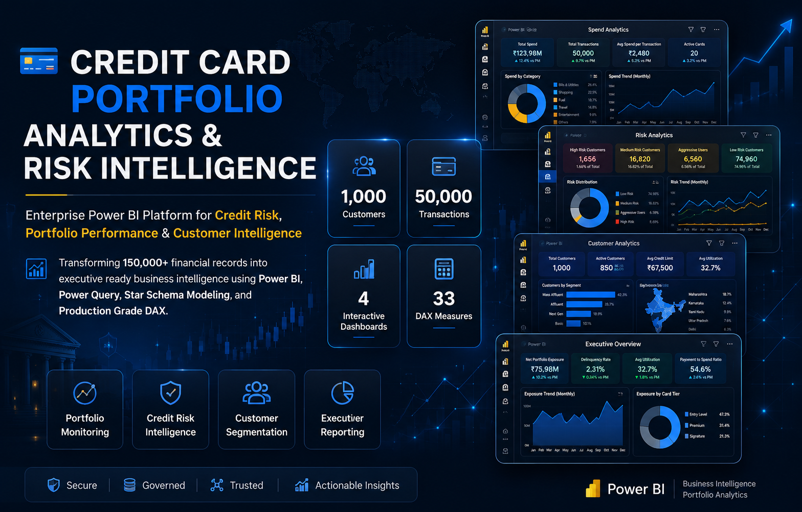
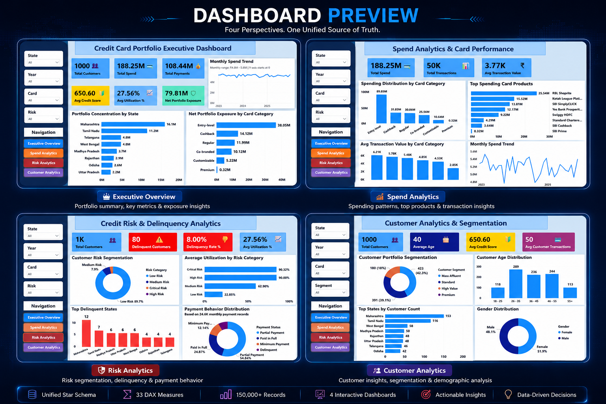
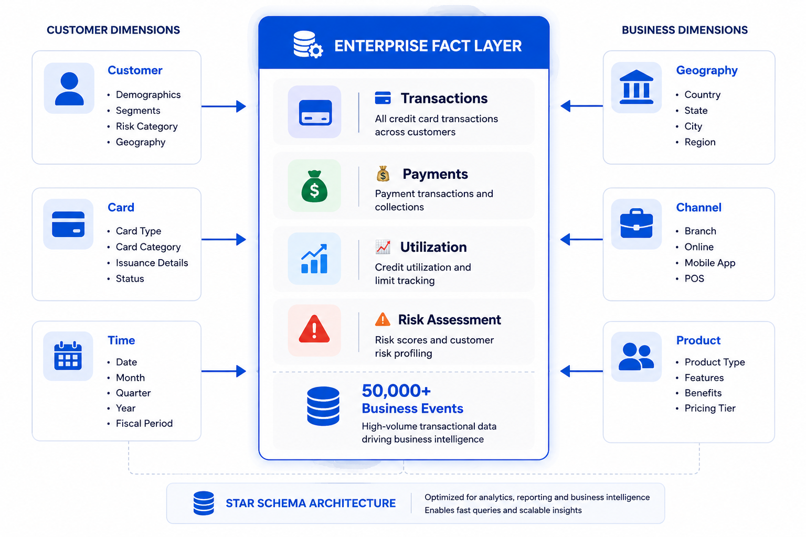
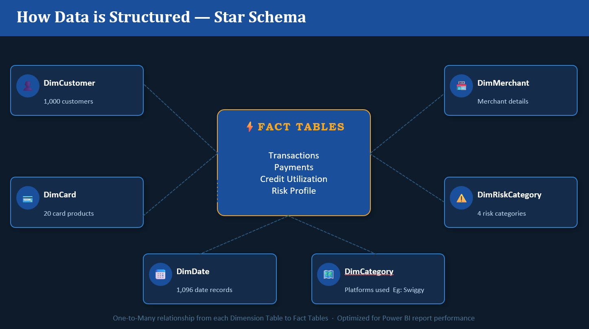

<p align="center">
  
</p>

<div align="center">

# 💳 Credit Card Portfolio Analytics & Risk Intelligence

### Enterprise Power BI Platform for Credit Risk, Portfolio Performance & Customer Intelligence

Transforming **150,000+ financial records** into executive ready business intelligence using **Power BI**, **Power Query**, **Star Schema Modeling**, and **Production Grade DAX**.

<br>


</div>

<br>

<div align="center">

| 👥 Customers | 💳 Transactions | 📊 Dashboard Pages | 🧮 DAX Measures |
|:---:|:---:|:---:|:---:|
| **1,000** | **50,000** | **4** | **33** |

</div>

---

## ✨ Project Highlights

- Enterprise Power BI solution built using a **5 Dimension, 4 Fact Star Schema**
- Processes **150,000+ financial records** across customer, transaction, payment, utilization, and risk domains
- Developed **33 production-ready DAX measures** using reusable calculation patterns
- Designed **4 interactive dashboards** for Executive, Product, Risk, and Customer Analytics
- Comprehensive **19-document enterprise documentation suite**
- Implements Power Query ETL, semantic modeling, and performance optimization best practices

## 📊 Dashboard Preview

<p align="center">
  
</p>

<div align="center">

**Four interactive Power BI dashboards built on a unified star schema, delivering executive reporting, portfolio performance analysis, credit risk intelligence, and customer segmentation through a single Business Intelligence platform.**

</div>

---

## 🎯 Business Challenge

Banks process millions of credit card transactions every day. Without centralized analytics, spotting a high-risk customer, tracking repayment behavior, or understanding spend trends means rebuilding a pivot table every time the question changes.

By the time risk shows up in a delinquency report, it's already too late to act on it.

## 💡 Solution Overview

A single Power BI model that turns four disconnected data sources — transactions, payments, utilization, risk assessments — into one governed source of truth.

One risk definition. One spend definition. Four audiences, each with a dashboard built for their decision, not a shared compromise.

<details>
<summary><b>How it's built, end to end</b></summary>


Raw Excel/CSV → Power Query cleaning (including a real data-quality fix, detailed below) → star-schema model → centralized DAX layer → four audience-specific report pages.

</details>

---

## 📊 Dashboard Suite

| Page | Built For | Answers |
|---|---|---|
| **Executive Overview** | Leadership | Is the portfolio healthy and growing? |
| **Spend Analytics** | Product & Marketing | Which cards actually earn their keep? |
| **Risk Analytics** | Risk & Collections | Who's at risk, right now — not last quarter? |
| **Customer Analytics** | Segmentation & Retention | Who are our customers, and where are they? |

Every page shares synced slicers (state, card, risk, date) and one-click navigation — set a filter once, it holds everywhere.

---

## 📈 Business KPIs

| KPI | Meaning | Why It Matters |
|---|---|---|
| **Net Portfolio Exposure** | Spend not yet recovered | The real risk carried right now |
| **Delinquency Rate %** | Share of customers overdue | Drives collections priority |
| **Current Risk Customers** | Risk count, *latest month only* | Avoids a diluted, historical read |
| **Avg Utilization %** | Credit-limit usage | Early warning, before delinquency hits |
| **Payment to Spend Ratio** | Repayment health | Signals portfolio-wide financial stress |

<details>
<summary><b>See the DAX behind the two hardest KPIs</b></summary>

```dax
Current Risk Customers =
VAR LatestMonth =
    CALCULATE(MAX(FactRiskProfile[AssessmentMonth]), REMOVEFILTERS(DimRiskCategory))
RETURN
    CALCULATE(DISTINCTCOUNT(FactRiskProfile[CustomerID]), FactRiskProfile[AssessmentMonth] = LatestMonth)

Delinquency Rate % = DIVIDE([Delinquent Customers], [Total Customers], 0)
```

`Current Risk Customers` deliberately resolves to the latest assessment month — not a blended average across history — so risk reporting reflects *now*. Every ratio measure uses `DIVIDE(..., 0)` instead of `/`, so an empty filter context returns `0`, not a broken visual.

<br>

**The other 31 measures, grouped:**

- **Aggregations:** `Total Spend`, `Total Payments`, `Total Transactions`, `Total Credit Limit`
- **Safe ratios:** `EMI %`, `Average Cashback Per Transaction`, `Average Spend Per Customer`
- **Conditional:** `High Risk Customers`, `EMI Transactions`, `Delinquent Customers` — each a `CALCULATE` wrapped around one business condition, reusing the same fact table for multiple questions instead of duplicating data.

All 33 live in a single disconnected Calculation Table — one place to find every metric, not scattered across nine tables.

</details>

---

## 💡 Executive Insights

> Entry-level cards generate nearly half of total portfolio spend — **₹89.85M** of it.
>
> High-risk and critical-risk customers both run utilization near **90%** — a leading indicator, visible before delinquency shows up in payment data.
>
> **Mass Affluent** customers are the largest segment at **42.3%** — and the clearest target for retention spend.
>
> **Maharashtra** is the single largest state by customer count, well ahead of every other region.
>
> Roughly 1 in 4 customers clears their balance in full every month — the other 3 carry a running balance worth watching.

---

## 🏛️ Enterprise Semantic Model Architecture

The analytics platform is built on a dimensional semantic model designed for enterprise scale analytics. Descriptive dimensions provide business context, while a centralized Enterprise Fact Layer captures transactional events that power KPI calculations, portfolio monitoring, customer intelligence, and executive reporting.

<div align="center">



</div>

### Why This Architecture Matters

This semantic model centralizes more than **50,000 business events** into a governed Enterprise Fact Layer. By separating descriptive dimensions from transactional facts, the model improves scalability, simplifies DAX development, reduces redundancy, and delivers consistent business definitions across every dashboard.

## Relationship Architecture

The conceptual architecture above is implemented in Power BI using optimized relationship design. Single direction filtering is used throughout the semantic model to ensure predictable filter propagation, with one intentional bidirectional relationship supporting customer risk segmentation.

| 💳 Fact Table | 🎯 Dimension Tables | 🔄 Cross Filter |
|---------------|---------------------|-----------------|
| FactTransactions | DimCustomer, DimCard, DimDate, DimMerchant, DimCategory | Single |
| FactPayments | DimCustomer, DimCard, DimDate | Single |
| FactUtilization | DimCustomer, DimCard | Single |
| FactRiskProfile | DimCustomer | **Bidirectional** |

`FactRiskProfile → DimCustomer` is intentionally bidirectional, allowing customer level slicers to interactively filter risk segmentation without affecting the rest of the semantic model.


<div align="center">

| Component | Count |
|-----------|------:|
| 🗂 Total Tables | **9** |
| 📘 Dimension Tables | **5** |
| 📊 Fact Tables | **4** |
| 🔗 Relationships | **11** |
| ⚡ Modeling Pattern | **Star Schema** |

</div>
  
---

## 🗺 Enterprise Relationship Model

The following visualization illustrates the logical semantic model implemented in Power BI. Dimension tables provide descriptive business context while centralized fact tables capture transactional events that drive enterprise reporting and reusable DAX calculations.

<div align="center">



</div>

| Table | Rows | Grain |
|---|---:|---|
| DimCustomer | 1,000 | One row per customer |
| DimCard | 20 | One row per card product |
| DimMerchant | 500 | One row per merchant |
| DimDate | 1,096 | One row per calendar day |
| DimCategory | 12 | One row per category |
| FactTransactions | 50,000 | One row per transaction |
| FactPayments | 24,682 | One row per payment |
| FactUtilization | 39,780 | One row per monthly snapshot |
| FactRiskProfile | 36,000 | One row per monthly risk assessment |

<details>

<summary><b>⚙️ Data Preparation with Power Query</b></summary>
  
Every table is typed explicitly, never left to auto-detection. The one that matters most — a real data-quality fix in `FactRiskProfile`:

```m
#"Replaced Value" = Table.ReplaceValue(#"Changed Type",
    "Aggressive User", "Critical Risk", Replacer.ReplaceText, {"RiskCategory"})
```

The raw source data labeled the highest-risk segment `"Aggressive User"` — inconsistent next to `"Low/Medium/High Risk"`. Fixed once, at the source, so every visual and measure downstream inherits the correct label automatically.

A payment-to-spend ratio was also caught surfacing above 100% during validation — traced back to source data and corrected before the measure was finalized, not patched at the display layer.

</details>

---

## 📂 Repository Structure

```text
📦 Credit Card Portfolio Analytics
│
├── 📁 Images
├── 📁 Data
│   ├── Dimension Tables
│   └── Fact Tables
├── Credit Card Analytics Dashboard.pbix
├── Credit_Card_Portfolio_Updated.pptx
├── README.md
└── LICENSE
```

## 📚 Enterprise Documentation Suite

This repository includes a comprehensive documentation package covering the complete Business Intelligence lifecycle.

| Document | Purpose |
|-----------|---------|
| Business Requirements | Business objectives and stakeholder requirements |
| Architecture | Semantic model and solution architecture |
| Data Dictionary | Complete metadata reference |
| Data Sources | Source system inventory |
| DAX Measures | Technical documentation for all measures |
| Dashboard Guide | Dashboard walkthrough and business interpretation |
| KPIs & Business Metrics | Business metric definitions |
| Power Query Transformations | ETL and transformation logic |
| Technical Design | Engineering decisions |
| Performance Optimization | VertiPaq and DAX optimization |
| Lessons Learned | Project retrospective |
| Project Roadmap | Future enhancements |
| Data Model | Relationship and semantic model |
| DAX Patterns | Reusable DAX techniques |
| Data Lineage | End-to-end data flow |
| Testing & Validation | Quality assurance |
| Deployment Guide | Deployment instructions |
| Project Structure | Repository organization |
| Change Log | Version history |

### Repository Statistics

| Component | Count |
|------------|------:|
| Documentation Files | 19 |
| Dashboard Pages | 4 |
| DAX Measures | 33 |
| Tables | 9 |
| Relationships | 11 |
| Data Sources | 9 |
| Records | 150,000+ |

## 🚀 Getting Started

```bash
git clone https://github.com/alanbinu/credit-card-portfolio-analytics.git
```

1. Open the `.pbix` file in Microsoft Power BI Desktop.
2. Update the Power Query source paths if prompted.
3. Refresh the semantic model.
4. Explore the interactive dashboards.

Open the `.pbix` in Power BI Desktop → repoint the Power Query source files when prompted → Refresh.

> ⚠️ Source paths are currently hardcoded to a local machine. Parameterize before sharing publicly — the single highest-value fix left on this project.

---

## 🚀 Project Roadmap

• Implement Row Level Security (RLS)

• Migrate data sources to Azure SQL or Microsoft Fabric

• Configure Incremental Refresh

• Build deployment pipelines

• Integrate AI driven credit risk prediction

• Implement automated data quality monitoring

---

## 🛠 Skills Demonstrated

### Business Intelligence

- Power BI Desktop
- Power Query
- DAX
- Data Modeling
- Star Schema Design
- ETL Development
- Dashboard Design

### Analytics

- Credit Risk Analytics
- Customer Segmentation
- Portfolio Performance Analysis
- KPI Development
- Executive Reporting

### Engineering

- Semantic Modeling
- Performance Optimization
- Data Governance
- Technical Documentation
- Git & GitHub

## 👨‍💻 About the Author

This project was independently designed and implemented to demonstrate end-to-end Business Intelligence solution development using Microsoft Power BI. It showcases data modeling, ETL with Power Query, DAX engineering, semantic modeling, dashboard design, performance optimization, and enterprise technical documentation within a production-style analytics solution.

<div align="center">

# Alan Binu

<div align="center">

[](https://github.com/alanbinu)

[](https://www.linkedin.com/in/alan-binu13)

[](mailto:alanbinu306@gmail.com)


</div>

---


## ❤️ Thank You for Visiting

Thank you for exploring this project and taking the time to review my work.

Every visualization, DAX measure, data model, and design decision in this repository reflects my passion for Business Intelligence, analytics, and continuous learning.

If this project inspired you, helped you, or you simply enjoyed exploring it, a ⭐ on the repository would mean a lot and motivates me to keep building, learning, and sharing more projects with the community.

## ⭐ Support the Project

If you found this repository helpful or interesting, consider giving it a ⭐.

Feedback, suggestions, and contributions are always welcome.

Thank you for taking the time to explore this project.

---

**Made with ❤️, curiosity, and countless cups of coffee by Alan Binu**

</div>
</div>
